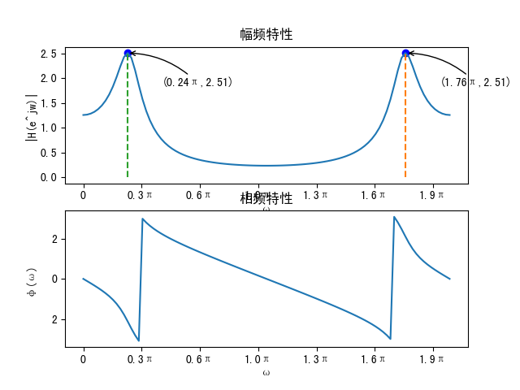

# 第2章习题

1、求序列 $x(n) = a^n [u(n) - u(n-N)]$ 的傅立叶变换。

> 解答

$$
\begin{split}
    x(n)
    &= a^nu(n) - a^nu(n-N) \\
    \mathrm{FT}[x(n)]
    &= \sum_{n = 0}^{\infty} a^n e^{-j\omega n} - \sum_{n = N}^{\infty} a^n e^{-j\omega n} \\
    &= \sum_{n = 0}^{N-1} a^n e^{-j\omega n} \\
    &= \frac{1 - a^N e^{-j\omega N}}{1 - ae^{-j\omega}} \\
\end{split}
$$

---

2、已知理想低通滤波器的频率响应函数为

$$
H(e^{-j \omega}) =
\begin{cases}
    e^{-j \omega n_0} & 0 \leq |\omega| \leq \omega_c \\
    0 & \omega_c < |\omega| \leq \pi \\
\end{cases}
$$

$n_0$ 为整数，求所对应的单位脉冲响应 $h(n)$。

> 解答

$$
\begin{align*}
    h(n)
    &= \mathrm{IFT}[H(e^{-j \omega})] \\
    &= \frac{1}{2\pi} \int_{-\pi}^{\pi} H(e^{j\omega}) e^{j\omega n} d\omega \\
    &= \frac{1}{2\pi} \int_{-\omega_c}^{\omega_c} e^{-j\omega n_0} e^{j\omega n} d\omega \\
    &= \frac{\sin[\omega_c (n-n_0)]}{\pi(n-n_0)}
\end{align*}
$$

---

3、已知理想高通滤波器的频率响应函数为：

$$
H(e^{-j \omega}) =
\begin{cases}
    0 & 0 \leq |\omega| \leq \omega_c \\
    1 & \omega_c < |\omega| \leq \pi \\
\end{cases}
$$

求所对应的单位脉冲响应 $h(n)$。

> 解答

$$
\begin{align*}
    h(n)
    &= \frac{1}{2\pi} \int_{-\pi}^{\pi} H(e^{j\omega}) e^{j\omega n} d\omega \\
    &= \frac{1}{2\pi} \int_{-\pi}^{-\omega_c} e^{j\omega n} d\omega + \frac{1}{2\pi} \int_{\omega_c}^{\pi} e^{j\omega n} d\omega \\
    &= \frac{\sin (\pi n)}{\pi n} - \frac{\sin(\omega_c n)}{\pi n}(???) \\
    &= \delta(n) - \frac{\sin(\omega_c n)}{\pi n} (???) \\
\end{align*}
$$

---

4、已知周期信号的周期为 5， 主值区间的函数值 $=\delta(n)+\delta(n-1)$,求该周期信号的离散傅里叶级数和傅里叶变换.

> 解答

$x(n) = \delta(n) + \delta(n - 1)$

离散傅里叶级数

$$
\xcancel{\begin{split}
    \tilde{X}(k)
    &= \frac{1}{5} \sum_{n = 0}^{4} x(n) e^{-j\frac{2\pi}{5} kn} \\
    &= \frac{1}{5} \sum_{n = 0}^{4} [\delta(n) + \delta(n - 1)] e^{-j\frac{2\pi}{5} kn} \\
    &= \frac{1}{5} \sum_{n = 0}^{4} \delta(n) e^{-j\frac{2\pi}{5} kn} + \frac{1}{5} \sum_{n = 0}^{4} \delta(n - 1) e^{-j\frac{2\pi}{5} kn} \\
    &= \frac{1}{5}\left[e^{-j\frac{2\pi}{5}k(0)} + e^{-j\frac{2\pi}{5}k(1)} + 0 + 0 + 0\right] \\
    &= \frac{1}{5}\left[1 + e^{-j\frac{2\pi}{5}k}\right] \\
\end{split}}
$$

$$
\begin{split}
    \tilde{X}(k)
    &= \sum_{n = 0}^{4} \tilde{x}(n) e^{-j \frac{2\pi}{5}nk} \\
    &= \sum_{n = 0}^{1} e^{-j\frac{2\pi}{5}nk} \\
    &= \frac{1 - e^{-j\frac{4\pi}{5}k}}{1 - e^{-j\frac{2\pi}{5}k}} \\
    &= 2 e^{-j\frac{2\pi}{5}k} \frac{\sin(\frac{4\pi}{5}k)}{\sin(\frac{2\pi}{5}k)} \\
    &= 2 e^{-j\frac{2\pi}{5}k} \cos(\frac{\pi}{5}k) \\
\end{split} \\
\color{#E45F59}?????
$$

$$
\begin{split}
    \tilde{x}(n)
    &= \frac{2}{5} \sum_{k=0}^{4} e^{j\frac{\pi}{5}k(2n-1)} \cos(\frac{\pi}{5}k)
\end{split} \\
\color{#E45F59}?????
$$

傅里叶变换

$$
\xcancel{\begin{split}
    X(e^{j\omega})
    &= \sum_{n = -\infty}^{\infty} x(n) e^{-j\omega n} \\
    &= \sum_{n = -\infty}^{\infty} [\delta(n) + \delta(n - 1)] e^{-j\omega n} \\
    &= \sum_{n = -\infty}^{\infty} \delta(n) e^{-j\omega n} + \sum_{n = -\infty}^{\infty} \delta(n - 1) e^{-j\omega n} \\
    &= 1 + e^{-j\omega} \\
\end{split}}
$$

$$
X(e^{j\omega}) = \frac{4\pi}{5} \sum_{k = -\infty}^{\infty} e^{-j \frac{\pi}{5} k} \cos(\frac{\pi}{5}k) \delta(\omega - \frac{2\pi}{5}k) \\
\color{#E45F59}?????
$$

---

5、已知信号 $x(n)$ 的傅立叶变换为 $X(e^{j\omega})$，求下列信号的傅立叶变换。

(1) $x(n − 3)$
(2) $x^* (−n)$

> 解答

(1) $\mathrm{DFT}[x(n-3)] = X(e^{j\omega}) e^{-j\omega 3}$

(2) $\mathrm{DFT}[x^* (−n)] = X^*(e^{-j\omega})$

---

6、已知实因果信号 $x(n)$ 如图所示，求 $x_e(n)$ 和 $x_o(n)$ 。

> 解答

$x(n) = \{\underline{1}, 0, 2, 1, 3\}$

$\xcancel{x^*(-n) = \{\underline{1}, 0, 0, 0, 0\}}$

$x(n) = \{ 3, 1, 2, 0, \underline{1} \}$

$x_e(n) = \frac{1}{2}[x(n)+x(-n)]$

$x_o(n) = \frac{1}{2}[x(n)-x(-n)]$

由于是实因果信号，所以

$x_e(n) = \{ \frac{3}{2}, \frac{1}{2}, 1, 0, \underline{1}, 0, 1, \frac{1}{2}, \frac{3}{2} \}$

$x_o(n) = \{ -\frac{3}{2}, -\frac{1}{2}, -1, 0, \underline{0}, 0, 1, \frac{1}{2}, \frac{3}{2} \}$

---

7、已知实因果信号 $x(n)$ 的**偶分量**（什么是？） $x_e(n) = \{-2,-3,3,4,\underline{1},4,3,-3,-2\}$,求信号 $x(n)$ 。

> 解答

$x_e(n) = x_e^*(-n) = \frac{1}{2}[x(n)+x^*(-n)]$

实信号的中，$x(-n) = x^*(-n)$，所以 $x_e(n) = \frac{1}{2}[x(n)+x(-n)]$

由于是实因果信号，所以 $n<0$ 时，$x(n) = 0$

所以 $x(n) = \{ \underline{1}, 8, 6, -6, -4 \}$ --- $\color{#E45F59}?????$

---

8、已知信号 $x_a (t) = \cos(2\pi 100t), f_s = 300 Hz$ ,对信号采样,得到时域采样信号 $\hat{x}_a(t)$ 和时域离散信号 $x(n)$ ,求:

(1) 写出信号 $x_a (t)$ 的傅里叶变换.

(2) 写出时域采样信号 $\hat{x}_a(t)$ 和时域离散信号 $x(n)$ 的表达式.

(3) 求时域采样信号 $\hat{x}_a(t)$ 和时域离散信号 $x(n)$ 的傅里叶变换.

> 解答

(1)

$$
\begin{split}
    X_a(j\Omega)
    &= \int_{-\infty}^{\infty} x_a(t) e^{-j\Omega t} dt \\
    &= \int_{-\infty}^{\infty} 2\cos(\Omega_0t) e^{-j\Omega t} dt \\
    &= \int_{-\infty}^{\infty} [e^{j\Omega_0t} + e^{-j\Omega_0t}] e^{-j\Omega t} dt \\
    & \text{引入奇异函数} \\
    &= 2\pi [\delta(\Omega - 200\pi) + \delta(\Omega + 200\pi)] \\
\end{split}
$$

(2)

$$
\begin{split}
    \hat{x}_a(t)
    &= \sum_{n = -\infty}^{\infty} x_a(t) \delta(t - nT_s) \\
    &= \sum_{n = -\infty}^{\infty} 2\cos(\Omega_0 t) \delta(t - nT_s) \\
\end{split}
$$

$$
x(n) = x_a(nT_s) = 2\cos(\Omega_0nT_s)
$$

其中，$\Omega_0 = 2 \times 100\pi = 200\pi, T_s = \frac{1}{f_s} = \frac{1}{300}ms$

(3)

$$
\begin{split}
    \hat{X}_a(j\omega)
    &= \xcancel{\frac{1}{T_s} \sum_{k = -\infty}^{\infty} X_a(j(\omega - \frac{2\pi n}{T_s}))} \\
    &= \frac{1}{T} \sum_{k = -\infty}^{\infty} X_a(j\Omega - jk\Omega_s) \\
    &= \frac{2\pi}{T} \sum_{k = -\infty}^{\infty} [\delta(\Omega - 200\pi - k\Omega_s) + \delta(\Omega + 200\pi - k\Omega_s)] \\
\end{split}
$$

其中，$\Omega_s = 2\pi f_s = 600\pi$

$$
\xcancel{X(j\omega) = \frac{1}{T_s} \sum_{n = -\infty}^{\infty} X_a(j(\omega - \frac{2\pi n}{T_s}))} \\
\begin{split}
    X(e^{j\omega})
    &= \sum_{n = -\infty}^{\infty} x(n) e^{-j\omega n} \\
    &= \sum_{n = -\infty}^{\infty} 2\cos(\omega_0nT_s) e^{-j\omega n} \\
    &= \sum_{n = -\infty}^{\infty} [e^{j\omega_0n} + e^{-j\omega_0n}] e^{-j\omega n} \\
    &= 2\pi \sum_{n = -\infty}^{\infty} [\delta(\omega - \omega_0 - 2\pi k) + \delta(\omega + \omega_0 - 2\pi k)] \\
\end{split}
$$

其中，$\omega_0 = \Omega_0 T_s = 200\pi \times \frac{1}{300} = \frac{2}{3}\pi$

---

9、已知稳定离散时间系统的差分方程为: $y(n)-\frac{10}{3}y(n-1)+y(n-2)=x(n)$ 求

(1) 系统函数和单位脉冲响应。

(2) 若 $x(n)=u(n)$ ,求系统的零状态响应。

(3) 写出频率响应函数 $H(e^{j\omega})$

(4) 若输入为 $x(n)=e^{j\omega_0 n}$ ，求输出 $y(n)$

> 解答

(1)

$$
\begin{align*}
    H(z)
    &= \frac{1}{1 - \frac{10}{3}z^{-1} + z^{-2}} \\
    &= \frac{z^2}{z^2 - \frac{10}{3}z + 1} \\
\end{align*}
$$

$$
\frac{H(z)}{z} = \frac{z}{(z-3)(z-\frac{1}{3})} = -\frac{1}{8} \frac{1}{z-\frac{1}{3}} + \frac{9}{8}\frac{1}{z-3} \\
\therefore \xcancel{h(n) = \left[ -\frac{1}{8}(\frac{1}{3})^n + \frac{9}{8}3^n \right]u(n)} \\
h(n) = -\frac{1}{8}(\frac{1}{3})^n - \frac{9}{8}3^n u(-n-1)
$$

(2)

$Y_{zs} = X(z) \cdot H(z) = \frac{z}{z-1} \cdot \frac{z^2}{(z-3)(z-\frac{1}{3})}$

$$
\begin{align*}
    \frac{Y_{zs}(z)}{z}
    &= \frac{z^2}{(z-1)(z-3)(z-\frac{1}{3})} \\
    &= \frac{z^2}{z-\frac{1}{3}} \frac{1}{2} \left[ \frac{1}{z-1} - \frac{1}{z-3} \right] \\
    &= \frac{1}{2} \left[ \frac{z^2}{(z-\frac{1}{3})(z-1)} - \frac{z^2}{(z-\frac{1}{3})(z-3)} \right] \\
    &= \frac{1}{2} \left[ -\frac{1}{8} \frac{z}{z-\frac{1}{3}} + \frac{9}{8} \frac{z}{z-3} + \frac{1}{2} \frac{z}{z-\frac{1}{3}} - \frac{3}{2} \frac{z}{z-1} \right] \\
    &= \frac{1}{2} \left[ \frac{3}{8} (1 + \frac{\frac{1}{3}}{z - \frac{1}{3}}) + \frac{9}{8} (1 + \frac{\frac{1}{3}}{z - 3}) - \frac{3}{2} (1 + \frac{1}{z - 1}) \right] \\
    &= \frac{1}{2} \left[ \frac{1}{8} \cdot \frac{1}{z - \frac{1}{3}} + \frac{27}{8} \cdot \frac{1}{z - 3} - \frac{3}{2} \cdot \frac{1}{z - 1} \right] \\
\end{align*}
$$

$\xcancel{}\therefore y_{zs}(n) = \left[ \frac{1}{16} (\frac{1}{3})^n + \frac{27}{16} 3^n - \frac{3}{4} \right] u(n)$

(3)

$$
\begin{align*}
    H(e^{j\omega})
    &= \frac{e^{j\omega2}}{e^{j\omega2} - \frac{10}{3}e^{j\omega} + 1} \\
    &= -\frac{3}{8} \cdot \frac{1}{3 - e^{-j\omega}} + \frac{9}{8} \cdot \frac{1}{1 - 3e^{-j\omega}} \\
\end{align*}
$$

(4)

$$
\begin{align*}
    y(n)
    &= e^{j\omega_0 n} H(e^{j\omega_0}) \\
    &= -\frac{3}{8} \cdot \frac{e^{j\omega_0 n}}{3 - e^{-j\omega_0}} + \frac{9}{8} \cdot \frac{e^{j\omega_0 n}}{1 - 3e^{-j\omega_0}} \\
\end{align*}
$$

---

10、一个离散时间系统有一对共轭极点：$p_1=0.8e^{\frac{j\pi}{4}}, p_2=0.8 e^{-\frac{j\pi}{4}}$ ，且在 $z=1$ 处有一阶零点。$H(0)=1$,

(1) 写出该系统的系统函数 $H(z)$, 并画出零极点图。
(2) 试用零极点分析的方法大致画出其幅频响应（$0 \sim 2\pi$）。
(3) 若输入信号 $x(n)=e^{j\frac{\pi}{2}n}$ ，求该系统的输出 $y(n)$。

> 解答

(1)

系统有两个共轭极点 $p_1=0.8e^{\frac{j\pi}{4}}, p_2=0.8 e^{-\frac{j\pi}{4}}$ 和一个一阶零点 $z=1$，所以系统函数可以写成：

$$
H(z) = K \frac{z-1}{(z-0.8e^{\frac{j\pi}{4}})(z-0.8 e^{-\frac{j\pi}{4}})}
$$

由于给定了 $H(0)=1$，我们可以用这个条件来求解 $K$。将 $z=0$ 代入上式，得到：

$$
H(0) = K \frac{-1}{(0.8e^{\frac{j\pi}{4}})(0.8 e^{-\frac{j\pi}{4}})} = 1
$$

解得：

$$
K = (0.8e^{\frac{j\pi}{4}})(0.8 e^{-\frac{j\pi}{4}}) = -0.64
$$

因此，该系统的系统函数为：

$$
\begin{split}
    H(z)
    &= -0.64 \frac{z-1}{(z-0.8e^{\frac{j\pi}{4}})(z-0.8 e^{-\frac{j\pi}{4}})} \\
    &= -0.64 \frac{z-1}{z^2 - 1.6z\cos(\frac{\pi}{4}) + 0.64} \\
\end{split}
$$

(2)

零极点图与幅频响应使用matplotlib画图：代码见 `plot2_2.py`

(3)

$$
\xcancel{\begin{split}
    y(n)
    &= H(e^{j\frac{\pi}{2}}) e^{j\frac{\pi}{2}n} \\
    &= 0.64 \frac{e^{j\frac{\pi}{2}}-1}{(e^{j\frac{\pi}{2}}-0.8e^{\frac{j\pi}{4}})(e^{j\frac{\pi}{2}}-0.8 e^{-\frac{j\pi}{4}})} e^{j\frac{\pi}{2}n} \\
    &= 0.64 \frac{e^{j\frac{\pi}{2}}-1}{e^{j\frac{\pi}{2}}-0.8e^{\frac{j\pi}{4}}-0.8 e^{-\frac{j\pi}{4}}+0.64} e^{j\frac{\pi}{2}n} \\
    &= 0.64 \frac{e^{j\frac{\pi}{2}}-1}{e^{j\frac{\pi}{2}}-1.6\cos(\frac{\pi}{4})+0.64} e^{j\frac{\pi}{2}n} \\
\end{split}}
$$

$$
\begin{align*}
    y(n)
    &=  H(e^{j\omega}) e^{j\frac{\pi}{2}n} \\
    &= -0.64 \frac{e^{j(\omega+\frac{\pi}{2})n - e^{j\frac{\pi}{2}n}}}{(e^{j\omega} - \frac{4}{5} e^{j\frac{\pi}{4}})(e^{j\omega} - \frac{4}{5} e^{-j\frac{\pi}{4}})} \\
\end{align*}
$$
