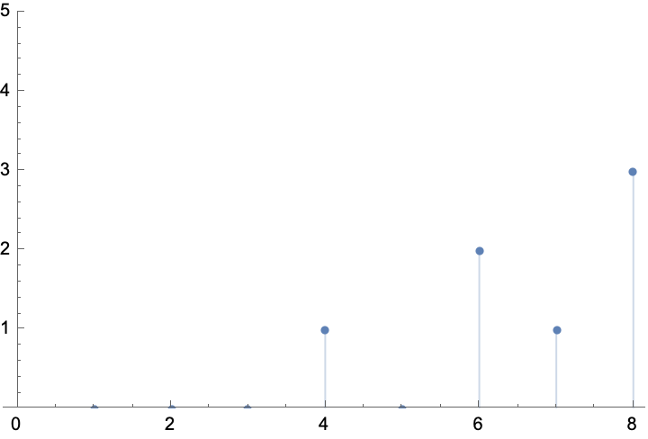
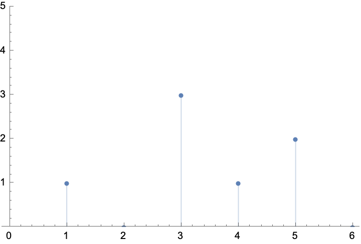

# 第3章习题

1、计算下列序列的 8 点 DFT

(1) $x(n) = \delta(n-3)$

(2) $x(n) = \delta(n) + 2\delta(n-4)$

> 解答

(1)

$$
\begin{align*}
    X(k)
    &= \sum_{n=0}^{N-1} x(n) W_N^{kn} \\
    &= \sum_{n=0}^{7} \delta(n-3) e^{-j \frac{2 \pi}{8} k n} \\
    &= e^{-j \frac{2 \pi}{8} k 3} = e^{-j \frac{3 \pi}{4} k} \\
\end{align*}
$$

(2)

$$
\begin{align*}
    X(k)
    &= \sum_{n=0}^{7} (\delta(n) + 2\delta(n-4)) e^{-j \frac{2 \pi}{8} k n} \\
    &= 1 + 2 e^{-j \frac{2 \pi}{8} k 4} = 1 + 2 e^{-j \frac{\pi}{2} k}
\end{align*}
$$

---

2、已知 $x(n) = (2n+1)\left[u(n+2) - u(n-3)\right]$，若 $y(n)=x((n))_4$，画出 $x(n)$ 和 $y(n)$ 的波形。

> 解答

~~画图代码参考 [plot3_2_1.py](../codes/hw3/plot3_2_1.py)~~ 错误！！！

$x(n) = \{-3, -1, \underline{1}, 3, 5 \}$

$y(n) = \{ -1, \underline{1}, 3, 2 \}$

---

3、已知 $x(n) = R_5(n)$ ，

(1) 求它的 DTFT -- $X(e^{j\omega})$ 。

(2) 若 $X(e^{j\omega})$ 中的 $\omega$ 在 $[0,2\pi]$ 内做 $N$ 点等间隔采样得到 $X(k)$，写出 $X(k)$ 的表示式，并说明在何种情况下可以由 $X(k)$ 恢复出 $X(e^{j\omega})$。

(3) 求 $\mathrm{IDFT}[X(k)]$.

> 解答

(1)

$$
\begin{align*}
    X(e^{j\omega})
    &= \sum_{n=-\infty}^{\infty} x(n) e^{-j\omega n} \\
    &= \sum_{n=0}^{4} e^{-j\omega n} \\
    &= \frac{1-e^{-j\omega 5}}{1-e^{-j\omega}} \\
\end{align*}
$$

(2)

$$
\begin{align*}
    X(k)
    &= X(e^{j\omega}) \big|_{\omega = \frac{2\pi}{N} k} \\
    &= \frac{1-e^{-j\frac{2\pi}{N} 5 k}}{1-e^{-j\frac{2\pi}{N} k}} \\
\end{align*}
$$

由频域采样定理，$x(n) = R_5(n)$ 长度为~~6~~ 5，所以 $N \geq 5$ 时可以由 $X(k)$ 恢复出 $X(e^{j\omega})$。

(3)

$$
\xcancel{
\begin{align*}
    \mathrm{IDFT}[X(k)]
    &= \frac{1}{N} \sum_{k=0}^{N-1} X(k) e^{j\frac{2\pi}{N} k n} \\
    &= \frac{1}{N} \sum_{k=0}^{N-1} \frac{1-e^{-j\frac{2\pi}{N} 5 k}}{1-e^{-j\frac{2\pi}{N} k}} e^{j\frac{2\pi}{N} k n} \\
    &= \frac{1}{N} (1 - e^{j\pi n} + e^{2j\pi n} - e^{3j\pi n} + \cdots + e^{(N-2)j\pi n} - e^{(N-1)j\pi n}) \\
    &= \frac{1}{N} \cdot \frac{1-e^{j\pi n \cdot N}}{1+e^{j\pi n}} \\
    &= \frac{1}{N} \cdot \frac{e^{j\pi n \cdot N/2} - e^{-j\pi n \cdot N/2}}{e^{j\pi n/2} + e^{-j\pi n/2}} \\
    &= \frac{1}{N} \cdot \frac{2j \sin(\pi nN/2)}{2j \cos(\pi n/2)} \\
    &= \frac{\sin(\pi nN/2)}{N\cos(\pi n/2)} \\
    &= \frac{1}{N} \frac{1 - \cos \frac{10 \pi}{n}}{1 - \cos \frac{2 \pi}{n}}
\end{align*}}
$$

$$
\begin{align*}
    \mathrm{IDFT}[X(k)]
    &= \frac{1}{N} \sum_{k=0}^{N-1} X(k) e^{j\frac{2\pi}{N} k n} (??????)\\
    &= \frac{1}{N} \sum_{k=0}^{4} e^{-j\frac{4\pi k}{N}} \frac{\sin ???}{\sin ???} e^{???} \\
    &= \frac{1}{N} \frac{1 - \cos \frac{10 \pi ?}{N}}{1 - \cos \frac{2 \pi ?}{N}} \\
\end{align*}
$$

---

4、已知信号 $x(n)=2 \delta(n)+\delta(n-1)+\delta(n-2)$, $h(n)=\delta(n+2)+3 \delta(n)-\delta(n-1)+2 \delta(n-3)$

(1) 求 $[h((-n))_6 R_6(n)]$ 并画出它的波形。

(2) 求线性卷积 $y(n)=x(n)^*\left[h((-n))_6 R_6(n)\right]$

(3) 求 $x(n)$ 和 $\left[h((-n))_6 R_6(n)\right]$ 的 6 点循环卷积.

(4) 若用循环卷积求解线性卷积,循环卷积的长度为多少?

> 解答

(1)

$\xcancel{h(n) = \{1, 0, \underline{3}, -1, 0, 2 \}}$

$h(-n) = \{2, 0, -1, \underline{3}, 0, 1 \}$

$h((-n))_6 = \{2, 0, -1, \underline{3}, 0, 1 \}$

$h((-n))_6 R_6(n) = \{\underline{3}, 0, 1, 2, 0, -1 \}$

(2)

$x(n) = \{\underline{2}, 1, 1\}$

```nb
x1 = {2, 1, 1};
x2 = {3, 0, 1, 2, 0, -1};

y = ListConvolve[x1, x2, {1, -1}, 0];
Print[y];
```

$y(n) = x(n) * h((-n))_6 R_6(n) = \{\underline{6},3,5,5,3,0,-1,-1\}$

(3)

请编写 mathematica 代码，计算下面的矩阵乘法：

$$
\begin{bmatrix}
    y(0)_c \\ y(1)_c \\ y(2)_c \\ y(3)_c \\ y(4)_c \\ y(5)_c
\end{bmatrix} =
\begin{bmatrix}
    2 & 0 & 0 & 0 & 1 & 1 \\
    1 & 2 & 0 & 0 & 0 & 1 \\
    1 & 1 & 2 & 0 & 0 & 0 \\
    0 & 1 & 1 & 2 & 0 & 0 \\
    0 & 0 & 1 & 1 & 2 & 0 \\
    0 & 0 & 0 & 1 & 1 & 2 \\
\end{bmatrix}
\begin{bmatrix}
    3 \\ 0 \\ 1 \\ 2 \\ 0 \\ -1
\end{bmatrix} =
\begin{bmatrix}
    5 \\ 2 \\ 5 \\ 5 \\ 3 \\ 0
\end{bmatrix}
$$

```sh
A = {{2, 0, 0, 0, 1, 1}, {1, 2, 0, 0, 0, 1}, {1, 1, 2, 0, 0, 0}, {0, 1, 1, 2, 0, 0}, {0, 0, 1, 1, 2, 0}, {0, 0, 0, 1, 1, 2}};
B = {{3}, {0}, {1}, {2}, {0}, {-1}};
Y = A.B;
Print[Y]; % markdown代码块又发病
```

(4) 若用循环卷积求解线性卷积,循环卷积的长度为多少?

L=N+M-1=8

---

5、已知一个 5 点有限长序列，如图所示。


(1) 画出波形 $x_1(n) = x((n-3))_8 R_8(n)$ 和 $x_2(n)=x((-n))_6 R_6(n)$ 的波形。

(2) 求线性卷积：$y(n) = x(n) * x_2(n)$

(3) 求 6 点循环卷积 $y(n) = x(n) \otimes x_2(n)$。

(4) 若用循环卷积求解线性卷积，则循环卷积至少要求几点？

> 解答

(1)

$x(n) = \{\underline{1}, 0, 2, 1, 3\}$

$x_1(n) = x((n-3))_8 R_8(n) = \{\underline{0}, 0, 0, 1, 0, 2, 1, 3 \}$

$x_2(n) = x((-n))_6 R_6(n) = \{\underline{1}, 0, 3, 1, 2, \xcancel{0}, ? \}$

```nb
x1 = {0, 0, 0, 1, 0, 2, 1, 3};
x2 = {1, 0, 3, 1, 2, 0};

ListPlot[x1, Filling -> Axis, PlotRange -> {0, 10}]
ListPlot[x2, Filling -> Axis, PlotRange -> {0, 10}]
```





已知 $x(n) = \{\underline{1}, 0, 2, 1, 3\}$ 请编写matlab代码，画出 $x_1(n) = x((n-3))_8 R_8(n)$ 和 $x_2(n)=x((-n))_6 R_6(n)$ 的波形。

(2)

```nb
x1 = {1, 0, 2, 1, 3};
x2 = {1, 0, 3, 1, 2, 0};

y = ListConvolve[x1, x2, {1, -1}, 0];
Print[y];
```

$\xcancel{y(n) = x(n) * x_2(n) = \{3,0,7,5,11,6,5,8,1,3\}}$

错误！！！
但答案没看懂。

(3)

$x(n) = \{\underline{1}, 0, 2, 1, 3\}$
$x_2(n) = \{\underline{1}, 0, 3, 1, 2, 0 \}$

$$
\begin{bmatrix}
    y(0)_c \\ y(1)_c \\ y(2)_c \\ y(3)_c \\ y(4)_c \\ y(5)_c
\end{bmatrix} =
\begin{bmatrix}
    1 & 0 & 3 & 1 & 2 & 0 \\
    0 & 1 & 0 & 3 & 1 & 2 \\
    2 & 0 & 1 & 0 & 3 & 1 \\
    1 & 2 & 0 & 1 & 0 & 3 \\
    3 & 1 & 2 & 0 & 1 & 0 \\
    0 & 3 & 1 & 2 & 0 & 1 \\
\end{bmatrix}
\begin{bmatrix}
    1 \\ 0 \\ 3 \\ 1 \\ 2 \\ 0
\end{bmatrix} =
\begin{bmatrix}
    15 \\ 5 \\ 11 \\ 2 \\ 11 \\ 5
\end{bmatrix}
$$

编写 mathematica 代码，计算 6 点 Cyclic convolution $y(n) = x(n) \otimes x_2(n)$

```nb
CyclicConvolution[lis1_, lis2_] := ListConvolve[lis1, lis2, {1, 1}]
CyclicConvolution[{1,0,2,1,3}, {1,0,3,1,2,0}]
```

教师批注：

y(n) = {1 0 5 2 11 5 14 5 6} <- ???

(4)

至少要求 N+M-1 点，即为 ~~10~~ 9 点。

---

6、已知实序列 $x(n)$ 的 9 点 DFT 为 $X(k)$
其中 $X(0)=1, X(1)=2+j, X(2)=2, X(3)=0.5-0.1 j, X(4)=1-0.5j$，

(1) 求出整个 $X(k)$。

(2) 若 $x_1(n)=x((n-3))_9 R_9(n)$ ，求 $X_1(k)$ 。

(3) 若 $x_2(n)=x_1(n) e^{j \frac{2 \pi}{3} n}$ ，求$X_2(k)$ 。

> 解答

(1) 由于 DFT 的周期性，我们可以利用 $X(k)$ 的前 5 个值求出后 4 个值，即：

$X(5) = X(5-9) = X(-4) = X(4)^* = 1+0.5j$

$X(6) = X(6-9) = X(-3) = X(3)^* = 0.5+0.1j$

$X(7) = X(7-9) = X(-2) = X(2)^* = 2$

$X(8) = X(8-9) = X(-1) = X(1)^* = 2-j$

因此，整个 $X(k)$ 为：

$X(k) = \begin{cases} 1, & k=0 \\ 2+j, & k=1 \\ 2, & k=2 \\ 0.5-0.1j, & k=3 \\ 1-0.5j, & k=4 \\ 1+0.5j, & k=5 \\ 0.5+0.1j, & k=6 \\ 2, & k=7 \\ 2-j, & k=8 \end{cases}$

(2)

若 $x_1(n)=x((n-3))_9 R_9(n)$ ，求 $X_1(k)$ 。

$X(k) = \begin{cases} 1, & k=0 \\ 2+j, & k=1 \\ 2, & k=2 \\ 0.5-0.1j, & k=3 \\ 1-0.5j, & k=4 \\ 1+0.5j, & k=5 \\ 0.5+0.1j, & k=6 \\ 2, & k=7 \\ 2-j, & k=8 \end{cases}$

可以利用下面的公式

$$
y(n) = x((n+m))_N R_N(n) \Leftrightarrow Y(k) = \mathrm{DFT}[y(n)] = W_N^{-km} X(k)
$$

$$
x_1(n) = x((n-3))_9 R_9(n) \\
\to X_1(k) = W_9^{-3k} X(k) =
\begin{cases}
    1, & k=0 \\
    (2+j) e^{-j \frac{2\pi}{3}}, & k=1 \\
    2 e^{-j \frac{4\pi}{3}}, & k=2 \\
    0.5-0.1j, & k=3 \\
    (1-0.5j) e^{-j \frac{8\pi}{3}}, & k=4 \\
    (1+0.5j) e^{-j \frac{10\pi}{3}}, & k=5 \\
    0.5+0.1j, & k=6 \\
    2 e^{-j \frac{14\pi}{3}}, & k=7 \\
    (2-j) e^{-j \frac{16\pi}{3}}, & k=8
\end{cases}
$$

(3) $x_2(n) = x_1(n) e^{j \frac{2 \pi}{3} n}$

$$
\begin{align*}
    X_2(k)
    &= \mathrm{DFT}[x_2(n)] \\
    &= \mathrm{DFT}[x_1(n) e^{j \frac{2 \pi}{3} n}] \\
    &= \mathrm{DFT}[x_1(n)] \otimes \mathrm{DFT}[e^{j \frac{2 \pi}{3} n}] \\
    &= X_1(k) \otimes \delta(k-3) \Leftarrow \text{这是怎么实现的？？？}\\
    &= \begin{cases} 1, & k=3 \\ 2+j, & k=4 \\ 2, & k=5 \\ 0.5-0.1j, & k=6 \\ 1-0.5j, & k=7 \\ 1+0.5j, & k=8 \\ 0.5+0.1j, & k=0 \\ 2, & k=1 \\ 2-j, & k=2 \end{cases}
\end{align*}
$$

---

7、已知 $x(n)$ 为 N 点序列，$n=0, 1, \dots, N-1$，N 为偶数，其 DFT 为 $X(k)$.
令 $y_1(n)=x(N-1-n)$, $y_2(n)=(-1)^n x(n)$, $y_1(n)$ and $y_2(n)$ 为 N 点序列，试用 $X(k)$ 表示 $Y_1(k)$ 和 $Y_2(k)$.

> 解答

$$
y_1(n) = x(N-1-n) \\
\to Y_1(k)=X^*(N-k)
$$

$$
\begin{align*}
    y_2(n) &= (-1)^n x(n) \\
    \to & Y_2(k)= \\
    &\begin{cases}
        X(k-\frac{N}{2}) & \frac{N}{2} \leq k \leq N-1 \\
        X(k+\frac{N}{2}) & 0 \leq k \leq \frac{N}{2}-1 \\
    \end{cases}
\end{align*}
$$

---

8、用微处理机对实数序列做谱分析，要求频率分辨率 $F \leq 20Hz$，信号最高频率为 1kHz，试确定以下参数：

(1) 最小记录时间 $T_{min}$;

(2) 最大取样间隔 $T_{max}$;

(3) 最少采样点数 $N_{min}$;

(4) 在采样频率不变的情况下，将频率分辨率提高一倍的最小采样点数 N。

> 解答

(1)

$$
T_p \geq \frac{1}{F} = 0.05s \to T_{pmin} = 0.05s
$$

(2) 因为要求 $f_s \geq 2f_c$，所以

$$
T_{max} = \frac{1}{2F} = 5 \times 10^{-3}s
$$

(3)

$$
N_{min} = \frac{2f_c}{F} = \frac{2 \times 1000}{20} = 100
$$

(4) 频带宽度不变，即信号最高频率 $f_c$ 不变。为使频率分辨率提高一倍（F为原来的一半），F = 10Hz，即记录时间扩大一倍，则

$$
N = \frac{2f_c}{F} = \frac{2 \times 1000}{10} = 200
$$
