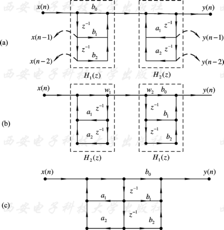
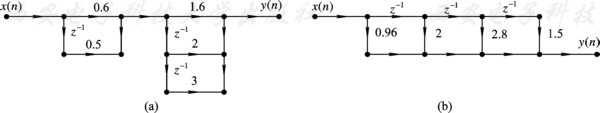

# 5 时域离散系统的网络结构

注意：本章系5+7.1

## 5.2 用信号流图表示网络结构

数字信号处理中有三种基本算法，即乘法、加法和单位延迟。

基本信号流图：

1. 信号流图中所有支路都是基本支路，即支路增益是常数或者是 $z^{-1}$ ；
2. 流图环路中必须存在延迟支路；
3. 节点和支路的数目是有限的。

---

信号流图的**梅森增益公式** Masson

$$
H(z) = \frac{1}{\Delta} \sum_k g_k \Delta_k
$$

$\Delta$ 称为流图的特征行列式
$k$ 表示由源点到阱点之间第k条前向通路的标号。
$g_k$ 表示由源点到阱点之间的第 k 条前向通路的增益。
$\Delta_k$ 称为对于第 k 条 它是除去与 k 条前向通路相接触的环路外，余下的特征行列式。

---

一般将网络结构分成两类：

* 有限长单位脉冲响应网络， 简称FIR（Finite Impulse Response）网络。
* 无限长单位脉冲响应网络， 简称IIR（Infinite Impulse Response）网络。

---

FIR网络中一般不存在输出对输入的反馈支路，因此差分方程用下式描述：

$$
y(n) = \sum_{i=0}^M b_i x(n-i)
$$

其单位脉冲响应h(n)是有限长的

$$
H(z) = \sum_{i=0}^M b_i z^{-i}
$$

---

IIR网络结构存在输出对输入的反馈支路，也就是说，信号流图中**存在反馈环路**。

这类网络的单位脉冲响应是无限长的。例如，一个简单的一阶IIR网络的差分方程为

$$
y(n) = a y(n-1) + x(n)
$$

其单位脉冲响应 $h(n)=a^n u(n)$

$$
H(z) = \frac{1}{1-az^{-1}}
$$

## 5.3 FIR

无限长脉冲响应基本网络结构

### 5.3.1 直接型

@Masson

对应的系统函数为

$$
H(z) = \frac{\sum_{i=0}^M b_i z^{-i}}{1 - \sum_{i=1}^N a_i z^{-i}}
$$

---

$y(n) = a_1y(n-1) + a_2y(n-2) + b_0x(n) + b_1x(n-1) + b_2x(n-2)$

两个系统交换次序 $H(z) = H_1(z)H_2(z) = H_2(z)H_1(z)$

$$
H(z) = \frac{b_0 + b_1z^{-1} + b_2z^{-2}}{1 - a_1z^{-1} - a_2z^{-2}}
$$

---

Example: IIR 系统的系统函数，画出直接型网络结构

$$
H(z) = \frac{8 - 4z^{-1} + 11z^{-2} - 2z^{-3}}{1 - \frac{5}{4}z^{-1} + \frac{3}{4}z^{-2} - \frac{1}{8}z^{-3}}
$$

### 5.3.2 级联型

系统函数 $H(z)$ 中，分子、分母均为多项式，且多项式的系数一般为实数。

$$
H(z) = A \frac{\prod_{i=0}^M (1 - C_i z^{-1})}{\prod_{i=1}^N (1 - d_i z^{-1})}
$$

这样H(z)就分解成一些一阶或二阶的子系统函数的相乘形式: $H(z) = H_1(z) H_2(z) \cdots H_L(z)$

级联型结构中每一个一阶网络决定一个零点、一个极点，每一个二阶网络决定一对零点、一对极点。

### 5.3.3 并联型

如果将级联形式的H(z)展成部分分式形式，则得到:

$$
H(z) = H_1(z) + H_2(z) + \cdots + H_L(z)
$$

## 5.4 IIR

有限长脉冲响应基本网络结构

### 5.4.1 直接型

按照H(z)或者差分方程直接画出结构图。这种结构称为直接型网络 结构或者称为卷积型结构。

$$
y(n) = \sum_{m=0}^{N-1} h(m) x(n-m)
$$

### 5.4.2 级联型

将H(z)进行因式分解，并将共轭成对的零点放在一起，形成一个系数为 实数的二阶形式，这样级联型网络结构就是由一阶或二阶因子构成的级联结构，其中每一个因式都用直接型实现。

【例5.4.1】 设FIR网络系统函数H(z)如下式：

$$
H(z) = (0.6 + 0.5 z^{-1}) (1.6 + 2 z^{-1} + 3 z^{-2})
$$

其级联型结构和直接型结构如图5.4.2所示。

级联型结构每一个一阶因子控制一个零点，每一个二阶因子 控制一对共轭零点，因此调整零点位置比直接型方便。

但**H(z)中的系数比直接型多，因而需要的乘法器多**。在例5.4.1 中直接型需要四个乘法器，而级联型则需要五个乘法器。

分解的因子愈多，需要的乘法器也愈多。另外，当H(z)的阶次 高时，也不易分解。因此，普遍应用的是直接型。

## 5.5 线性相位结构

线性相位结构是FIR系统的直接型结构的简化网络结构，特点是网络具有线性相位特性，比直接型结构**节约了近一半的乘法器**。

如果系统具有线性相位，它的单位脉冲响应满足下面公式:

$$
h(n) = \pm h(N-n-1)
$$

式中，“+”代表第一类线性相位滤波器; “-”号代表第二类线性相位滤波器。
