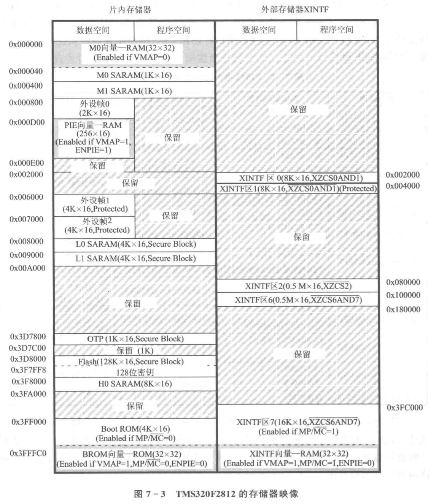

# DSP应用开发

## 1 How to start

DSP = [Digital signal processing](https://en.wikipedia.org/wiki/Digital_signal_processing) 数字信号处理器

DSP的特点

* 采用哈佛结构
* 采用流水线技术
* 硬件乘法器
* 多处理单元

需要的知识

* 速速学C/C++
* 信号与系统

典型DSP算法？

How to choose DSP -> TI DSP 具体型号的含义？

DSP 性能指标

DSP 开发工具

[CCSTUDIO](https://www.ti.com/tool/download/CCSTUDIO/) <- 全平台支持，好评。直接安装最新版了。

## 2 TMS320X2812 的结构、资源及性能

### 2.1 TMS320X2812 的片内资源

哈佛总线

TMS320X2812的片内外设

（1）事件管理器（Event Manager，EM）EVA/EVB，每个事件管理器具有:

* 2个通用定时器
* 3个全比较单元
* 3个捕获单元
* 1个QEP电路，可产生4路独立的PWM波形和6对12路互补的PWM波形

（2）ADC采样模块

---

TMS320F2812的主要特点 -- 见PPT（照片）

### 2.2 TMS320X2812 引脚分布

179 BGA/**176 LQFP**

## 3 TMS320X2812 的硬件设计

书上不对应的（恼

## 6 使用C语言操作DSP的寄存器

一些常用关键字

`const`

`volatile` 声明存储器或外设寄存器

`cregister` 允许采用高级语言访问特殊功能寄存器

`interrupt` 声明中断服务函数

在C语言中嵌入汇编语言

```c
asm("MOV DP,#0x0000");
```

`extern` 声明外部变量

### 6.1 寄存器的C语言访问

位定义和寄存器结构体方式？

---

SCI的寄存器

SCIA寄存器文件

| 寄存器名 | 寄存器地址 | 占用空间 |          功能描述          |
| :------: | :--------: | :------: | :------------------------: |
|  SCICCR  | 0x00007050 |   16位   |     SCIA通信控制寄存器     |
| SCICTL1  | 0x00007051 |   16位   |       SCIA控制寄存器       |
| SCIHBAUD | 0x00007052 |   16位   |   SCIA波特率高字节寄存器   |
| SCILBAUD | 0x00007053 |   16位   |   SCIA波特率低字节寄存器   |
| SCICTL2  | 0x00007054 |   16位   |      SCIA控制寄存器2       |
| SCIRXST  | 0x00007055 |   16位   |     SCIA接收状态寄存器     |
| SCIRXEMU | 0x00007056 |   16位   | SCIA接收仿真数据缓冲寄存器 |
| SCIRXBUF | 0x00007057 |   16位   |     SCIA接收缓冲寄存器     |
| SCITXBUF | 0x00007059 |   16位   |     SCIA发送缓冲寄存器     |
| SCIFFTX  | 0x0000705A |   16位   |   SCIA发送FIFO控制寄存器   |
| SCIFFRX  | 0x0000705B |   16位   |   SCIA接收FIFO控制寄存器   |
| SCIFFCT  | 0x0000705C |   16位   |    SCIA FIFO控制寄存器     |
|  SCIPRI  | 0x0000705F |   16位   |    SCIA优先级控制寄存器    |

SCIB寄存器文件 -- 类似

---

使用位定义方式定义寄存器

位域

```c
struct SCICCR_BITS
{
    Uint16 SCICHAR:3; // 字符长度控制位
    Uint16 ADDRIDLE_MODE:1;
    Uint16 LOOPBKENA:1;
    Uint16 PARITYENA:1;
    Uint16 PARITY:1;
    Uint16 STOPBITS:1;
    Uint16 rsvd1:8;
};
struct SCICCR_BITS bits;
bit.SCICHAR = 7;
```

需要从最低位开始定义

声明共同体

```c
union SCICCR_REG
{
    Uint16 all;
    struct SCICCR_BITS bit;
};
union SCICCR_REG SCICCR;
SCICCR.all = 0x007F;
SCICCR.bit.SCICHAR = 5;
```

创建结构体文件

### 6.2 寄存器文件的空间分配

CMD文件的功能: 用于描述DSP的内存空间分配情况

`pragma` 将寄存器~~文件分配到指定的内存空间~~

```c
#pragma DATA_SECTION(SciaRegs,"SciaRegsFile");
volatile ...
#pragma DATA_SECTION(ScibRegs,"ScibRegsFile");
volatile ...
```

`MEMORY` 指示寄存器的实际硬件空间

```c
MEMORY
{
    ...
    PAGE 1:
    SCI_A: origin = 0x007050, length = 0x000010;
    SCI_B: origin = 0x007750, length = 0x000010;
    ...
}
```

`SECTION` 指示寄存器数据段...

```c
SECTIONS
{
    ...
    SciaRegsFile: > SCI_A, PAGE 1
    ScibRegsFile: > SCI_B, PAGE 1
    ...
}
```

## 7 存储器的结构、映像、CMD文件的编写

### 7.2 F2812的存储器

F2812的存储器结构

F2812的存储器映像



### 7.3 CMD File

链接命令文件 Linker Command File

COFF格式

#### 7.3.2 C语言生成的段

C语言生成的段可以分为两大类：已初始化的段和未初始化的段。已初始化的段含有真实的指令和数据，存放在程序存储空间。未初始化的段只是保留变量的地址空间，在 DSP上电调用`_c_int0`初始化库前，未初始化的段并没有真实的内容。末初始化的段存放在数据存储空间。

#### 7.3.3 CMD 文件的编写

1 通过`MEMORY`指令定义存储器空间

```c
MEMORY
{
PAGEO; name0[(attr)]:origin = constant,length = constant
PAGEn: namen[(attr)]:origin = constant, length = constant
}
```

2 通过`SECTIONS`指令分配到存储空间

```c
SECTIONS
{
name0: > PAGE0, PAGE1, PAGE2, PAGE3, PAGE4, PAGE5, PAGE6, PAGE7
}
```

`load = alloction` 定义~~加载到存储器的文件~~ 输出段将被装载到哪里
`run` 定义程序的入口点

### 7.4 外部接口 XINIF

采样非复用异步总线

外部时钟？？？

## 8 X281x的时钟和系统控制

### 8.1 OSC & PLL

震荡器 & 锁相环

### 8.3 看门狗电路

BOOK P130

关联 图8-3

### 8.5 时钟和系统控制模块的寄存器

表 8-3 锁相环 PLL、时钟、看门狗和低功耗模式的配置寄存器

---

(1) 外设时钟控制寄存器

...

(5) PLL 控制寄存器

### 8.6 系统初始化函数

... BOOK P137

DSP28_SysCtrl.c

```c
void InitSysCtrl(void)
{
    Unit16 i;
    EALLOW;
    ...
    SysCtrlRegs.PLLSTS.bit.DIVSEL = 0;
    ...
    SysCtrlRegs.PLLSTS.bit.MCLKOFF = 1;
    ...
    // Initalize PLL
    SysCtrlRegs.PLLCR = 0xA;
    ...
    // 如果外部晶振位 30 MHz，则 SYSCLKOUT=(30 MHz * 10)/2=150 MHz
    // Wait for PLL to lock
    for(i = 0; i < 5000; i++){}
    ...
    SysCtrlRegs.PLLSTS.bit.MCLKOFF = 0;
    ...
    EDIS;
}
```

关于计算 -- NMSL

## 9 GPIO

### 9.1 GPIO 多路复用器

「复用」

## 10 CPU 定时器

### 10.1 CPU 定时器工作原理

BOOK P154-156

几个寄存器

PRDH: PRD -- 32位的定时器周期寄存器
TIMH: TIM -- 32位的定时器计数寄存器
TDDRH: TDDR -- 16位的定时器分频寄存器
PSCH: PSC -- 16位的预定标寄存器

## 11 X2812的中断系统

### 11.1 什么是中断

这还需要解释吗，请bing

### 11.2 X2812的CPU中断

看书，请。

### 11.3 X2812的PIE中断

Peripheral Interrupt Expansion Block

看书，请。

### 11.4 X281x的三级中断系统分析

## 12 事件管理器EV

### 12.1 事件管理器的功能

看书，请。P189

### 12.2 通用定时器

#### 12.2.1 通用定时器的时钟

关注书P194 图12-4

#### 12.2.2 通用定时器的计数器

(1) 停止/保持模式

#### 12.2.3 通用定时器的中断事件

上溢、下溢、比较事件

#### 12.2.5 通用定时器的比较操作和PWM波

1. 当 T1CNT 工作于连续增计数模式时，T1PWM_TICMP 引脚输出不对称的PWM波形
2. 当 T1CNT 工作于连续增/减计数模式时，T1PWM_TICMP 引脚输出对称的PWM波形

## 参考资料

教材: 《手把手教你学DSP 基于TMS320X281X 第3版》

[书中标记资料地址](http://hellodsp.com/)
