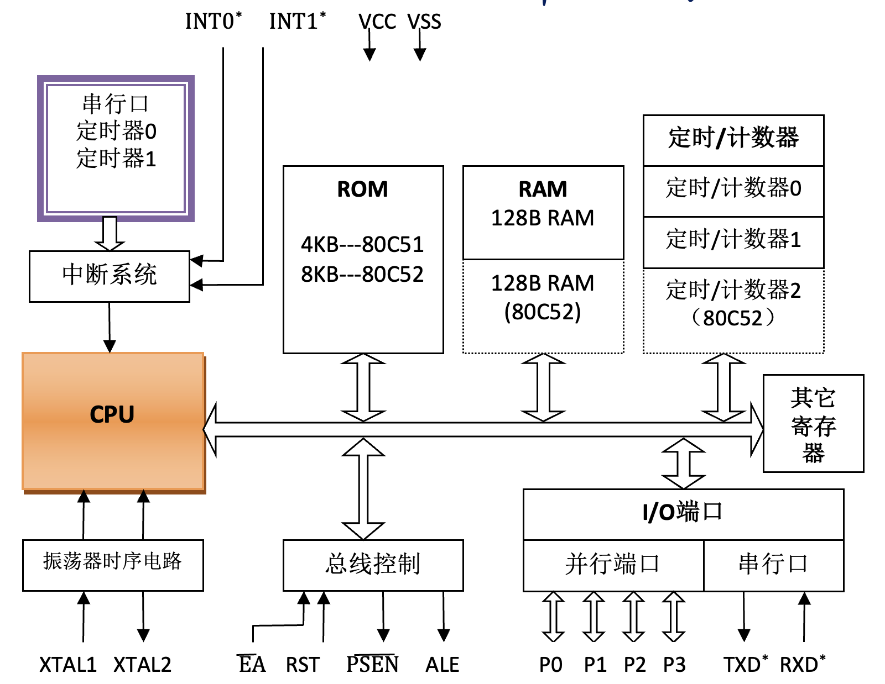
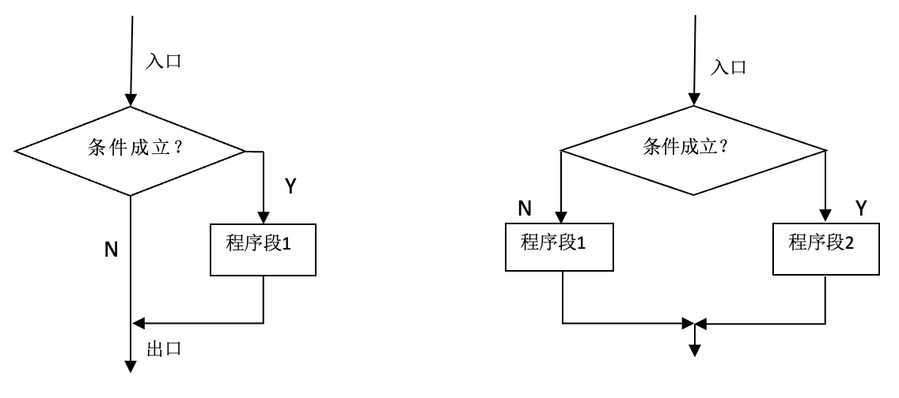
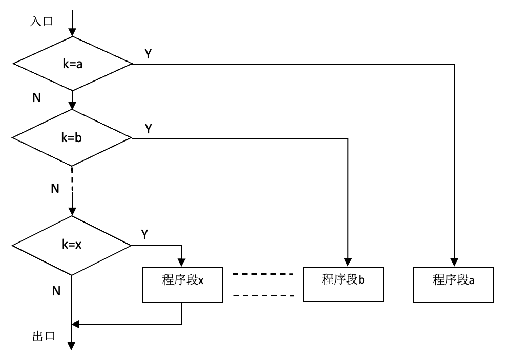

# 单片机原理及应用

To add a new .asm file to a Keil project, you can follow these steps:

1. Open your Keil project.
2. Right-click on the **Target** or **Group** where you want to add the new .asm file.
3. Select **Add New Item to Group** from the context menu.
4. In the **Add New Item** dialog box, select **Asm File** under the **File Type** drop-down menu.
5. Enter a name for your new .asm file and click **Add**.

Your new .asm file will be added to your project and you can start writing your Assembly code in it.

---

bing ai: The code is intended for an 8051 microcontroller. I assemble this code using Keil uVision 5.

## 1 绪论

需要使用的软件 keil、proteus

中断源/控制源 = 5/2

全双工 异步

## 2 单片机的结构与原理

单片机的内部结构



8位单片机

* 并行接口 4个IO口 8位
* 串行接口 1个 全双工
* 定时器/计数器 2个 16位
* 5个中断应用
* 哈佛结构 ROM4kb + RAM128b

全双工: 可以同时发送和接受

### 2.2 单片机的引脚功能

电源引脚 VCC GND

控制信号引脚
RST 复位
ALE 地址锁存允许信号输出
EA 内部及外部ROM选择端

### 2.3 单片机的CPU

运算器
ALU 算术逻辑运算单元 算数运算+逻辑运算
缓冲器

寄存器B —- 较少用

ACC 累加器A 8位寄存器 向ALU提供操作数和存放运算的结果

程序状态字寄存器**PSW**

* D7: CY 进位, 对运算结果标记=1时进位
* D6: AC 辅助进位标志位
* D5: F0
* D4: RS1 (工作寄存器组选择位) -- 4种组合
* D3: RS0
* D2: OV 溢出标志位
* D1: -
* D0: P 奇偶校验位, 用于管理A中1的个数为奇数 (1) 还是偶数 (0)

您好，这是Bing。根据网上的资料，我尝试补全以下表格¹²：

| PSW.4（RS1） | PSW.3（RS0） | 当前使用的工作寄存器组的R0～R7 |
| :----------: | :----------: | :----------------------------: |
|      0       |      0       |        0组（00H～07H）         |
|      0       |      1       |        1组（08H～0FH）         |
|      1       |      0       |        2组（10H～17H）         |
|      1       |      1       |        3组（18H～1FH）         |

程序计数器PC: 16位专用寄存器，存放下一条将要执行的指令的起始地址
PC的位宽为16，这决定了单片机对程序存储器可以直接寻址的空间范围为64KB

PC的基本工作方式有如下几种：
（1）自动加1计数操作工作方式。
（2）复位工作方式。上电复位后从0000H开始执行程序。
（3）赋值工作方式。

自动+1计数操作工作模式，使程序顺序执行
复位后，PC的值 = 0000H，地址范围 = 0000H ～ 0FFFH

DPTR (数据指针)可拆分为DPH+DPL (高/低8位)

震荡器和时钟电路 晶振 XTAL1/2

CPU的时序

时序单位

(1) 时钟周期 $T_{osc}$
(2) 状态周期 $T_{s} = 2T_{osc}$
(3) 机器周期 $T_{m} = 12T_{osc}$
(4) 指令周期 以机器周期计数

晶振频率=12MHz，时钟周期=1/12M秒; 状态周期=1/12M×2秒=1/6M秒; 机器周期=1/12M×12秒=1us

指令时序

### 2.4 单片机的存储器 (重点)

#### 2.4.1 程序存储器ROM

外扩后，统一编址 4k+64k 关联PC—16位寄存器

`MOVC` 访问内部存储器
`MOVX` 访问外部RAM存储器

起始指令 `ORG 0000H`, `AJMP MAIN`

中断服务程序入口: 0003H～000BH (需要了解其入口地址，关联第5章)

占用端口(单元？)数8个 -- 书P31

#### 2.4.2 数据存储器RAM

外扩后，单独编址 128b+64k

片内数据存储器的结构

* 数据缓冲区 地址：30H~7FH
* 位寻址区 地址：20H~2FH
* 工作寄存器区 R0~R7 地址：00H~1FH
* 工作寄存器组的选择 PSW - RS1/0

位寻址区 共128位 20H~2FH

位操作 如`MOV 20H.3, C`

位地址

数据缓冲区 30H～7FH

只能字节寻址

`MOV 30H, #45H` 表示30H的内容是45H

特殊功能寄存器SFR

(1) 与计算有关 B ACC PSW
(2) 与端口有关 并行 P0-3 / 串行 SBUF PCON SCON
(3) 与中断有关 IP IE 设置优先级
(4) 与定时器/计数器有关 TH1/0 ... etc
(5) 指针类 SP DPTR 存放地址

堆栈指针SP

堆栈 临时存放数据/地址 可用于保护断点/现场
数据入栈`PUSH` 出栈`POP` (重点)

PUSH操作步骤

```asm
; (ACC) = 00H , (50H) = 23H
MOV SP, #30H ; (SP)= 30H 地址，设置栈底
PUSH ACC ; 直接地址direct 此时(SP)=31H(地址) (31H) = 00H
PUSH 50H ; 此时(SP)=32H(地址) (32H) = 23H
```

POP指令操作步骤

```asm
MOV SP, #32H ; 找到当前SP地址，以及地址的内容
POP ACC ; (ACC) = 23H (SP) = 31H
POP B ; (B) = 00H (SP) = 30H
```

利用`PUSH`和`POP`实现数据互换

PUSH指令将ACC和B的内容压入栈中，POP指令将栈顶的内容弹出到B中，再将下一个栈顶的内容弹出到ACC中，实现了交换两个寄存器的内容。

```asm
PUSH ACC
PUSH B
POP ACC ; 交换pop顺序，实现内容互换
POP B
```

入栈过程

```asm
MOV SP, #30H    ; (SP)=30H
MOV  A,  #10H   ; (ACC)=10H
PUSH   ACC      ; (SP)=31H (31H)=10H
MOV   A, #21H   ; (ACC)=21H
PUSH  ACC       ; (SP)=32H (32H)=21H
; ……
; 最终（SP）=39H
```

出栈过程

```asm
(SP)=39H
POP ACC     ; (ACC)=8AH (SP)=38H
; …… 
POP  ACC    ; (ACC)=21H (SP)=31H
POP  ACC    ; (ACC)=10H (SP)=30H
```

### 2.5 51单片机的I/O端口

4个8位并行I/O口 P0/P1/P2/P3

分时复用端口

* P0 外扩ROM/RAM -> 低8位地址+数据
* P2 外扩ROM/RAM -> 高8位地址
* P3 第二功能

2.5.1 P0

输入时，端口锁存器先置1 `MOV P0, #0FFH`
读引脚时，需要先将P0置1

P0做输出时，需要上拉电阻

第二功能: 地址/数据分时复用口，作为数据/地址（低8位）分时复用端口（外扩ROM RAM ）

输出逻辑1 T1截止 T2导通 (场效应管1时导通)
输出逻辑0 T2截止 T1导通

2.5.2 P1

8位准双向并行接口，无第二功能

2.5.3 P2

第二功能: 作为高8位地址输出端口（外扩ROM RAM ）

2.5.4 P3

8位准双向并行接口

第二功能，包括串行口输入、串行口输出、外部中断0输入、外部中断1输入、定时器/计数器0的外部输入等

### 2.6 单片机的工作方式

复位工作方式

复位: `RST`超过两个机器周期 T_m 的高电平

需要外部复位电路

上电复位/手动复位

复位后

SP 07H
P0-P3 FFH
PC 0000H
另外还有一些， 00H 居多

单片机的最小系统: 51单片机最小系统是指单片机可工作的最小模块，任何大系统都是从最小系统扩展而来的。传统的51单片机集成度低，最小系统应包括：**晶振电路，复位电路及电源**等。

## 3 单片机的指令系统

汇编语言指令格式: `[标号:] 操作码助记符 [目的操作数][, 源操作数] [;注释]`

MCS-51单片机汇编语言指令共有111条，包含有42种助记符，对应着255种具体的操作。根据指令不同的属性，111条汇编指令有三种不同的分类方法。

根据指令的时间属性分，111条汇编指令可分为三种：
单机器周期指令，有64条；
双机器周期指令，有45条；
四机器周期指令，有2条。

根据指令的空间属性分，111条汇编指令可分为三种：
单字节指令，有49条；
双字节指令，有45条；
三字节指令，有17条。

根据指令的功能属性来分类。任何类型单片机的指令系统实现的基本功能至少应包含数据传输类指令、运算类指令（包括算术运算、逻辑运算、位运算等）以及转移类指令等。MCS-51单片机的111条汇编语言指令按照功能可以细分为5类：
数据传输类指令（29条）
算术运算类指令（24条）
逻辑操作类指令（24条）
控制转移类指令（17条）
位操作类指令  （17条）

### 3.2 寻址方式

#### 3.2.1 立即寻址

立即数前面加符号`#`，用于区别操作数地址

```asm
MOV DPTR, #2345H
```

#### 3.2.2 寄存器寻址

指以通用寄存器的内容作为操作数

工作寄存器 RAM 00H~1FH

```asm
MOV A, R0
ADD A, R0
```

#### 3.2.3 直接寻址

直接寻址是指将寄存器的地址直接写入指令中，例如MOV A,P1，其中P1是一个特殊功能寄存器的地址。

可以访问以下存储单元

1. 内部数据地址的低128B
2. 特殊功能寄存器
3. 特殊功能寄存器中可以位寻址的位地址空间
4. 内部数据RAM地址空间子集的128位(位地址空间)

#### 3.2.4 寄存器间接寻址

指令中一个寄存器的内容是操作数的地址

在寄存器前加`@`表示寄存器间接寻址

只有R0/1可以作为地址指针

DPTR 可以访问外部RAM 64kb空间

```asm
; Ri
MOV A, @R0

; DPTR
MOV DPTR, #1234H
MOVX A, @DPTR
```

#### 3.2.5 变址寻址

基地址(PC/DPTR的内容)+偏移量(变址寄存器A的内容) = 操作数

用于查表
表首地址 #TABLE

```asm
MOV A, #01H
MOV DPTR, #TABLE
MOVC A, @A+DPTR
```

说是DPTR比PC方便一点 具体看教材P57

#### 3.2.6 相对寻址

以`PC`的当前值为基准，加上相对偏移量`rel`
相对偏移量rel: 带符号的8进制数，补码

目的地址 = 源地址 + 转移字节数 + rel

```asm
SJMP REL
```

#### 3.2.7 位寻址

关联 布尔处理器

```asm
MOV 20H, C
```

### 3.3 单片机指令集

操作数约定符号

`Rn, n = 0,...,7` 当前被选定寄存器组的8个工作寄存器R0~R7
`Ri, i = 0,1` 当前被选定寄存器组的2个工作寄存器R0,R1
`direct` 8位内部存储器单元的地址，RAM(00H~7FH)/(SFR)的地址
`#data` 指令中的8位立即数
`#data16` 指令中的16位立即数
`addr16` 表示16位目标地址，用于 `LCALL` 和 `LJMP` 指令
`addr11` 表示11位目标地址，用于 `ACALL` 和 `AJMP` 指令
`rel` 带符号的8位偏移地址
`bit` 位地址
`@` 寄存器间接寻址符号
`/` 位操作的前缀，表示对该位操作数取反

#### 3.3.1 数据传送类指令

访问片内RAM: MOV
访问片外RAM: MOVX
访问片内外ROM指令: MOVC
访问堆栈: PUSH POP
数据交换: XCH XCHD SWAP

(1) 片内RAM数据传送指令

1. 以累加器A为目的操作数的指令

    ```asm
    MOV A, Rn
    MOV A, direct
    MOV A, @Ri
    MOV A, #data
    ```

2. 以工作寄存器Rn为目的操作数的指令
注意: 不能出现 `Rn`、`@Ri`，来做数据传送

    ```asm
    MOV Rn, A
    MOV Rn, direct
    MOV Rn, #data
    ```

3. 以直接地址direct为目的操作数的指令

    ```asm
    MOV direct, A ;(direct) <- (A)
    MOV direct, Rn ;(direct) <- (Rn)
    MOV direct1, direct2 ;(direct1) <- (direct2)
    MOV direct, @Ri ;(direct) <- ((Ri))
    MOV direct, #data ; (direct) <- #data
    ```

(2) 片外RAM数据传送指令

```asm
; read RD
MOVX A, @DPTR
MOVX A, @Ri

; write WR
MOVX @DPTR, A
MOVX @Ri, A
```

举例，内部R0 -> 外部30H

```asm
MOV DPTR, #30H
MOV A, R0
MOVX @DPTR, A
```

DPTR存放地址

查表

```asm
MOV DPTR, #TABLE
MOV A, R1
MOVC A, @A+DPTR
```

(3) 片内外ROM访问指令

```asm
MOVC A, @A+DPTR ; (A) <- ((A)+(DPTR))
MOVC A, @A+PC
```

(4) 堆栈操作指令

```asm
PUSH direct ; (SP) <- (SP)+1 ((SP)) <-(direct)
POP direct ; (direct) <-((SP)) , (SP) <- (SP)-1
```

(5) 数据交换指令

1 字节交换指令

```asm
XCH A, Rn ; (A) <-> (Rn)
XCH A, direct ; (A) <-> (direct)
XCH A, @Ri ; (A) <-> ((Ri))
```

2 半字节交换指令

```asm
XCHD A, @Ri
```

3 累加器A的低4位与高4位互换指令

```Asm
SWAP A
```

#### 3.3.2 算术运算类指令

(1) 加法指令

1. 不带进位的加法指令

    ```asm
    ADD A, Rn ; (A) <- (A) + (Rn)
    ADD A, direct ;(A) <- (A) + (direct)
    ADD A, @Ri ; (A) <- (A) + ((Ri))
    ADD A, #data ; (A) <- (A) + #data
    ```

2. 带进位的加法指令
在 ADDC 指令中，CY 代表进位标志位，用于表示加法进算中的进位和减法运算中的借位。加法运算中有进位或减法运算中有借位则 CY 位置 1，否则为 0

    ```asm
    ADDC A, Rn ; (A) <- (A) + (Rn) + (CY)
    ADDC A, direct ;(A) <- (A) + (direct) + (CY)
    ADDC A, @Ri ; (A) <- (A) + ((Ri)) + (CY)
    ADDC A, #data ; (A) <- (A) + #data + (CY)
    ```

(2) 减法指令

```asm
SUBB A, Rn ; (A) <- (A) - (Rn) - (CY)
SUBB A, direct ;(A) <- (A) - (direct) - (CY)
SUBB A, @Ri ; (A) <- (A) - ((Ri)) - (CY)
SUBB A, #data ; (A) <- (A) - #data - (CY)
```

OV的判断?

(3) +1/-1指令

1. +1 指令

    ```asm
    INC A ; (A) <- (A)+1
    INC Rn
    ...
    INC DPTR
    ```

2. -1 指令

    ```asm
    DEC A
    DEC Rn
    DEC direct
    DEC @Ri
    ```

(4) 乘法指令

```asm
MUL AB ; (A)*(B)
```

低8位放在A中，高8位放在B中

(5) 除法指令

```asm
DIV AB
```

A 被除数 B 除数
结果 A 商 B 余数
if 除数 = 0， OV = 0

(6) 十进制调整指令

十进制调整指令 AD 用于对 BCD 码的加法运算结果自动进行修正，但 BCD 码的减法运算不能用此指令来进行修正。

十进制调整的实质是将十六进制的加法运算转换成十进制 -- +06H

BCD 码是用 4 位二进制数表示 1 位十进制数的编码，例如十进制数 9 用 BCD 码表示为 1001

```asm
DA A
```

#### 3.3.3 逻辑运算类指令

ANL / ORL / XRL

CLR / CPL

RL / RLC / RR / RRC

(1) 逻辑运算指令

1. 与 and
计算: 转二进制，一位一位与即可
可以用于将指定位置0

    ```asm
    ; to A
    ANL A, Rn
    ANL A, direct
    ANL A, @Ri
    ANL A, #data

    ; to direct
    ANL direct, A
    ANL direct, #data
    ```

2. 或 or
可以用于将指定位置1

    ```asm
    ORL A, Rn
    ORL A, direct
    ORL A, @Ri
    ORL A, #data
    ```

3. 异或 xrl
可以用于将指定位取反，与1异或即可

    ```asm
    XRL A, Rn
    XRL A, direct
    XRL A, @Ri
    XRL A, #data
    ```

(2) 累加器A的清零/取反

A清零: `CLR A`

(3) 移位指令

1. 左移
将A中的内容左移一位，D7循环回D0

    ```asm
    RL A ; 1010 0111 -> 0100 1111
    ```

2. 右移
将A中的内容右移一位，D0循环回D7

    ```asm
    RR A ; ...
    ```

3. 带进位循环的左/右移指令

    RLC / RRC
    可以用于*2运算

#### 3.3.4 控制转移类指令

* 无条件转移指令: LJMP AJMP SJMP JMP
* 条件转移指令: JZ JNZ CJNE DJNZ
* 子程序调用及返回指令: ACALL LCALL RET RETI
* 空操作指令: NOP

(1) 无条件转移指令

在80C51单片机中，不同的跳转指令具有不同的跳转范围。

1. SJMP（Short Jump）指令：SJMP指令用于进行相对短跳转。它可以跳转到当前指令的相对偏移位置。SJMP指令的跳转范围是-128到+127字节。

2. AJMP（Absolute Jump）指令：AJMP指令用于进行相对中跳转。它可以跳转到指定的地址范围内。AJMP指令的跳转范围是0到2047字节。AJMP指令通过指定目标地址的高5位来确定目标地址。

3. LJMP（Long Jump）指令：LJMP指令用于进行绝对长跳转。它可以跳转到整个64KB的程序存储器中的任何位置。LJMP指令的跳转范围是0到65535字节。LJMP指令通过指定目标地址的16位来确定目标地址。

因此，根据上述信息，SJMP的跳转范围是-128到+127字节，AJMP的跳转范围是0到2047字节，LJMP的跳转范围是0到65535字节。

长跳转指令 LJMP: 范围最大

```asm
LJMP addr16 ; (PC) <- addr16
```

绝对跳转指令 AJMP: 范围: 1000H - 17FFH

```asm
AJMP addr11 ; (PC) <- (PC)+2 or ... 
```

短转移指令 SJMP: 范围 $\pm$ 256b

```asm
SJMP rel
```

间接转移指令

选择不同偏移值

```asm
JMP @A+DPTR
```

(二) 条件转移指令

1. 累加器判0条件转移指令
以A的内容是否为0来判断是否转移

    ```asm
    JZ rel ; if (A) = 0, exec (PC) <- (PC)+2+rel, else, (PC) <- (PC)+2
    JNZ rel ; 

    ; example if (A) ... 
    JZ NEXT
    MOV 55H, #0FFH
    SJMP EXIT
    NEXT: MOV 55H, #00H
    EXIT: SJMP EXIT
    ```

2. 比较转移指令

    若目的操作数 > 源操作数，则`CY`清0；若目的操作数 < 源操作数，则`CY`置1

    CJNE 的作用是比较两个操作数，如果相等则按顺序执行下一条指令，否则进行转移。

    CJNE 指令的语法格式为：`CJNE A, #data, label`。其中，A 为累加器，#data 为立即数，label 为转移地址。

    例如，下面的代码段比较累加器 A 的值和立即数 0x05，如果不相等，则跳转到标号 L1 处执行。

    ```asm
    CJNE A, #05H, L1
    ```

    ```asm
    CJNE A, #data, rel
    CJNE A, direct, rel
    CJNE Rn, #data, rel
    CJNE @Ri, #data, rel
    ```

3. 减1条件转移指令

    -1 非0 转移

    DJNZ 是 8051 单片机汇编语言中的一条指令，是循环转移指令。DJNZ 指令的作用是将寄存器 Rn 中的值减 1，然后判断结果是否为 0。如果结果不为 0，则跳转到目标地址执行，否则继续执行下一条指令。

    DJNZ 指令的格式为：DJNZ Rn, rel，其中 Rn 是要操作的寄存器，rel 是相对地址。例如：DJNZ R6, Loop，意思是每转移到标号 Loop 一次 R6 就减 1；直到 R6=0 时执行下一条指令。

    The maximum number of times this instruction can loop is 256 times because the register being decremented is 8 bits in size and can hold a maximum value of 255. When the register reaches 0 and is decremented again, it will wrap around to 255.

    ```asm
    DJNZ Rn, rel
    DJNZ direct, rel
    ```

(3) 子程序调用及返回指令

1. 调用指令

    会自动完成保护断点的操作

    ACALL指令是一种汇编指令，用于调用子程序。当执行ACALL指令时，会将当前程序计数器PC的值增加2，然后将PC的值压入栈中，接着将子程序的地址送入PC中，从而实现了对子程序的调用。

    ```asm
    ACALL addr11
    LCALL addr16
    ```

2. 返回指令

    功能: 恢复断点，通过两次出栈完成恢复

    ```asm
    RET ; at the end of 子程序
    RETI ; at the end of 中断服务程序
    ```

#### 3.3.5 位操作指令

(1) 位传送运算类指令

1. 位传送指令

    ```asm
    MOV C, bit
    MOV bit, C
    ```

2. 位赋值指令

    置位指令

    ```asm
    SETB C
    SETB bit
    ```

    位清零指令

    ```asm
    CLR C
    CLR bit
    ```

3. 位运算指令

    与运算

    ```asm
    ANL C, bit
    ANL C, /bit
    ```

    或逻辑

    ```asm
    ORL C, bit
    ORL C, /bit
    ```

    取反指令

    ```asm
    CPL C
    CPL bit
    ```

(2) 控制传送指令

以标志位 CY 或 位地址 bit 作为转移的条件

1. 以CY内容为条件的转移指令

    ```asm
    JC rel ; 1 转移, 0 顺序执行
    JNC rel ; 0 转移, 1 顺序执行
    ```

2. 以位地址内容为条件的转移指令

    ```asm
    JB bit, rel ; 1 转移, 0 顺序执行
    JNB bit, rel ; 0 转移, 1 顺序执行
    JBC bit, rel ; 1 转移, 0 顺序执行, 再bit清零
    ```

### 3.4 汇编语言程序设计

伪指令: 伪指令是给汇编程序的命令，它不会被翻译成机器代码，也不会控制机器的操作，只是指导汇编程序如何进行汇编。伪指令可以用来定义变量，分配内存空间，规定程序的起始地址等。伪指令与指令的区别是，伪指令只在汇编时有效，而指令是机器运行时执行的动作 （汇编过程）

常用伪指令

(1) ORG

start a program with `ORG 0000H`

功能: 修改当前端定位计数器的值

地址从小到大，可以多次出现

(2) END

功能: 表示程序结束

只能出现一次

(3) EQU

用来定义一个符号，并为该符号分配一个数值

(4) DATA, IDATA, ...

(5) DB, DW

属于存储空间初始化伪指令，是分别以字节和字为单位初始化程序存储器空间

存储字节 `DB 1, 2, 3, 114`
存储字 先高8位，再低8位 `DW 78H, 1234H`

#### 3.4.3 顺序结构 Code Example

ex.1 将外部RAM的0010H和0020H单元中的内容互换

```asm
MOV  DPTR,  #0010H ; 修改地址指针为外部RAM的0010H单元
MOVX A,     @DPTR ; 读取0010H单元的内容到累加器A
MOV  30H,   A ;  0010H单元的内容暂存到内部RAM 30H单元
MOV  DPTR,  #0020H ; 修改地址指针为外部RAM的0020H单元
MOVX A,     @DPTR ; 读取0020H单元的内容到累加器A
MOV  DPTR,  #0010H ; 修改地址指针为外部RAM的0010H单元
MOVX @DPTR, A ; 将0020H单元的内容写到0010H单元
MOV  A,     30H ; 将暂存到30H单元的0010H单元内容送A
MOV  DPTR,  #0020H ; 修改地址指针为外部RAM的0020H单元
MOVX @DPTR, A ; 将0010H单元的内容写到0020H单元
```

#### 3.4.4 分支结构 Code Example

单/双分支结构图



多分支结构图



ex. $x$ in 60H, 实现 $ y = \begin{cases}
       x+1 & x = 10 \\
       6 & x \neq 10
\end{cases}$

```asm
; 用伪指令符号定义自变量X和函数Y,目的是提高程序可读性
X  DATA 60H  ; 用伪指令符号定义符号地址即变量X
Y  DATA 61H  ; 用伪指令符号定义符号地址即变量Y

; 入口 : 开始比较运算
MOV A, X          ; 取出自变量X的值送累加器A,准备比较
CJNE A,#10, BR2   ; 将自变量的值与常量10进行比较

; 分支1: X = 10 
BR1:                              
    INC A      ; 根据函数式要求,将自变量值加1
    MOV Y, A   ; 累加器A中的结果保存
    SJMP OutG  ; 分支1程序结束,跳转到同一的出口OutG

; 分支2: X ≠ 10
BR2:  MOV Y, #6  ; 根据函数式要求,将常量6送到Y中

; 出口 : 分支1和分支2的共同出口
OutG: SJMP $  ; 程序结束,停止向下运行
```

#### 3.4.5 循环结构 Code Example

计数式循环控制 / 条件式循环控制

ex. 将片内RAM的50H～5FH地址区间的数据缓冲区内容初始化为0～15，即(50H) = 0，(51H) = 1…，(5FH) = 15，然后将该区间50H～5FH数据缓冲区的内容复制到片内RAM的30H～3FH单元

```asm
; 循环结构初始化
MOV R7, #16 ; 设置循环计数器R7, 程序循环次数为16次
MOV R0, #50H ; 为地址指针变量设置初值
MOV A, #0H ; 为数据变量A设置初值

Lp1:
MOV @R0, A ; 将累加器的初始值写到R0指向的目标单元中
INC R0 ; 修改地址指针变量寄存器R0的值
INC A ; 修改数据变量累加器A中的值,指向下个数据
DJNZ R7, Lp1 ; 计数器的值减1并判断是否为0,不为0,继续执行循环体,否则循环结束,完成初始化

; 第2个循环程序: 完成数据缓冲区数据的复制
MOV R7, #10 ; 设置循环计数器R7, 程序循环次数为10次
MOV R0, #26H ; 为源数据缓冲区地址指针变量设置初值26H
MOV DPTR, #0010H ; 为目的数据缓冲区地址指针变量设置初值0010H
Lp2:
MOV A, @R0 ; 将源数据区单元中的数据读到累加器A
MOVX @DPTR, A ; 将累加器的值写到DPTR指向的目标单元中
INC R0 ; 修改地址指针变量寄存器R0中的值
INC DPTR ; 修改地址指针变量寄存器DPTR中的值
DJNZ R7, Lp2 ; 计数器的值减1并判断是否为0,不为0,继续执行循环体,否则,循环结束,完成数据复制

TAB:
DB 12H,03H,97H,61H,20H,60H,51H,88H,71H,32H
```

ex. 将片内RAM的26H～2FH地址区间的数据缓冲区内容初始化为12H，03H，97H，61H，20H，60H，51H，88H，71H，32H，然后将该区间26H～2FH数据缓冲区的内容复制到片外RAM地址从10H开始的存储单元中。

ex. 51单片机的系统时钟频率为12MHz，请设计一软件延时程序，延时时间为10ms

需要避免寄存器冲突

2Tm * 100

Tm = 1/12mhz * 12

```asm
; 外循环，实现延时10ms的程序，选用R6作为循环计数器
DL10ms: MOV R6, #10

; 延时1ms的程序，选用R7作为循环计数器
DL1ms:  MOV  R7,  #200 ; 为R7赋值指令，指令周期: 1个机器周期
DL5us:
    NOP   ; 空操作，   指令周期: 1个机器周期
    NOP   ; 空操作，   指令周期: 1个机器周期
    NOP   ; 空操作，   指令周期: 1个机器周期
    DJNZ R7,  DL5us ; DJNZ指令,  指令周期: 2个机器周期
    SJMP $
    DJNZ R6, DL1ms   ; 外循环判断控制
```

#### 3.4.6 子程序结构 Code Example

入口参数 / 出口参数

注意事项:

(1) 每个子程序必须有一个子程序名。子程序名实际上是子程序段中第一条指令的地址，是子程序的入口地址。
(2) 主程序通过子程序调用指令实现对子程序的调用。有长调用指令 `LCALL` 和绝对调用指令 `ACALL`
(3) 明确入口参数与出口参数
(4) 保护现场和恢复现场 -- 现场是指调用子程序时用到的寄存器或存储区，需要 `PUSH` 接 `POP`
(5) 子程序中最后一条指令是子程序返回指令 `RET` ，恢复断点到 `PC` ，使主程序从断点处继续执行。
(6) 子程序可以嵌套，即在一个子程序中调用另一个子程序

ex. 编程设计一个子程序，实现0～9数字平方的查表。设变量x的值存放在累加器A中，查表后所求的x^2的值放在累加器A中

solution1: use `DPTR`

solution2: use `PC`

`INC A` : 使得 `@A+PC` 成为表首地址

ex. LED0连接在P1.0，已知单片机的晶振频率是 12MHz，请编程实现发光二极管 LED0 亮0.1s灭0.1s的闪烁现象，要求采用模块化技术设计

```asm
    ORG 0000H  ; ORG伪指令
    SJMP Main  ; 复位入口地址处放一条转移至用户程序的转移指令 
    
; 主程序
    ORG 0030H  ; 用户程序从0030H单元开始存放, 目的是避开中断入口地址
Main:
    MOV SP,  #6FH ; 设置堆栈地址
    SETB P1.0  ; 设置LED灯的初始状态, 熄灭状态

LpLED:
    CLR P1.0  ; 点亮LED灯
    LCALL DL100ms  ; 调用延时0.1s的子程序, 令灯亮0.1s
    SETB P1.0  ; 熄灭LED灯
    LCALL DL100ms  ; 调用延时0.1s的子程序, 令灯灭0.1s
    SJMP LpLED  ; 重复上述过程。

; 子程序
; 子程序名:    DL100ms
; 子程序功能: 实现延时0.1s的子程序
; 子程序入口: 无
; 子程序出口: 无
DL100ms: MOV R6, #100    ; 外循环, 实现延时100ms,即0.1s

; 内循环, 实现延时1ms的程序, 选用R7作为循环计数器
DL1ms: MOV R7,  #200 ; 为R7赋值指令, 指令周期: 1个机器周期
DL5us:
    NOP     ; 空操作,    指令周期: 1个机器周期
    NOP     ; 空操作,    指令周期: 1个机器周期
    NOP     ; 空操作,    指令周期: 1个机器周期
    DJNZ    R7,     DL5us   ; DJNZ指令,  指令周期: 2个机器周期
    DJNZ    R6,     DL1ms   ; 外循环判断控制
    RET     ; 子程序返回
    END     ; 程序汇编结束
```

#### 3.4.7 汇编语言综合

(1) 数据传送类程序

ex. 编写程序，首先将片外RAM地址从0000H～22FFH单元的内容初始化为0FFH,然后将片内30H～60H单元中数据搬迁到片外RAM中的1000H～1030H单元中，并将源数据区清零

(2) 运算处理类程序

ex. 在多个单字节无符号数中查找最大数。设内部RAM从60H开始的单元中存放着8个无符号数，请找出最大数，并将其保存到片内30H单元中

使用了MOVX指令来读取和写入内存中的数据。使用了CJNE指令来比较两个值，并根据比较结果跳转到不同的标签。DJNZ指令用于循环计数。

```asm
; 初始化
MOV DPTR,#60H ; DPTR指向第一个数
MOV A,#00H ; A寄存器清零
MOV R0,A ; R0寄存器清零
MOV R1,A ; R1寄存器清零

; 循环比较
LOOP:
    MOVX A,@DPTR ; 读取内存中的数据到A寄存器
    CJNE A,R0,COMPARE ; 如果A不等于R0，跳转到COMPARE
    SJMP NEXT ; 否则跳转到NEXT

COMPARE:
    CJNE A,R1,COMPARE2 ; 如果A不等于R1，跳转到COMPARE2
    SJMP NEXT ; 否则跳转到NEXT

COMPARE2:
    JC MAX ; 如果A大于R1，跳转到MAX
    MOV R1,A ; 否则将A赋值给R1

MAX:
    MOV R0,A ; 将A赋值给R0

NEXT:
    INC DPTR ; DPTR指向下一个数
    DJNZ R2,LOOP ; 重复循环直到所有数都比较完毕

; 保存最大数到内存中
MOVX @DPTR,R0 ; 将最大数保存到内存中
```

(3) I/O口操作类程序设计

ex. 请编程实现由外到里的双向跑马灯程序。即每个LED灯点亮0.3S后熄灭，然后相邻的灯再点亮0.3s后熄灭，方向自外而里。发光二极管控制电路如图所示，当P1.0输出为高电平即逻辑“1”时，LED1熄灭，否则，输出为低电平时即逻辑“0”，LED1点亮。

## 4 设计实例入门

见 folder -> [51_ex](./51_ex/)

## 5 单片机中断系统的原理及其应用

### 5.1 中断的基本概念

中断是为使单片机具有对外部或内部随机发生的事件实时处理而设置的。当单片机在执行某个程序时，如果有紧急事件需要处理，如外部中断请求、计时器溢出、串口接收到数据等，此时单片机就会立即停止当前程序的执行，转而去处理这个紧急事件，待处理完毕后再返回原来的程序继续执行。这种在程序执行过程中临时转去处理其他事件的方式称为中断。

(1) 中断请求信号
(2) 主程序
(3) 断点
(4) 中断源
(5) 中断响应
(6) 中断返回 -- `RETI`

### 5.2 中断控制

#### 5.2.1 单片机的中断源

| Number | Interrupt Source Name | Interrupt Flag | Interrupt Entry Address |
| ------ | --------------------- | -------------- | ----------------------- |
| 1      | External interrupt 0  | IE0            | 0003H                   |
| 2      | Timer 0 interrupt     | TF0            | 000BH                   |
| 3      | External interrupt 1  | IE1            | 0013H                   |
| 4      | Timer 1 interrupt     | TF1            | 001BH                   |
| 5      | Serial port interrupt | RI/TI          | 0023H                   |
| 6      | Timer 2 interrupt     | TF2/EXF2       | 002BH                   |

(1) $\overline{\mathrm{INT0}}$: P3.2
(2) $\overline{\mathrm{INT1}}$: P3.3
(3) T0: timer/计数器0 溢出中断
(4) T1: timer/计数器1 溢出中断
(5) Serial port interrupt

入口地址用于存放 Interrupt Entry Address
中断源用 Interrupt Flag 向 CPU 发送中断请求

#### 5.2.2 中断控制寄存器

(1) 计数器控制寄存器 `TCON`

好的，我可以帮你补充表格。根据网上的资料¹²，计数器控制寄存器 `TCON` 的功能和含义如下：

| TCON | NAME | ADDRESS | FUNCTION                |
| ---- | ---- | ------- | ----------------------- |
| D0   | PX0  | 0B8H    | INT0 中断触发方式选择位 |
| D1   | IE0  | 89H     | INT0 中断标志位         |
| D2   | IT1  | 8AH     | INT1 中断触发方式选择位 |
| D3   | IE1  | 8BH     | INT1 中断标志位         |
| D4   | TR0  | 8CH     | T0 控制位               |
| D5   | TF0  | 8DH     | T0 中断标志位           |
| D6   | TR1  | 8EH     | T1 控制位               |
| D7   | TF1  | 8FH     | T1 中断标志位           |

可以进行位寻址

IT0/1

跳变？ 设置？

另外，在选择低电平触发方式时，有一些注意事项 -- **书P161**
如，清零

TF0/1 timer/counter0 溢出中断

(2) 中断允许控制器 `IE`

总中断允许 EA set 1

中断允许控制器 `IE` 的功能和含义如下：

| IE  | NAME | ADDRESS | FUNCTION                 |
| --- | ---- | ------- | ------------------------ |
| D0  | EX0  | A8H     | INT0 外部中断允许位      |
| D1  | ET0  | A9H     | T0 中断允许位            |
| D2  | EX1  | AAH     | INT1 外部中断允许位      |
| D3  | ET1  | ABH     | T1 中断允许位            |
| D4  | ES   | ACH     | 串行口中断允许位         |
| D5  | ET2  | ADH     | T2 中断允许位（S52才有） |
| D6  | -    | -       | 保留位                   |
| D7  | EA   | AFH     | 总中断允许位             |

3 中断优先级控制寄存器 `IP`

| IP  | NAME | ADDRESS | FUNCTION                       |
| --- | ---- | ------- | ------------------------------ |
| D0  | PX0  | B8H     | INT0 外部中断优先级控制位      |
| D1  | PT0  | B9H     | T0 中断优先级控制位            |
| D2  | PX1  | BAH     | INT1 外部中断优先级控制位      |
| D3  | PT1  | BBH     | T1 中断优先级控制位            |
| D4  | PS   | BCH     | 串行口中断优先级控制位         |
| D5  | PT2  | BDH     | T2 中断优先级控制位（S52才有） |
| D6  | -    | -       | 保留位                         |
| D7  | -    | -       | 保留位                         |

for example, -> PPT

```asm
SETB PX0
...
CLR PS
...
```

中断优先级：8051单片机中，共有5个中断源，按照优先级从高到低分别为:  **INT0、T0、INT1、T1、S**

当多个中断同时发生时，优先级高的中断会被优先处理。

CPU 不会响应的3种情况

1. CPU 正在响应同级或更高优先级的中断。
2. CPU 当前指令未执行完。
3. CPU 正在执行的指会是中斯返回指会“RETI”或访问特殊功能寄存器IE或IP的指令。遇到这个情况后，至少再执行一条其他指令，才会响应中断。

### 5.4 中断服务程序举例

看书

## 6 定时器/计数器

### 6.2 TMOD and TCON

工作方式寄存器 TMOD

不能位寻址，只能整体赋值

低四位 / 高四位分别管理 T1 / T0

(1) GATE: 门控位
(2) C /T: 定时(0)和计数(1)模式选择位

0000 0001

TMOD 中 M1, M0 工作方式选择

| M1  | M0  | 工作方式  | 功能描述                  |
| --- | --- | --------- | ------------------------- |
| 0   | 0   | 工作方式0 | 13位定时器/计数器工作方式 |
| 0   | 1   | 工作方式1 | 16位定时器/计数器工作方式 |
| 1   | 0   | 工作方式2 | 自动重装的8位定时器/Timer |
| 1   | 1   | 工作方式3 | 仅适用于T0                |

控制寄存器 TCON

启动: SETB TR0/1

### 6.3 工作方式

2^{13} = 8192

6.3.1 工作方式0

定时时间T，$f_{osc}$ 为单片机时钟震荡频率

$$ T = NT_m = (2^{13} -X) \times \frac{12}{f_{osc}} $$

when $f_{osc}$ = 12 MHz, max timer = 8.192ms

6.3.2 工作方式1

定时时间T，$f_{osc}$ 为单片机时钟震荡频率

$$ T = NT_m = (2^{16} -X) \times \frac{12}{f_{osc}} $$

when $f_{osc}$ = 12 MHz, max timer = 65.536ms

6.3.3 工作方式2

M1M0 = 10

定时时间T，$f_{osc}$ 为单片机时钟震荡频率

$$ T = NT_m = (2^{8} -X) \times \frac{12}{f_{osc}} $$

when $f_{osc}$ = 12 MHz, max timer = 256us

相同初值

提高了计数的精度

6.3.4 工作方式3

分成两个独立的8定时器/Timer位，比较少用...

### 6.5 定时器/计数器的编程和应用

step1 setting TMOD
step2 calculate THx and TLx
step3 set ETX and EA
step4 start TRx

ex6-1. T0工作方式0, output T=2ms 方波, 12MHz

$$ X = 2^n - \frac{T}{T_m} = 8192 - \frac{1 \times 10^{-3}}{1 \times 10^{-6}} = 7192 = \mathrm{E018H} $$

```asm
ORG 0000H
AJMP MAIN
ORG 000BH ; T0
AJMP TIME
ORG 0030H

START:
    MOV SP, #60H
    MOV TMOD, #00H
    MOV TL0, #18H
    MOV TH0, #0E0H
    SETB ET0
    SETB EA
    SETB TR0

LOOP: AJMP LOOP ; 保护这个b
TIME:
    CPL P1.0
    MOV TL0, #18H
    MOV TH0, #0E0H
    RETI
    END
```

ex6-2. T1工作方式2, output T=500us 方波, 12MHz

解释

```asm
ORG 0000H
AJMP START
ORG 001BH
CPL 1.0
RETI
ORG 0030H

START:
    MOV SP, #60H
    MOV TMOD, #20H ; T1方式2定时模式
    MOV TL1, #06H
    MOV TH1, #06H
    SETB ET1
    SETB EA
    SETB TR1
LOOP:
    AJMP LOOP
    END
```

ex6-3. clk = 12MHz, P1.0, use mode1, output period 1s, 方波

500ms = 50ms * 10

50ms = $2^{16}$ - X

X = 65536 - 50000 = 15536 = 3CB0H

TH0 = 3CH, TL0 = 0B0H

TH0和TL0都是单片机的8位定时器。TH0中的H即为HIGH缩写，它是表示定时器高八位。TL0中L即为LOW缩写，它所代表为低八位。

```asm
ORG 000H
AJMP START
ORG 000H
AJMP TIME
ORG 0030H

START:
    MOV SP, #60H
    MOV TMOD, #01H ; T0 方式1
    MOV TH0, #03CH
    MOV TL0, #0B0H
    MOV R0, #0AH
    SETB ET0
    SETB EA
    SETB TR0
LOOP: AJMP LOOP ; 自身跳转，等待中断
TIME:
    MOV TH0, #3CH
    MOV TL0, #0B0H
    DJNZ R0, EXIT
    MOV R0, #0AH
    CPL P1.0
EXIT:
    RETI
    END
```

利用 GATA = 1 时的性质，测量脉冲宽度

具体代码参考 ex6-5

```asm
...
LOOP3:
    JB P3.2 LOOP3
    CLR TR0 ; ???????????
...
```

## 7 单片机串行通信原理及接口应用

注意: **期末考试-笔试 中，本章知识不涉及编程，各种概念居多，关注波特率的计算等**

串行通信的数据传输模式？

本章关注 异步通信

波特率的基本概念: 波特率是指在串行通信中每秒钟传输的位数
1 bps = 1bit/s

异步通信双方必须有相同的波特率

串行通信的错误校验

串行通信中常用的错误校验方法有奇偶校验。在发送数据时，在数据位尾随的一位为奇偶校验位（1或0）。奇校验时，数据中“1”的个数与校验位“1”的个数之和应为奇数；偶校验时，数据中“1”的个数与校验位“1”的个数之和应为偶数。

### 7.2 串行接口的内部硬件结构

相关的特殊功能寄存器: SBUF/SCON/PCON

TI and TR 需要去清零

SCON寄存器的功能和含义如下：

| SCON | NAME | ADDRESS | FUNCTION             |
| ---- | ---- | ------- | -------------------- |
| D0   | RI   | 98H     | 接收中断标志位       |
| D1   | TI   | 99H     | 发送中断标志位       |
| D2   | RB8  | 9AH     | 接收数据位8          |
| D3   | TB8  | 9BH     | 发送数据位8          |
| D4   | REN  | 9CH     | 允许接收控制位       |
| D5   | SM2  | 9DH     | 多机通信控制位       |
| D6   | SM1  | 9EH     | 串行口工作方式控制位 |
| D7   | SM0  | 9FH     | 串行口工作方式控制位 |

SM0 SM1 用于选择工作模式

| SM1 | SM0 | 工作方式  | 功能描述   | 波特率           |
| --- | --- | --------- | ---------- | ---------------- |
| 0   | 0   | 工作方式0 | 移位寄存器 | f_osc/12         |
| 0   | 1   | 工作方式1 | 8位UART    | 可变             |
| 1   | 0   | 工作方式2 | 9位UART    | f_osc/32 or ~/64 |
| 1   | 1   | 工作方式3 | 9位UART    | 可变             |

电源控制寄存器 PCON

### 7.3 串行接口的通信工作方式

#### 7.3.1 工作方式0

51串行接口的通信，工作方式0的发送和接收过程是什么

* 工作方式0是同步移位寄存器输入输出方式，可以**用于扩展I/O口**或连接同步I/O设备。
* 波特率是固定的，为晶振频率的1/12。
* 数据大小是8位，低位在前。
* 发送操作：当执行一条`MOV SBUF,A`指令时，启动发送操作，由TXD输出移位脉冲，由RXD串行发送SBUF中的数据。发送完8位数据后自动置TI=1，请求中断。要继续发送时，TI必须有指令清零。
* 接收操作：REN是串行口接收允许控制位。REN=0时禁止接收；REN=1时允许接收。当软件将REN置“1”时，即开始从RXD端口以晶振频率的1/12波特率输入数据，当接收到8位数据时，将中断标志RI置“1”。再次接收数据之前，必须用软件将RI清0。

#### 7.3.2 工作方式1

TXD 与 RXD 分别为发送和接收

1. 方式1发送过程

    首先执行 `MOV SBUF, A`
    ...

2. 方式1接收过程

    需要满足:
    REN = 1
    RI = 0

51串行接口的通信，工作方式1的发送和接收过程是这样的：

* 工作方式1是8位异步通信方式，可以用于连接UART设备。
* 帧格式是10位，包括1位起始位（0）、8位数据位和1位停止位（1）。
* 波特率由定时器T1的溢出率决定，可以通过软件设置。
* 发送操作：当执行一条“MOV SBUF,A”指令时，启动发送操作，A中的数据从TXD端实现异步发送。发送完一帧数据后自动置TI=1，请求中断。要继续发送时，TI必须由指令清零。
* 接收操作：当置REN=1时，串行口采样RXD，当采样到1至0的跳变时，确认串行数据帧的起始位，开始接收一帧数据，直到停止位到来时，把停止位送入RB8中。置位RI请求中断。CPU取走数据后用指令清零RI。

#### 7.3.3 工作方式2 and 3

...

#### 7.3.4 波特率(Baud rate)设定

方式2

$$ \mathrm{Baud \space rate} = \frac{2^{\mathrm{SMOD}}}{64} \times f_{\mathrm{osc}} $$

方式1 and 方式3

$$ \mathrm{Baud \space rate} = \frac{2^{\mathrm{SMOD}}}{32} \times \frac{f_{\mathrm{osc}}}{12 \times (256 - x)}$$

$$ \rightarrow \mathrm{Baud \space rate} = \frac{2^{\mathrm{SMOD}}}{32} \times \mathrm{定时器T1的溢出率}$$

使用定时器 T1 工作在方式2 初值 x

$$ \mathrm{定时器T1的溢出率} = \frac{1}{T} = \frac{1}{(2^8 - x)\times \frac{12}{f_{\mathrm{osc}}}} $$

ex7-1 T1 工作方式2 4800b/s, 串口 工作方式1

SMOD = 0, so $x = 256 - \frac{2^0 \times 11.0592 \times 10^6}{32 \times 12 \times 4800} = 249... = \texttt{FAH}$

### 7.4 多机通信工作原理

主机 RXD 与所有从机 TXD 相连

主机识别从机 SM2

SM2 = 1 ， than what?

RS-232C

需要使用 MAX232 芯片

ex7-4. MCS-51单片机进行通信。要求甲机将内部RAM地址30H开始存储的20个数据送入乙机器中内部RAM地址40H开始的存储空问中。要求双方的串行口均来用方式1、中断方式进行数据传输。波特率为4800bit/s，晶振频率为11.0592MHz。试分别写出甲、乙机器的发送与接收程序

## 8 存储器及并行输入输出扩展

连线，算地址

P0 xxx
P2 xxx
ALE xxx

单片机扩展编码方法

1. 线选法: 片选线+本身需要的信号线
2. 译码法: 需要译码器，例如 74LS138

4k = 2^12 故需要12根地址线

地址锁存器

### 8.2 外部存储器的扩展

常用 SRAM 芯片

ex8-3 将片外存储器 2000H～20FFH 的单元内容清零

循环256次 -- MOV R7, #00H

这样写可以实现循环256次的原因是：

* MOV R7, #00H 是将00H（十六进制）赋值给寄存器R7，相当于将0（十进制）赋值给R7。
* DJNZ R7，LOOP 是一个条件跳转指令，意思是先将R7的值减1，然后判断是否为0，如果不为0，则跳转到LOOP标签处继续执行，否则继续执行下一条指令。
* 由于R7是一个8位寄存器，它的取值范围是00H到FFH（十六进制），或者0到255（十进制）。当R7的值为00H时，执行DJNZ R7，LOOP指令后，R7的值会变成FFH（十六进制），或者255（十进制），并且跳转到LOOP标签处。这样就实现了一个从0到255的循环。
* 这个循环一共执行了256次，因为每次执行DJNZ R7，LOOP指令时，R7的值都不为0，所以都会跳转到LOOP标签处。直到R7的值从FFH（十六进制）减1变成FEH（十六进制），或者从255（十进制）减1变成254（十进制）时，才会结束循环。

连接外部存储器之硬件电路 @书P215～217

### 8.3 并行I/O接口的扩展

The function of I/O

* 和不同速度外设匹配
* 输出数据锁存
* 输入数据三态缓冲

#### 8.3.2 可编程I/O接口芯片 8255A

8255A 的引脚功能

(1) 数据输入输出引脚

D0~7

(2) 并行输入输出引脚

PA0~7 / PB0~7 / PC0~7

(3) 控制和地址信号

RD / WR / RESET / CS / A0,1

8255A 的控制字

(1) 工作方式控制字

(2) PC口置位/复位控制字

注：书P222 右图中PA修改为PB

8255A 的3种工作方式

8255A是一种可编程的并行I/O接口芯片，它有三个8位的I/O端口（A、B和C），可以用于与微处理器连接。8255A有三种工作方式，分别是：

* **模式0**：在这种模式下，端口A和B用作两个8位的端口，端口C用作两个4位的端口。每个端口可以编程为输入模式或输出模式，其中输出是锁存的，输入是不锁存的。端口没有中断能力。
* **模式1**：在这种模式下，端口A和B用作8位的I/O端口。它们可以配置为输入或输出端口。每个端口使用端口C的三条线作为握手信号。输入和输出都是锁存的。
* **模式2**：在这种模式下，端口A可以配置为双向端口，端口B可以在模式0或模式1中。端口A使用端口C的五个信号作为数据传输的握手信号。端口C剩余的三个信号可以用作简单的I/O或作为端口B的握手信号。

MCS-51外扩一个8255时，需要占用的端口地址为：**FF7CH、FF7DH、FF7EH、FF7FH**

## 9 单片机人机接口电路设计

### 9.1 键盘接口电路

按键

消抖电路/软件延迟去抖

独立按键的识别方法

矩阵式按键的识别

* 逐列扫描法
* 反转法

### 9.2 LED数码管

动态显示 P236

其中熄灭所有LED数码管`MOV P2, #0FFH`

### 9.3 液晶显示器

LCD1602

教师指出太简单，你们自己看罢

## 10 数模 and 模数转换

### 10.1 数模转换器的接口技术

DAC 主要性能指标

1. 分辨率
2. 线性度
3. 转换精度
4. 转换时间

DAC0832 8位数模转换器

### 10.2 模数转换器

ADC 主要性能指标

1. 分辨率
2. 线性度
3. 转换精度
4. 转换速率

ADC0809 8位8路模拟输入通道的模数转换器

连接

P253 例子中，`MOV DPTR, #7FF8H`中， 8 表示选择通道0 ，因为8 = 1000

## 参考资料

教材: 51 单片机原理接口技术及工程实践 清华大学出版社,2021年 刘丹丹,杨芳,王计元,刘洪利
