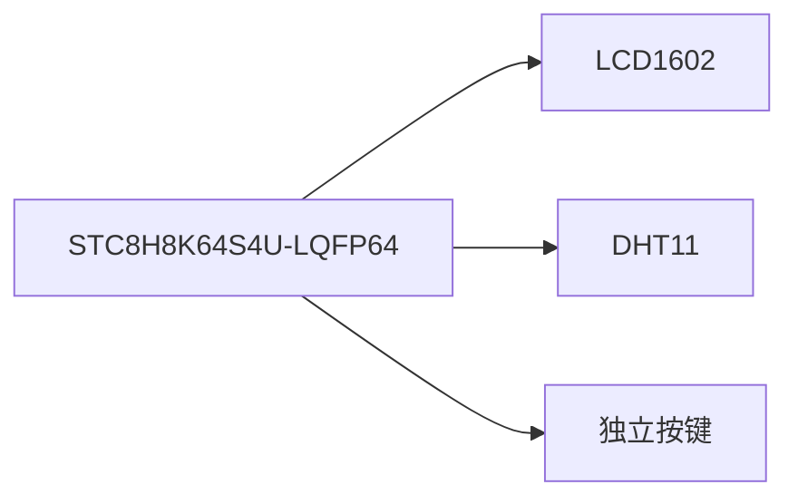

# 报告

## 第一章 引言

请写一段引言，说明本课题课题的意义、目的；基本要求、具体指标等内容。
本课题是以51单片机为核心器件，以DHT11芯片为传感器件，设计一个温湿度计；系统能在LCD1602上显示显示湿度、温度信息；能利用按键调整显示精度。

from bing - creative

这是我为你写的一段引言，希望对你有帮助：

随着科学技术的发展，温湿度的测量和控制在各个领域都有着重要的作用，如农业、工业、医疗、环保等。温湿度计是一种能够测量并显示环境的温度和湿度的仪器，它可以帮助人们了解和调节周围的气候条件，提高生活和工作的质量。

51单片机是一种功能齐全、易于编程、广泛应用的微型计算机系统¹，它可以实现各种复杂的逻辑控制和数据处理。DHT11芯片是一种集成式数字输出的温湿度传感器，具有高可靠性、低成本、快速响应等特点²。LCD1602液晶显示模块是一种常用的字符型液晶显示模块，能够显示16×2个字符，支持8位和4位数据接口³。

本课题的目的是设计一个基于51单片机的温湿度计，能够测量并显示环境的温度和湿度。本课题的基本要求是：

- 以51单片机为核心器件，以DHT11芯片为传感器件，以LCD1602模块为显示器件。
- 系统能在LCD1602上显示显示湿度、温度信息，格式为“T:XX°C H:XX%RH”，其中XX为两位数字。
- 系统能利用按键调整显示精度，分别为0.1°C/0.1%RH、0.5°C/0.5%RH和1°C/1%RH三档。

本课题的具体指标是：

- 温度测量范围：0~50°C
- 温度测量精度：±0.5°C
- 湿度测量范围：20~90%RH
- 湿度测量精度：±5%RH
- 显示刷新频率：1Hz

from bing - balance

这个课题的目的是设计一个温湿度计，以51单片机为核心器件，以DHT11芯片为传感器件。系统能在LCD1602上显示湿度、温度信息，并且能利用按键调整显示精度。这个课题的意义在于，它可以帮助人们更好地了解周围环境的温度和湿度，从而更好地保护自己的健康。

## 第二章 系统方案设计

系统框图



功能单元

STC8H8K64U: STC8H8K64U-45I-LQFP64是一款由STC Micro生产的单片机，具有以下特点：

- 采用51系列CPU核心，支持16位硬件乘法器和除法器
- 内置64KB的FLASH存储器和64KB的EEPROM存储器
- 内置15通道12位ADC转换器
- 支持USB 2.0全速通信
- 封装为LQFP-64或QFN-64

lcd1602: 用于显示测量结果，人机交互
dht11: 温湿度传感器
独立按键: 用于调节显示精度。0位小数显示精度、1位小数显示精度、2位小数显示精度

## 第三章 硬件设计

本项目使用嘉立创EDA进行硬件设计，原理图如图3-1表示。

## 第四章 软件设计

### 4.1 前期准备

如果要汇编语言，基于以下器件，设计一个温湿度计。请给出设计思路。
使用的芯片: STC8H8K64U-45I-LQFP64
使用的传感器: DHT11
使用的屏幕: LCD1602
系统使用DHT11收集温湿度数据，能在LCD1602上显示显示湿度、温度信息；
能利用按键调整湿度显示精度和温度显示精度

from bing - creative

1. 首先，需要了解使用的芯片、传感器和屏幕的特性和接口。通过可以查看它们的数据手册和示例代码。
2. 其次，需要配置芯片的时钟、中断、串口、定时器等功能，以便与传感器和屏幕进行通信和控制。您可以使用汇编语言指令来设置相应的寄存器和位。
3. 然后，需要编写主程序，用于初始化芯片、传感器和屏幕，以及循环读取温湿度数据并显示在屏幕上。可以使用汇编语言指令来调用子程序、传递参数、处理数据等。
4. 最后，需要编写子程序，用于实现按键调整精度、读取传感器数据、发送屏幕命令等功能。

### 4.2 完善与应用开发

DHT11 数据读取

DHT11 数据读取子程序的功能是从DHT11温湿度传感器读取一个字节的数据，并保存在A寄存器中。DHT11传感器的通信协议是一种单总线协议，即使用一根数据线进行双向数据传输。DHT11传感器每次发送40位的数据，分为5个字节，分别表示湿度整数部分、湿度小数部分、温度整数部分、温度小数部分和校验和。每个字节的传输过程如下：

1. DHT11传感器拉低数据线50us，表示开始发送一个位。
2. DHT11传感器拉高数据线26-28us，表示发送0；或者拉高数据线70us，表示发送1。
3. DHT11传感器拉低数据线50us，表示一个位发送结束。

因此，DHT11 数据读取子程序的主要逻辑是：

1. 初始化A寄存器为0，用于保存接收到的数据。
2. 循环8次，每次接收一个位。
3. 每次接收一个位之前，等待数据线由高变低，表示开始发送一个位。
4. 延时50us，跳过低电平持续时间。
5. 将A寄存器左移一位，为接收新的一位做准备。
6. 判断数据线是否仍然为低电平，如果是，则说明发送的是0，不做任何操作；如果不是，则说明发送的是1，将A寄存器最低位置为1。
7. 等待数据线由高变低，表示一个位发送结束。
8. 延时50us，跳过低电平持续时间。
9. 重复步骤3-8，直到接收完8个位。
10. 返回主程序。

本段汇编代码使用了INT_DHT11作为数据线的输入端口，并调用了DHT_DEL_J40US作为延时50us的子程序。

```asm
;DHT11读取1个字节的数据
READ_BYTE_DHT11:
	MOV A,#0	;数据保存变量清0
	
	;【1】
	JNB INT_DHT11,$			;等待低电平过去
	LCALL DHT_DEL_J40US		;延时50US
	RL  A					;数据左移一位
	
	JNB INT_DHT11,DHT_GA1	;判断接收到的电平信号
	ORL A,#01H				;传输值为1
	JNB INT_DHT11,$			;等待低电平过去
	DHT_GA1:
	LCALL DHT_DEL_J40US		;延时50US
	
	;【2】
	JNB INT_DHT11,$			;等待低电平过去
	LCALL DHT_DEL_J40US		;延时50US
	RL  A					;数据左移一位
	
	JNB INT_DHT11,DHT_GB1	;判断接收到的电平信号
	ORL A,#01H				;传输值为1
	JNB INT_DHT11,$			;等待低电平过去
	DHT_GB1:
	LCALL DHT_DEL_J40US		;延时50US
	
	;【3】
	JNB INT_DHT11,$			;等待低电平过去
	LCALL DHT_DEL_J40US		;延时50US
	RL  A					;数据左移一位
	
	JNB INT_DHT11,DHT_GC1	;判断接收到的电平信号
	ORL A,#01H				;传输值为1
	JNB INT_DHT11,$			;等待低电平过去
	DHT_GC1:
	LCALL DHT_DEL_J40US		;延时50US
	
	;【4】
	JNB INT_DHT11,$			;等待低电平过去
	LCALL DHT_DEL_J40US		;延时50US
	RL  A					;数据左移一位
	
	JNB INT_DHT11,DHT_GD1	;判断接收到的电平信号
	ORL A,#01H				;传输值为1
	JNB INT_DHT11,$			;等待低电平过去
	DHT_GD1:
	LCALL DHT_DEL_J40US		;延时50US
	
	;【5】
	JNB INT_DHT11,$			;等待低电平过去
	LCALL DHT_DEL_J40US		;延时50US
	RL  A					;数据左移一位
	
	JNB INT_DHT11,DHT_GE1	;判断接收到的电平信号
	ORL A,#01H				;传输值为1
	JNB INT_DHT11,$			;等待低电平过去
	DHT_GE1:
	LCALL DHT_DEL_J40US		;延时50US
	
	;【6】
	JNB INT_DHT11,$			;等待低电平过去
	LCALL DHT_DEL_J40US		;延时50US
	RL  A					;数据左移一位
	
	JNB INT_DHT11,DHT_GF1	;判断接收到的电平信号
	ORL A,#01H				;传输值为1
	JNB INT_DHT11,$			;等待低电平过去
	DHT_GF1:
	LCALL DHT_DEL_J40US		;延时50US
	
	;【7】
	JNB INT_DHT11,$			;等待低电平过去
	LCALL DHT_DEL_J40US		;延时50US
	RL  A					;数据左移一位
	
	JNB INT_DHT11,DHT_GG1	;判断接收到的电平信号
	ORL A,#01H				;传输值为1
	JNB INT_DHT11,$			;等待低电平过去
	DHT_GG1:
	LCALL DHT_DEL_J40US		;延时50US
	
	;【8】
	JNB INT_DHT11,$			;等待低电平过去
	LCALL DHT_DEL_J40US		;延时50US
	RL  A					;数据左移一位
	
	JNB INT_DHT11,DHT_GH1	;判断接收到的电平信号
	ORL A,#01H				;传输值为1
	JNB INT_DHT11,$			;等待低电平过去
	DHT_GH1:
	LCALL DHT_DEL_J40US		;延时50US
	RET
```

LCD1602 显示子函数

通过首先对LCD1602初始化，完成对LCD1602的清屏等工作

为按键设置了多种模式，模式0表示显示小数点后两位，通过按键控制

这段子程序的功能是在LCD1602液晶显示屏上显示温度数据，并通过P3.3端口的按键控制显示的小数位数。LCD1602显示屏是一种常用的字符型液晶显示模块，可以显示16x2个字符。P3.3端口是单片机的一个输入输出端口，可以连接外部设备。这段子程序使用了JDE_SHOW和TEMP_HH两个变量，分别表示显示的小数位数和温度数据的高位。这两个变量没有给出具体赋值，需要根据具体的硬件平台和软件环境进行设计和编写。这段汇编代码的主要逻辑是：

1. 进入LOOP0标签，将JDE_SHOW的值移入A寄存器，与0比较，如果不等于0，则跳转到LOOP1标签，否则继续执行。
2. 调用LCD1602_SHOW0子程序，在LCD1602显示屏的第一行显示“TEMP=00.00”，其中00.00是由TEMP_HH变量决定的温度数据，显示两位小数。
3. 进入JDE_P33标签，检测P3.3端口的电平状态，如果为高电平（1），则跳转到P33_OUT标签，否则继续执行。
4. 调用DELAY_50MS子程序，延时50毫秒，以消除按键抖动的干扰。
5. 再次检测P3.3端口的电平状态，如果为高电平（1），则跳转到P33_OUT标签，否则继续执行。
6. 等待P3.3端口由低电平（0）变为高电平（1），表示按键松开。
7. 将JDE_SHOW变量赋值为0，表示显示两位小数。
8. 进入P33_OUT标签，返回主程序。

这段汇编代码使用了WR_CMD和WR_DAT两个子程序，分别表示向LCD1602显示屏写入命令和数据。这两个子程序没有给出具体实现，需要根据具体的硬件平台和软件环境进行设计和编写。

```asm
LOOP0:
    MOV A,JDE_SHOW
    CJNE A,#0,LOOP1     ;2位精度
    LCALL LCD1602_SHOW0 ;LCD1602显示数据

JDE_P33:
    JB P3.3,P33_OUT     ;按键按下判断，等于1则跳转
    LCALL DELAY_50MS    ;延时消抖
    JB P3.3,P33_OUT     ;按键按下判断，等于1则跳转
    JNB P3.3,$          ;等待按键松手
    MOV JDE_SHOW,#0     ;显示2位小数
P33_OUT:
    RET

LCD1602_SHOW0:
    ;LCD1602的第1行显示：TEMP=00.00

    ...

    MOV A,#085H     ;LCD1602第1行，第6个位置
    LCALL WR_CMD    ;写地址
    MOV A,#"0"
    ADD A,TEMP_HH
    LCALL WR_DAT

    ...

    RET
```

(3) 独立按键控制子程序

独立按键控制子程序，用于检测P3.3口的按键状态，并根据按键的按下和松开来控制显示的小数位数。

代码的逻辑如下：

首先，使用JB指令判断P3.3口的状态，如果为1（高电平），说明按键没有按下，那么就跳转到P33_OUT标号处，返回主程序。
如果为0（低电平），说明按键可能按下，那么就调用DELAY_50MS子程序，进行延时消抖处理，防止误触发。
延时后，再次使用JB指令判断P3.3口的状态，如果为1（高电平），说明按键已经松开或者是干扰信号，那么就跳转到P33_OUT标号处，返回主程序。
如果为0（低电平），说明按键确实按下，那么就使用JNB指令循环等待，直到P3.3口变为1（高电平），说明按键松开。
按键松开后，使用MOV指令将0赋值给JDE_SHOW变量，表示显示2位小数。
最后，跳转到P33_OUT标号处，返回主程序。

```asm

JDE_P33:
	JB P3.3,P33_OUT		;按键按下判断，等于1则跳转
	LCALL DELAY_50MS	;延时消抖
	JB P3.3,P33_OUT		;按键按下判断，等于1则跳转
	JNB P3.3,$			;等待按键松手
	MOV JDE_SHOW,#0		;显示2位小数
P33_OUT:
	RET
```

---

请解释以下汇编代码

```asm
LOOP4:
		CLR EA				;关闭总中断
		
		;起始信号
		SETB  INT_DHT11		;拉高
		LCALL DHT_DEL_1MS	;主机拉低总线1ms
		CLR   INT_DHT11		;拉低
		LCALL DHT_DEL_20MS	;主机拉低总线至少18ms
		SETB  INT_DHT11		;拉高
		LCALL DHT_DEL_40US	;主机拉高总线20~40us
		
		;判断启始信号是否OK？
		JB INT_DHT11,DHT_LAE0	;如果为高电平，则退出
		JNB INT_DHT11,$			;等待数据线被拉高
		JB  INT_DHT11,$			;等待数据线被拉低
		
		LCALL READ_BYTE_DHT11	;读取数据
		MOV 72H,A				;保存温度数据【整数】
		
		LCALL READ_BYTE_DHT11	;读取数据
		MOV 73H,A				;保存温度数据【小数】
		
		LCALL READ_BYTE_DHT11	;读取数据
		MOV 70H,A				;保存湿度数据【整数】
		
		LCALL READ_BYTE_DHT11	;读取数据
		MOV 71H,A				;保存湿度数据【小数】
		
		LCALL READ_BYTE_DHT11	;读取数据
		MOV 74H,A				;保存校验位
		
		
		;【计算温度值】
		MOV A,70H
		MOV B,#10
		DIV AB
		MOV TEMP_HH,A	;湿度的十位
		MOV TEMP_HL,B	;湿度的个位
		
		MOV A,71H
		MOV B,#10
		DIV AB
		MOV TEMP_LH,A	;湿度的十位
		MOV TEMP_LL,B	;湿度的个位
		
		;【计算湿度值】
		MOV A,72H
		MOV B,#100		;除以100
		DIV AB
		MOV DUTY_HH,A	;温度的十位
		MOV A,B
		MOV B,#10		;除以10
		DIV AB
		MOV DUTY_HM,A	;温度的十位
		MOV DUTY_HL,B	;温度的个位
		
		MOV A,73H
		MOV B,#10
		DIV AB
		MOV DUTY_LH,A		;温度的十位
		MOV DUTY_LL,B		;温度的个位
		
		;数据线未被拉低【退出】
		DHT_LAE0:
			CLR EA				;关闭总中断
			LCALL DELAY_50MS	;等待50MS
			LCALL DELAY_50MS	;等待50MS
```

### 4.3 仿真调试

通过将汇编程序编译后，使用下载器将 .hex 文件下载到开发板，可以观察到如下图所示现象。

...

以上图片表明，本系统可以按照预期的方式工作。

## 第五章 总结

请写一段总结，结论是对本课题进行归纳和综合而得出的总结，结论必须完整、准确、鲜明。
本课题是以51单片机为核心器件，以DHT11芯片为传感器件，设计一个温湿度计；系统能在LCD1602上显示显示湿度、温度信息；能利用按键调整显示精度。

from bing - creative

本课题的目的是设计一个基于51单片机的温湿度计，能够测量并显示环境的温度和湿度。本课题的主要内容和步骤如下：

- 选择51单片机作为核心控制器，因为它是一种功能齐全、易于编程、广泛应用的微型计算机系统¹。
- 选择DHT11芯片作为温湿度传感器，因为它是一种集成式数字输出的温湿度传感器，具有高可靠性、低成本、快速响应等特点²。
- 选择LCD1602液晶显示模块作为显示器件，因为它是一种常用的字符型液晶显示模块，能够显示16×2个字符，支持8位和4位数据接口³。
- 设计电路图和原理图，连接51单片机、DHT11芯片和LCD1602模块，以及必要的电源、晶振、复位等电路。
- 编写程序代码，实现以下功能：
  - 初始化51单片机、DHT11芯片和LCD1602模块，设置工作模式和参数。
  - 通过DHT11芯片读取温湿度数据，并进行校验和转换。
  - 通过LCD1602模块显示温湿度数据，格式为“T:XX°C H:XX%RH”，其中XX为两位数字。
  - 利用按键调整显示精度，分别为0.1°C/0.1%RH、0.5°C/0.5%RH和1°C/1%RH三档。
- 调试程序和电路，检查是否能够正常工作，是否有误差或异常情况。

本课题的结论是：

- 本课题成功地设计了一个基于51单片机的温湿度计，能够测量并显示环境的温度和湿度，具有实用性和可靠性。
- 本课题充分利用了51单片机的功能和特点，以及DHT11芯片和LCD1602模块的优势，实现了一个简单而有效的系统。
- 本课题还提供了按键调整显示精度的功能，增加了用户的选择性和灵活性。
