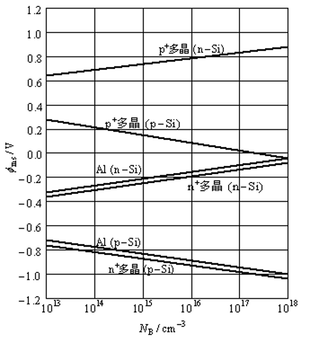

# 2022-2023期末考试

纯手工打造的不保证准确率的版本，仅做复习用途。

## 一、填空题

（共 10 空，每空 2 分，共 20 分）

加粗部分表示答案。

1. 半导体中载流子的运动方式主要有两种，分别为 漂移运动 和 **扩散** 运动。
2. pn 结最主要的特性为 **整流** 特性；当足够大的反向偏压施加在 pn 结上时，两种重要的电击穿机制为 **隧道效应** 和 **雪崩倍增**  。
3. 制作双极晶体管时，要求基区宽度 **很薄** 。
4. P 衬底的 MOS 二极管施加负向偏压时，氧化层与半导体界面出现 **累积** 现象；施加较小正偏压时，可出现 **耗尽** 现象，当此负偏压足够大时，在氧化层与半导体界面出现 **反型** 现象。
5. 在双极晶体管中，共基电流增益 $\alpha_0$ 与发射效率 $\gamma$ 和基区输运系数 $\alpha_T$ 之间的关系是 **$\alpha_0 = \gamma \alpha_T$** ；共射电流增益 $\beta_0$ 与共基电流增益 $\alpha_0$ 之间的关系是 **$\beta_0 = \alpha_0/(1 - \alpha_0)$**。

## 二、选择题

（共 10 题，每小题 2 分，共 20 分）

1. 金属和 N 型半导体接触后，若金属功函数值大于半导体功函数值，在热平衡状态下，半导体界面处的能带（ **A** ）
    A. **向下弯曲**
    B. 向上弯曲
    C. 不变
    D. 向左弯曲

2. 电荷耦合器件（CCD）是工作在 MOS 二极管的（ **C** ）状态。
    A. 饱和
    B. 反转
    C. **反型**
    D. 截止

3. 下列选项中，影响 MOS 二极管的非理想因素为（ **C** ）
    A. 场效应管
    B. 栅极电压
    C. **金属半导体功函数差**
    D. 集电极电压

4. 金属和半导体接触后，金属侧的势垒高度为金属功函数与半导体的（ **A** ）之差。
    A. **电子亲和力**
    B. 费米能级
    C. 功函数
    D. 真空能级

5. 双极性晶体管的三个电极分别为集电极、基极和 ( **B** )。
    A. 源极
    B. **发射极**
    C. 栅极
    D. 共基极

6. 偏压由正瞬变到负后，二极管的关闭时间同以下哪个因素相关（ **A** ）
    A. **少子寿命**
    B. 少子浓度
    C. 漂移速度
    D. 无影响

7. 热平衡状态下，pn 结的内建电场方向为（ **B** ）
    A. 由 p 指向 n
    B. **由 n 指向 p**
    C. 由 n 指向费米能级
    D. 不确定

8. MOS 存储器分为挥发性和非挥发性存储器两种，下列选项中属于挥发性存储器的是（ **D** ）
    A. 可擦除及编程只读存储器
    B. 快闪存储器
    C. 单电子存储单元
    D. **静态随机存储器**

9. p 沟道增强型 MOSFET 是一种（ **C** ）
    A. 常开二极管
    B. 常关二极管
    C. **常开场效应管**
    D. 常关场效应管

10. 场效应晶体管的三个电极分别为源极、漏极和( **C** )
    A. 源极
    B. 发射极
    C. **栅极**
    D. 共基极

## 三、简答题

（共 5 题，每小题 5 分，共 25 分）

### 3.1

试写出半导体 pn 结二极管的 I-V 特性公式。

> 解答

P93-(55); P94-(55b)

对于 p^+ -n 结，总电流

$$
\color{#E09941}{
\begin{align*}
    J
    &= \frac{q D_p p_{n0}}{L_p} \left[ \exp(\frac{qV}{KT})-1 \right] \\
    &= \frac{q D_n}{L_p} N_v \left[ \exp(\frac{qV - (E_F - E_V)}{kT}) - 1 \right] \\
\end{align*}}
$$

### 3.2

画出 CMOS 反相器的电路图，并简要分析其工作原理。

> 解答

p沟道与n沟道MOSFET均为增强型晶体管。两个晶体管的栅极连接在一起,并作为输入端;
两个管子的漏极亦连接在一起，作为输出端。NMOS的源极与衬底均接地，而PMOS的源极与衬底连接至电源供应端($V_{\text{DD}}$)。当输入高电平时，NMOS导通，PMOS关闭。因此输出端将NMOS放电至零电势。

### 3.3

请描述双极性晶体管的四种工作模式及其对应的偏压情况。

> 解答

4种工作状态

| 发射极 | 集电极 | 工作状态 |
| ------ | ------ | -------- |
| 正     | 反     | 放大     |
| 正     | 正     | 饱和     |
| 反     | 反     | 截止     |
| 反     | 正     | 反转     |

### 3.4

请写出双极性晶体管的三种组态，并画出其电路接法

> 解答

3种放大组态
双极型三极管有三个电极，其中两个可以作为输入，两个可以作为输出，这样必然有一个电极是公共电极。三种接法也称三种组态，如其发射极接法，也称其集电极组态，简称共基极组态。

共发射极接法，发射极作为公共电极，用CE表示；
共集电极接法，集电极作为公共电极，用CC表示；
共基极接法，基极作为公共电极，用CB表示。

### 3.5

请描述下 MOSFET 的工作原理

> 解答

源极作为电压的参考点。衬底为欧姆接触，可连接至参考电压。当栅极无外加偏压时，源极与漏极之间可视为两个背对背相接的p-n结，源漏间的电流只有反向漏电流。当栅极加一足够大的正电压上时，MOS结构将被反型，在两个n型区域之间形成表面反型层即沟道。源极与漏极通过这一导电的表面n型沟道相互连结，允许电流流过。沟道电导通过栅极电压的变化加以调节。

1. $V_G > V_T$，线性区: 栅极正偏使半导体表面产生强反型后，漏极加小电压，电子将由源极经沟道流向漏极。

2. $V_G > V_T$，过渡区: 漏极电压增大，源漏电压 $V_{Ds}$ 使栅绝缘层下有效电压降从源端到漏端逐渐减小，导致反型层厚度不相等。漏极电压继续增加，直到漏端绝缘层上的有效电压降低于表面强反型所需的阈值电压 $V_T$ 时，在靠近y=L处的反型层厚度将趋近于零，此处称为夹断点P。此时漏源电压称为饱和电压 $V_{Dsat}$ 。超过夹断点后，漏极的电流量基本上维持不变，因为当 $V_D > V_{Dsat}$ 时，在P点的电压 $V_{Dsat}$ 保持固定。

3. $V_G > V_T$，饱和区: 沟道夹断后，若漏极电压继续增加，超过夹断电压的部分 $\left( V_{DS} - V_{Dsat}\right)$ 将降落在夹断区上，因而夹断区将随 $V_{Ds}$ 的增大而展宽，夹断点P随之向源端移动。但由于P点的电压保持为 $V_{Dsat}$ 不变，所以，由源极流到P点的载流子数不变。一旦载流子漂移到P点，将立即被夹断区的强电场扫入漏区，形成漏源电流。电流 $T_D$ 不随 $V_{Ds}$ 的增大而变化，即达到饱和。如果 $V_{Ds}$ 过大，漏端p-n结会发生反向击穿。

## 四、计算题

（共 2 题，第 1 题 15 分，第 2 提 20 分，共 35 分）

### 4.1

已知在一理想晶体管中，各电流成分为：$I_{Ep}=3mA$、$I_{En}=0.01mA$、$I_{Cp}=2.99mA$、$I_{Cn}=0.001mA$。求出共射电流增益$β_0$，并以$β_0$和$I_{CBO}$表示$I_{CEO}$，并求出$I_{CEO}$的值。

> 解答

(a) 发射效率为

$$
\color{#E09941}
\gamma = \frac{I_{Ep}}{I_{Ep} + I_{En}} = \frac{3}{3+0.01} = 0.9967
$$

(b) 基区输运系数为

$$
\color{#E09941}
\alpha_T = \frac{I_{Cp}}{I_{Ep}} = \frac{2.99}{3} = 0.9967
$$

(c) 共基电流增益为

$$
\color{#E09941}
\alpha_0 = \gamma \alpha_T = 0.9967 \times 0.9967 = 0.9934
$$

(d)

$$
\color{#E09941}
\begin{align*}
    & I_E = I_{Ep} + I_{En} = 3 + 0.01 = 3.01 mA \\
    & I_C = I_{Cp} + I_{Cn} = 2.99 + 0.001 = 2.991 mA \\
    & \therefore I_{CBO} = I_C - \alpha_0 I_E \\
    &= 2.991 - 0.9934 \times 3.01 = 0.87 \mu A
\end{align*}
$$

因此可得

$$
\color{#E09941}
\begin{align*}
    \beta_0
    &= \frac{0.9934}{1 - 0.9934} = 150.5 \\
    I_{CEO}
    &= \left( 1 + \frac{\alpha_0}{1 - \alpha_0} \right) I_{CBO} = (\beta_0 + 1) I_{CBO} \\
    &= (150.5 + 1) \times 0.87 \times 10^{-6} = 1.32 \times 10^{-4} mA
\end{align*}
$$

### 4.2

计算一 $N_A=10^{17}cm$ 及 $d=5nm$ 的 $n^+$ 多晶硅-SiO2-Si电容器的平带电压.假设氧化层中 $Q_t$ 与 $Q_m$ 可忽略，且 $\frac{Q_f}{q} = 5 \times 10^{11} cm^{-2}$

> 解答

由图5.8可知，在 $N_A=10^{17}cm$ 时，对于 $n^+$ 多晶硅 p-Si系统，$\varphi_s$ 为 -0.98eV，由例2可得出 $C_o$

$$
\color{#E09941}{
\begin{split}
    C_0
    &= \frac{\varepsilon_{ox}}{d} \\
    &= \frac{3.9 \times 8.85 \times 10^{-14}}{5 \times 10^{-7}} \\
    &= 6.9 \times 10^{-7} F/cm^2 \\
    V_{FB}
    &= \varphi_{ms} - \frac{Q_f + Q_m + Q_{ot}}{C_o} \\
    &= -0.98 - \frac{1.6 \times 10^{-19} \times 5 \times 10^{11}}{6.9 \times 10^{-7}} \\
    &= -1.10 V \\
\end{split}}
$$
