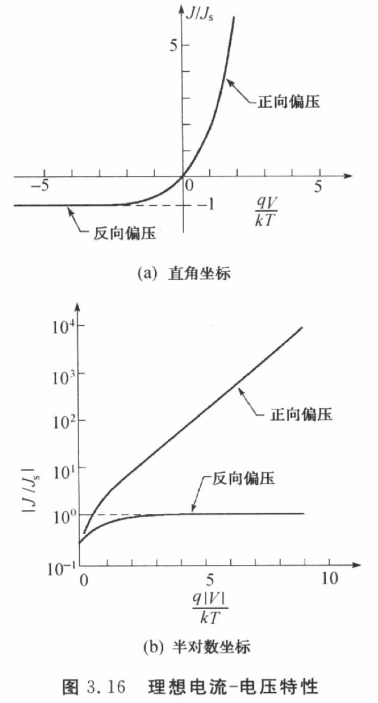

# 4 p-n Junction

课件中的PPT从第4章开始，对应教材第3章。

## 4.1 热平衡状态下的p-n结

电荷存储与暂态响应

基本工艺步骤 -> PPT

热平衡状态下的p-n结

热平衡状态：没有外加偏置的p-n结

---

pn 结单向导电
费米能级决定电流
载流子对电场敏感

mosfet 耗尽 反型？

有源 -> 空间电荷区（耗尽层）

---

空间电荷和内建电场

计算静电势

热平衡下，p型与n型中性区的总静电电势差即为内建电势$V_{bi}$

tags: [#考试要考, #内置了一个计算题，使用以下公式]

$$
\color{#E45F59}{V_{bi} = \psi_n - \psi_p = \frac{kT}{q} \ln \frac{N_A N_D}{n_i^2}} \tag{4.1}
$$

其中的:

$n_i$ 是本征载流子浓度，会随温度等因素变化。
$\psi_n = -\frac{1}{q}(E_{i} - E_{F}) = \frac{k T}{q}\ln(\frac{N_{D}}{n_{i}})$ 是n型中性区的静电势
$\psi_p = -\frac{1}{q}(E_{i} - E_{F}) = -\frac{k T}{q}\ln(\frac{N_{A}}{n_{i}})$ 是p型中性区的静电势

柏松方程 <- 指出非常关键

$$
\frac{\partial^2 \psi}{\partial x^2} = -\frac{\rho}{\epsilon} = -\frac{q}{\epsilon} (p - n + N_D^+ - N_A^-)
$$

---

tags: [#考试要考, #期末考试原题]

注意：$\frac{k T}{q} = 0.026, @300k$

例1 对于一理想p-n结，$N_A = 10^{1} cm^{-3}, N_D = 10^{15} cm^{-3}, T = 300K$，求内建电势 $V_{bi}$

解：

$$
\begin{split}
    V_{bi}
    &= \frac{kT}{q} \ln \frac{N_A N_D}{n_i^2} \\
    &= (0.026) \ln \frac{10^{18} \times 10^{15}}{(9.65 \times 10^{9})^2}V \\
    &= 0.774 V \\
\end{split}
$$

或者看图，用 $V_{bi} = \Psi_n + |\Psi_p| = 0.774V$

习题关联教材 P110 4（1）（2）

4 对于一理想p-n结，$N_A = 10^{17} cm^{-3}, N_D = 10^{15} cm^{-3}$

(a) 计算在 250K, 300K, 350K 时的内建电势 $V_{bi}$, 并画出 $V_{bi}$ 和 $T$ 的关系

评价是纯纯代入公式

(b) 用能带图评价所求结果

---

tags: [#考试要考]

内建电场方向

---

## 4.3 耗尽区

耗尽区（depletion region）/空间电荷区（space-charge region）: 自由载流子浓度为0.

突变结（abrupt junction）：近似，见ppt之b图

单边突变结(one-side abrupt junction)：一边轻掺杂，一边重掺杂
轻掺杂、重掺杂 $n^{+} p / p^{+} n$

总耗尽层宽度 $W = x_p + x_n$
下面的公式中，等号右边的是以内建电势为函数的总耗尽区宽度，约等于号右边的是单边突变结的耗尽层宽度

$$
\color{#E45F59}{
\begin{split}
    W
    &= \sqrt{\frac{2 \epsilon_s}{q} \frac{N_A + N_D}{N_A N_D} V_{bi}} \\
    &\approx x_{n} = \sqrt{\frac{2 \epsilon_s V_{bi}}{q N_D}} \\
\end{split}
} \tag{4.2}
$$

$\epsilon_s = \epsilon_o \times \epsilon_r$ ​是半导体的介电常数，与材料的性质有关，等于真空介电常数$\epsilon_o$​与相对介电常数$\epsilon_r$​的乘积。

单边突变结最大电场

$$
\color{#E45F59}{E_{\max} = \frac{q N_B W}{\epsilon_s}} \tag{4.3}
$$

$x=0$ 处的最大电场 $\color{#E45F59}{E_{\max} = \frac{q N_D x_n}{\epsilon_s} = \frac{q N_A x_p}{\epsilon_s}}$

有个b三角形，可以直接看出 $V_{bi}$

---

p端加一相对n端电压$V_F$，p-n结变成正向偏置；n端加一相对p端电压$V_R$，p-n结变成反向偏置。

参考图片教材P84 图3.8

* 正向偏置降低耗尽区宽度 $V_{bi} - V_F$。
* 反向偏置增加耗尽区宽度 $V_{bi} + V_R$。

单边突变结耗尽层宽度与偏置电压关系

$$
W = \sqrt{\frac{2 \varepsilon_s (V_{bi} - V)}{q N_D}} \\
$$

| 状态     | 离子  | 数量 | 离子  | 数量 |
| -------- | ----- | ---- | ----- | ---- |
| 热平衡   | $p^+$ | 100  | $n^-$ | 100  |
| 正向偏置 | $p^+$ | 20   | $n^-$ | 20   |
| 反向偏置 | $p^+$ | 300  | $n^-$ | 300  |

p-n结的空间电荷区具有电容效应。指n区和p区的离子又在变化。

SCR：$p^+$ 和 $n^-$ 与 $V$ 有关

p区和n区部分没有电场，通过扩散运动。反向偏置太大有可能出现量子隧穿/雪崩倍增，导致损坏。

## 4.4 耗尽电容

耗尽层的势垒电容

$$
C_{j} = \frac{\mathrm{d} Q}{\mathrm{d} V}
$$

$\mathrm{d} Q$ 是指外加偏置电压变化 $\mathrm{d} V$ 时，耗尽层中的电荷增加量。

关联半导体物理 $Q \rightarrow E \rightarrow V$ -> 泊松方程 -> 有限元/有限差分

对于单边突变结

$$
C_{j} = \frac{\epsilon_s}{W} = \dots
$$

~~扩散电容~~ 见下

$$
C_{d} = \dots
$$

## 4.5 电流-电压特性

| 状态     | 扩散电流 | 漂移电流 |
| -------- | -------- | -------- |
| 热平衡   | /        | /        |
| 正向偏置 | ++       | --       |
| 反向偏置 | --       | +(/)     |

漂移电流不能随反向偏置电压的增加而线性增加，速度极限，饱和

假设

* 耗尽区为突变边界
* 边界载流子浓度和跨过结的静电势有关
* 小注入情况（低于开启电压），注入的少子浓度远小于多子浓度
* 在耗尽区内并无产生和复合电流

注: $n_{p0}$ 中的下标0表示热平衡状态下，$n_i^2 = n p$

tags: [#考试要考]

在 $x = x_n$ 处：

$$
\color{#E45F59}{J_{P}(x_{n}) = \frac{q D_p p_{n0}}{L_p} \left[ \exp(\frac{qV}{KT})-1 \right]} \tag{4.4}
$$

$J_{P}(x_{n})$ - 表示二极管在 $x_{n}$ 位置的饱和电流密度($A/m^2$)
$L_p$ 为p区电子（少数载流子）的扩散长度(diffussion length)

tags: [#考试要考]

理想二极管方程 ideal diode equation

$$
\color{#E45F59}{\begin{split}
    J
    &= J_{p}(x_{n}) + J_{n}(-x_{p}) \\
    &= J_{S} \left[ \exp(\frac{qV}{KT})-1 \right] \\
\end{split}} \tag{4.5}
$$

---

影响之三个因素

1. 耗尽层中产生复合影响，$\eta \in(1,2)$ 理想系数
2. 大注入影响
3. 温度影响

## 4.6 电荷存储和暂态响应

存储电荷

$$
Q_{P} = \frac{L_{p}^2}{D_{p}} J_{P}(x_{n}) = \tau_{p} J_{P}(x_{n})
$$

扩散电容，和电压有关，在正偏时明显.

$$
C_{d} = \frac{A q^2 L_{p}p_{n0}}{kT} \exp(\frac{qV}{kT})
$$

p-n结的小信号等效电路

---

瞬态响应 transient behavior
电荷存储导致的...

瞬态时间 $t_{off}$

## 4.7 结击穿

tags: [#考试要考]

2个效应

### 4.7.1 隧穿效应

tunneling effect

只发生在电场很高的时候

### 4.7.2 雪崩倍增

avalanche multiplication

如果电场足够大，电子可以获得足够的动能，以至于当和原子撞击时能破坏晶格价键，产生电子-空穴对（2和 2’）.这些新产生的电子和空穴，可由电场获得动能，并产生额外的电子-空穴对（譬如3和3'）.该过程一直持续，继续产生其他的电子-空穴对.

## 4.8 异质结

两种不同材料组成的结 -- 了解即可
