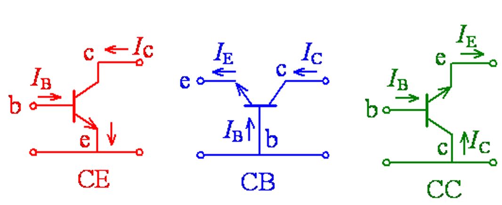

# 5 Bipolar Transistors and Related Devices

双极型晶体管及相关器件

* 双极型半导体三极管
* 场效应半导体三极管

## 5.1 晶体管的工作原理

关联`模电`

p-n-p 双极型晶体管

掺杂浓度 p > n > p+

发射区的掺杂浓度大，集电区掺杂浓度低，且集电结面积大。
基区要制造得很薄，其厚度一般在几个微米至几十个微米。

---

tags: [#考试要考]

4种工作状态

| 发射极 | 集电极 | 工作状态 |
| ------ | ------ | -------- |
| 正     | 反     | 放大     |
| 正     | 正     | 饱和     |
| 反     | 反     | 截止     |
| 反     | 正     | 反转     |

3种放大组态
双极型三极管有三个电极，其中两个可以作为输入，两个可以作为输出，这样必然有一个电极是公共电极。三种接法也称三种组态，如其发射极接法，也称其集电极组态，简称共基极组态。

共发射极接法，发射极作力公共电极，用CE表示；
共集电极接法，集电极作为公共电极，用CC表示；
共基极接法，基极作为公共电极，用CB表示。

---

放大工作模式

## 5.2 双极性晶体管的静态特性

基区少子分布 -- 公式不用记

发射极和集电极区少子分布 -- 公式不用记

放大模式下理想晶体管的电流

---

共射组态晶体管的电流-电压特性（pnp）

共射电流增益

$$
\beta_0 = \frac{\Delta I_C}{\Delta I_B} = \frac{\alpha_0}{1 - \alpha_0}
$$

---

关联一些公式 <-- 啥啊，一周没看已经忘了...

---

tags: [#考试要考, #期末考试原题]

> 教师：可能数字都不会变的

例3：已知在一理想晶体管中，各电流成分为：$I_{Ep}=3mA$、$I_{En}=0.01mA$、$I_{Cp}=2.99mA$、$I_{Cn}=0.001mA$。求出共射电流增益$β_0$，并以$β_0$和$I_{CBO}$表示$I_{CEO}$，并求出$I_{CEO}$的值。

解：

发射效率为

$$
\color{#E09941}{
\gamma = \frac{I_{Ep}}{I_{Ep} + I_{En}} = \frac{3}{3+0.01} = 0.9967}
$$

基区输运系数为

$$
\color{#E09941}{
\alpha_T = \frac{I_{Cp}}{I_{Ep}} = \frac{2.99}{3} = 0.9967}
$$

共基电流增益为

$$
\color{#E09941}{
\alpha_0 = \gamma \alpha_T = 0.9967 \times 0.9967 = 0.9934}
$$

因此可得

$$
\color{#E09941}{
\begin{align*}
    & \beta_0 = \frac{0.9934}{1 - 0.9934} = 150.5 \\
    I_{CEO}
    &= \left( 1 + \frac{\alpha_0}{1 - \alpha_0} \right) I_{CBO} = (\beta_0 + 1) I_{CBO} \\
    &= (150.5 + 1) \times 0.87 \times 10^{-6} = 1.32 \times 10^{-4} mA
\end{align*}}
$$

注：教师觉得要把0.87修改为1

## 5.3 双极型晶体管的频率响应与开关特性

频率响应（共射组态）

交流小信号重叠在直流值上的情况。
小信号意指交流电压和电流的峰值小于直流的电压、电流值。

---

tags: [#考试要考, #关系]

BJT 之 3f 分别指什么？

* $f_{\alpha} \leftarrow 0.707\alpha_0$ 公共射极频率 (common-emitter frequency)
* $f_I \leftarrow \beta = 1$ 输入频率 (input frequency)
* $f_{\beta} \leftarrow (1-\alpha_0)f_{\alpha}$ 公共基极频率 (common-base frequency)

$f_{\alpha} > f_I > f_{\beta}$

---

1 高频等效电路：共射组态在固定的直流输入电压VEB下，将会有直流基极电流IB和直流集电极电流IC流过晶体管。

跨导

$$
g_m = \frac{\tilde{i}_C}{\tilde{v}_{BE}}
$$

输入电导

$$
g_{EB} = \frac{\tilde{i}_B}{\tilde{v}_{BE}}
$$

基区宽度调制效应产生附加输出电导：

$$
g_{BC} = \frac{\tilde{i}_C}{\tilde{v}_{EC}}
$$

---

2 截止频率

---

3 开关暂态过程

开关时间:晶体管状态从关变为开或从开变为关所需的时间。

## 5.4 异质结双极型晶体管

异质结双极型晶体管(HBT)特点：晶体管中的一个或两个结由不同的半导体材料所构成。

HBT的主要优点：发射效率较高，其应用基本上与双极型晶体管相同，但HBT具有较高的速度，可以工作在更高的频率。因为其具有这些特性，HBT在光电、微波和数字应用上非常受欢迎。

可控硅器件及相关功率器件

---

1. 如果输入一个高电平，而输出需要一个低电平时，首选择npn。
2. 如果输入一个低电平，而输出需要一个低电平时，首选择pnp。
3. 如果输入一个低电平，而输出需要一个高电平时，首选择npn。
4. 如果输入一个高电平，而输出需要一个高电平时，首选择pnp。npn基极高电压，极电极与发射极短路.低电压，极电极与发射极开路.也就是不工作。pnp基极高电压.极电极与发射极开路，也就是不工作。如果基极加低电位，集电极与发射极短路。

用数字万用表如何测试出三极管的极性呢？
首先将万用表打到测试二极管端，用万用表的红表笔接触三极管的其中一个管脚，而用万用表另外的那支表笔去测试其余的管脚，直到测试出如下结果：

1. 如果三极管的黑表笔接其中一个管脚，而用红表笔测其它两个管脚都导通有电压显示，那么此三极管为PNP三极管，且黑表笔所接的脚为三极管的基极B，用上述方法测试时其中万用表的红表笔接其中一个脚的电压稍高，那么此脚为三极管的发射极E，剩下的电压偏低的那个管脚为集电极C。
2. 如果三极管的红表笔接其中一个管脚，而用黑表笔测其它两个管脚都导通有电压显示，那么此三极管为NPN三极管，且红表笔所接的脚为三极管的基极B，用上述方法测试时其中万用表的黑表笔接其中一个脚的电压稍高，那么此脚为三极管的发射极E，剩下的电压偏低的那个管脚为集电极C。
