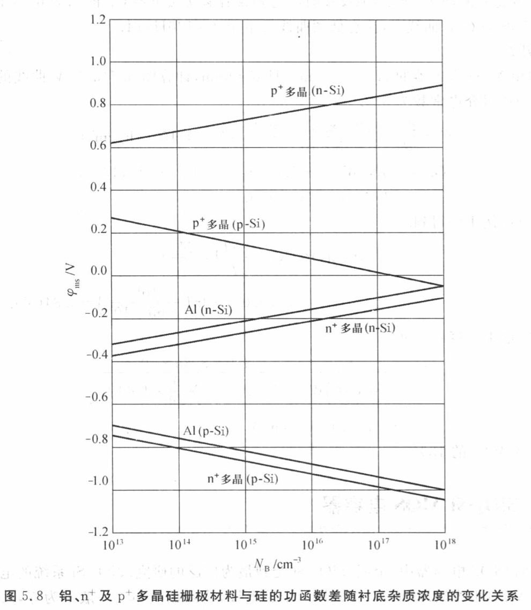

# 6 MOS Capacitor and MOSFET

MOS 电容器及 MOSFET

## 6.1 理想的 MOS 电容器

对应教材第5.1节

tags: [#考试要考, #大填空题, #简答题]

当一理想 MOS 电容器偏压为正或负时，半导体表面会出现三种状况.

1. 积累现象
2. 耗尽现象
3. 反型现象

p-type mos 二极管

加反偏 -> V<0 靠近半导体表面的能带将向上弯曲 -> 空穴积累

加小正偏 -> V>0 靠近半导体表面的能带将向下弯曲，使 $E_F=E_i$ -> 空穴耗尽

加大正偏 -> V>0 靠近半导体表面的能带将向下弯曲更严重，使 $E_F>E_i$ -> 空穴反型

* 强反型
* 弱反型

### 6.1.1 表面耗尽区

$\psi$ 静电势

$\psi_s$ 表面静电势 surface potential

$$
\psi_s(inv) \approx 2\psi_B = \frac{2kT}{q} \ln(\frac{N_A}{n_i})
$$

### 6.1.2 理想 MOS 曲线

$$
V_o = \frac{|Q_s|}{C_o}
$$

$Q_s$ 表示氧化层内电荷的数量

$V_o$ 表示氧化层的电压

$C_o = \frac{\varepsilon_{ox}}{d}$ 每单位面积的氧化层电容

---

阈值电压 $V_T$: 在强反型发生时的金属平行板电压

$$
V_T = \frac{q N_A W_m}{C_o} + \psi_s(inv) \\
\approx \frac{\sqrt{2\varepsilon_s q N_A(2\psi_B)}}{C_o} + 2\psi_B
$$

## 6.2 SiO2-Si MOS 电容器

tags: [#考试要考, #可能, #填空题]

不同影响因素产生原因

* $\phi \neq 0$
* 4种电荷

### 6.2.1 功函数差

半导体的功函数 $q\varphi_{s}$ 为费米能级至真空能级之间的能量差，它随掺杂浓度而有所变化.

功函数差 $q\varphi_{ms} = q\varphi_m - q\varphi_s$

平带电压 $V_{FB}$

发生能带弯曲

图5.9
（a）独立金属与独立半导体之间夹一氧化层的能带图；
（b）热平衡下 MOS 电容器的能带图

### 6.2.2 界面陷阱与氧化层内电荷

* 界面陷阱电荷 $Q_{it}$
* 氧化层固定电荷 $Q_{f}$

---

tags: [#考试要考, #大填空题]

例3: 计算一 $N_A=10^{17}cm$ 及 $d=5nm$ 的 $n^+$ 多晶硅-SiO2-Si电容器的平带电压.假设氧化层中 $Q_t$ 与 $Q_m$ 可忽略，且 $\frac{Q_f}{q} = 5 \times 10^{11} cm^{-2}$

> 解答

由图5.8可知，在 $N_A=10^{17}cm$ 时，对于 $n^+$ 多晶硅 p-Si系统，$\varphi_s$ 为 -0.98eV，由例2可得出 $C_o$

$$
\begin{split}
    C_0
    &= \frac{\varepsilon_{ox}}{d} \\
    &= \frac{3.9 \times 8.85 \times 10^{-14}}{5 \times 10^{-7}} \\
    &= 6.9 \times 10^{-7} F/cm^2 \\
    V_{FB}
    &= \varphi_{ms} - \frac{Q_f + Q_m + Q_{ot}}{C_o} \\
    &= -0.98 - \frac{1.6 \times 10^{-19} \times 5 \times 10^{11}}{6.9 \times 10^{-7}} \\
    &= -1.10 V \\
\end{split}
$$

## 6.3 MOS 电容器中的载流子输运

对应教材第5.3节

注：疑似被跳过

## 6.4 电荷耦合器件

对应教材第5.4节

电荷耦合器件 charge-coupled device (CCD)

CCD由同一半导体衬底上多个MOS二极管阵列所组成．对CCD所有的电极施加大的正偏压，各MOS表面发生耗尽．

## 6.5 MOSFET 基本原理

learn more from `VLSI.md`

### 6.5.1 基本特性

越靠近漏极，沟道越窄

tags: [#考试要考, #简答题]

1. $V_G > V_T$, $V_o \downarrow$, $I_o$ 与 $V_o$ 成线性增长
2. $V_G < V_T$, $V_o \uparrow$, 沟道倾斜，$I_D$ 与 $V_o$ 成非线性增长
3. $V_G > V_T$, $V_D > V_{Dsat}$, $I_o$ 不再随 $V_o$ 增加而增加，出现饱和 $I_{osat}$

亚阈值区 subthreshold region
4. $V_G < V_T$, $I_o$ 漏电流，-> $V_G = 0$, $I_D \uparrow$

MOSFET 的4种类型

## 6.2 CMOS AND BiCMOS

对应教材第6.2节

### 6.2.1 The CMOS Inverter

tags: [#考试要考]

CMOS 原理 -- 反相

1. 电路图构成
2. 原理描述

## 6.4 MOS MEMORY STRUCTURES

MOS 存储器结构

tags: [#考试要考, #选择题]

分类

* 挥发性存储器
* 非挥发性存储器

非挥发性存储器

* the erasable-programmable read-only memory (EPROM)
* electrically erasableprogrammable read-only memory (EEPROM)
* flash memory.

下面这些就不考了...

### 6.4.1 DRAM

The 1T/1C DRAM

### 6.4.2 SRAM

SRAM is a matrix of static cells using a bistable flip-flop structure(双稳态触发器) to store the logic state. The flip-flop consists of two cross-coupled CMOS inverters (T1, T3 and T2, T4). The output of the inverter is connected to the input node of the other inverter. This configuration is called “latched.” Two additional n-channel MOSFETs, T5 and T6, with their gates connected to the word line, are used to access the SRAM cell. The operation of the SRAM is static since the logic state is sustained as long as the power is applied. Therefore, SRAM does not have to be refreshed. The two p-channel MOSFETs (T1 and T2) in the inverters are used as the load transistors. There is essentially no dc current flow through the cell, except during switching. In some situations, p-channel polysilicon TFTs or polysilicon resistors are used instead of bulk p-channel MOSFETs. These polysilicon load devices can be fabricated over the bulk n-channel MOSFETs. 3-D integration can effectively reduce the cell area and thus increase the storage capacity of the chip.

### 6.4.3 Nonvolatile Memory

非挥发性存储器

When the gate electrode of a conventional MOSFET is modified so that semipermanent charge storage inside the gate is possible, the new structure becomes a nonvolatile memory device. Since the first nonvolatile memory device was proposed in 1967, various device structures have been made. Nonvolatile memory devices have been used extensively in ICs such as the erasable-programmable read-only memory (EPROM), electrically erasableprogrammable read-only memory (EEPROM), and flash memory.

There are two groups of nonvolatile memory devices, floating-gate devices and charge-trapping devices (Fig. 28). In both types of devices, charges are injected from the silicon substrate across the first insulator and stored in the floating gate or in the nitride. The stored charges give rise to a threshold-voltage shift, and the device is switched to a high-threshold state (programmed or logical 1). In a well-designed memory device, the charge retention time can be over 100 years. To return to the low-threshold state (erased or logical 0), a gate or other means (such as ultraviolet light) can be applied to erase the stored charges.
