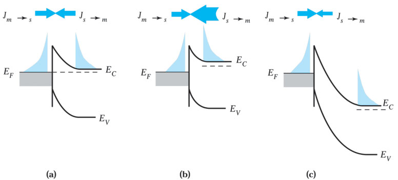

# MESFET and Related Devices

## 7.1 Metal-Semiconductor Contacts

金属-半导体 接触

特点：

1. MESFET具有与MOSFET相似的电流-电压特性。然而在器件的栅电极部分，MESFET利用金属-半导体的整流接触取代了MOSFET的MOS结构；而在源极与漏极部分，MESFET以欧姆接触取代MOSFET中的p-n结。

2. MESFET与其他的场效应器件一样，在高电流时具有负的温度系数，即随着温度的升高电流反而下降。因此即使是使用大尺寸的有源器件或将许多器件并接使用时，仍可维持热稳定。此外，由于MESFET可用GaAs、InP等具有高电子迁移率的化合物半导体制造，因此具有比硅基MOSFET高的开关速度与截止频率。

3. MESFET结构的基础在于金半接触，在电特性上它相当于单边突变的p-n结，然而在工作时，它具有多数载流子器件所享有的快速响应。

### 7.1.1 Basic Characteristics

Fig. 1 (a) Perspective view of a metal-semiconductor contact fabricated by the planar process. (b) One-dimensional structure of a metal-semiconductor contact.

---

tags: [#考试要考]

顺着电场，为什么能带向上弯曲？ -- 费米能级？

Fig. 2 (a) Energy band diagram of an isolated metal adjacent(孤立金属) to an isolated n-type semiconductor under thermal nonequilibrium condition(热平衡情形). (b) Energy band diagram of a metal-semiconductor contact in thermal equilibrium.

---

Fig. 4 Energy band diagrams of metal n-type and p-type semiconductors under different biasing conditions: (a) thermal equilibrium; (b) forward bias; and (c) reverse bias.

### 7.1.2 The Schottky Barrier

肖特基接触（肖特基势垒）

tags: [#考试要考, #特点, #原理]

肖特基势垒指一具有很大的势垒高度，以及半导体掺杂浓度低的金属-半导体接触。电流的传导主要由**多数载流子热电子发射**越过电势势垒而进入金属中。

特点：肖特基势垒中，电流的传导主要由多数载流子来完成，这与由少数载流子来进行电流传导的p-n结不同。对工作在常温(300K)下的肖特基二极管而言，其主要传导机制是半导体中多数载流子的热电子发射越过电势势垒而进入金属中。

Fig. 7 Current transport(电流运输) by the thermionic emission process(热离化过程). (a) Thermal equilibrium; (b) forward bias; and (c) reverse bias.

tags: [#考试要考, #公式, #简答题]

The current-voltage characteristic(I-V特性) of a metal-semiconductor contact(金属-半导体接触) under thermionic emission condition is then

$$
J = J_s [\exp(\frac{qV}{kT})− 1]
$$

$$
J_s= A* T^2 \exp(\frac{−q\varphi_{Bn}}{kT})
$$

where $J_s$ is the saturation current density(饱和电流密度) and the applied voltage $V$ is positive for forward bias and negative for reverse bias.

### 7.1.3 The Ohmic Contact

特点：当金属-半导体接触的接触电阻相对于半导体主体或串联电阻可以忽略不计时，则可被定义为 **欧姆接触**。
良好的欧姆接触电压降比降落于器件有源区的电压降还要小。

## 7.2 MESFET

金属-半导体场效应晶体管

The metal-semiconductor field-effect transistor

### 7.2.1 Basic Device Structures

Fig. 10 (a) Perspective view of a metal-semiconductor field-effect transistor (MESFET). (b) Cross section of the gate region of a MESFET.

tags: [#考试要考, #原理]

工作原理

1. $V_G = 0$，小$V_D$ ，沟道小电阻效应，$I_b$与$V_D$呈线性。
2. $V_G = 0, V_D \uparrow$ 沟道夹断，$I_D$ 出现饱和。
3. $V_G = 0, V_D \Uparrow$， 沟道夹断点向 S 极偏移, $I_D$ 不变化
4. $V_G \neq 0$ 相当于夹断点电压减小 $V_G$
   * $V_G = 0, V_D \sim \infty$ , 栅极击穿，$I_D \sim \infty$

## 7.3 MODFET

**调制掺杂场效应晶体管**为异质结构的场效应器件，又称为高电子迁移率晶体管、二维电子气场效应晶体管以及选择性掺杂异质结构晶体管。通常通称为异质结场效应晶体管。右图为传统MODFET的透视图，其特征是栅极下方的异质结结构以及调制掺杂层。
