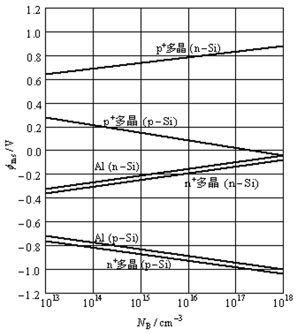

# 考试要考之习题

节选自`半导体器件基础.md`

## 4 p-n 结

注意：$\frac{k T}{q} = 0.026, @300k$

例1 对于一理想p-n结，$N_A = 10^{1} cm^{-3}, N_D = 10^{15} cm^{-3}, T = 300K$，求内建电势 $V_{bi}$

> 解答

$$
\begin{split}
    V_{bi}
    &= \frac{kT}{q} \ln \frac{N_A N_D}{n_i^2} \\
    &= (0.026) \ln \frac{10^{18} \times 10^{15}}{(9.65 \times 10^{9})^2}V \\
    &= 0.774 V \\
\end{split}
$$

或者看图，用 $V_{bi} = \Psi_n + |\Psi_p| = 0.774V$

---

习题关联教材 P110 4（1）（2）

4 对于一理想p-n结，$N_A = 10^{17} cm^{-3}, N_D = 10^{15} cm^{-3}$

(a) 计算在 250K, 300K, 350K 时的内建电势 $V_{bi}$, 并画出 $V_{bi}$ 和 $T$ 的关系

> 解答

250K时

$$
\begin{split}
    V_{bi}
    &= \frac{kT}{q} \ln \frac{N_A N_D}{n_i^2} \\
    &= \dots
\end{split}
$$

$$
\frac{kT}{q} = 0.0259, @300k ??????
$$

(b) 用能带图评价所求结果

## 5 双极型晶体管及相关器件

例3：已知在一理想晶体管中，各电流成分为：$I_{Ep}=3mA$、$I_{En}=0.01mA$、$I_{Cp}=2.99mA$、$I_{Cn}=0.001mA$。求出共射电流增益$β_0$，并以$β_0$和$I_{CBO}$表示$I_{CEO}$，并求出$I_{CEO}$的值。

> 解答

发射效率为

$$
\color{#E09941}{
\gamma = \frac{I_{Ep}}{I_{Ep} + I_{En}} = \frac{3}{3+0.01} = 0.9967}
$$

基区输运系数为

$$
\color{#E09941}{
\alpha_T = \frac{I_{Cp}}{I_{Ep}} = \frac{2.99}{3} = 0.9967}
$$

共基电流增益为

$$
\color{#E09941}{
\alpha_0 = \gamma \alpha_T = 0.9967 \times 0.9967 = 0.9934}
$$

因此可得

$$
\color{#E09941}{
\begin{align*}
    \beta_0
    &= \frac{0.9934}{1 - 0.9934} \\
    &= 150.5 \\
    I_{CEO}
    &= \left( 1 + \frac{\alpha_0}{1 - \alpha_0} \right) I_{CBO} = (\beta_0 + 1) I_{CBO} \\
    &= (150.5 + 1) \times 0.87 \times 10^{-6} = 1.32 \times 10^{-4} mA
\end{align*}}
$$

注：教师觉得要把0.87修改为1

## 6 MOS 电容器及 MOSFET

例3: 计算一 $N_A=10^{17}cm$ 及 $d=5nm$ 的 $n^+$ 多晶硅-SiO2-Si电容器的平带电压. 假设氧化层中 $Q_t$ 与 $Q_m$ 可忽略，且 $\frac{Q_f}{q} = 5 \times 10^{11} cm^{-2}$

> 解答

由图5.8可知，在 $N_A=10^{17}cm$ 时，对于 $n^+$ 多晶硅 p-Si系统，$\varphi_s$ 为 -0.98eV，由例2可得出 $C_o$

$$
\color{#E09941}{
\begin{split}
    C_0
    &= \frac{\varepsilon_{ox}}{d} \\
    &= \frac{3.9 \times 8.85 \times 10^{-14}}{5 \times 10^{-7}} \\
    &= 6.9 \times 10^{-7} F/cm^2 \\
    V_{FB}
    &= \varphi_{ms} - \frac{Q_f + Q_m + Q_{ot}}{C_o} \\
    &= -0.98 - \frac{1.6 \times 10^{-19} \times 5 \times 10^{11}}{6.9 \times 10^{-7}} \\
    &= -1.10 V \\
\end{split}}
$$
