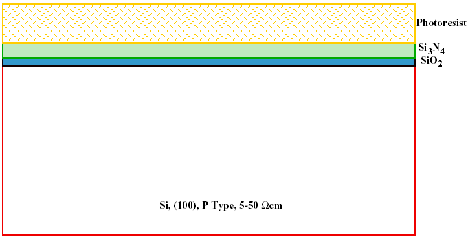
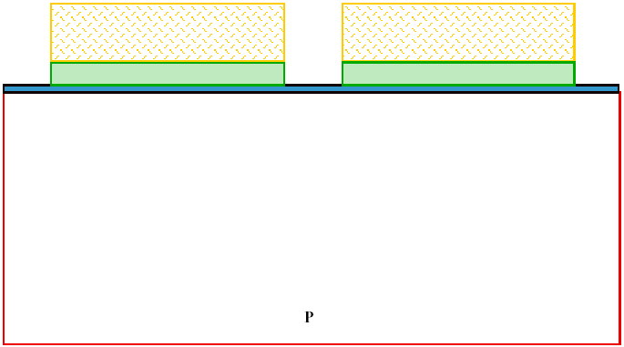
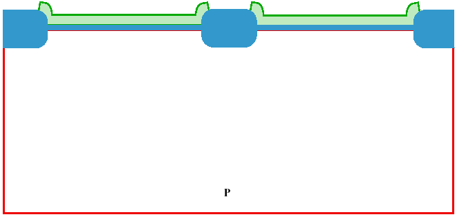

# 过程化考核2

## Q1 写出每一步的工艺步骤

1. **表面预处理（Surface Pretreatment）**：在晶圆表面进行清洁和处理，以确保后续层的附着性和质量。

2. **电介质沉积（Dielectric Deposition）**：在晶圆上沉积电介质材料（如氮化硅、低介电常数材料等）来形成绝缘层。

3. **光刻和沟槽蚀刻（Photolithography, Trench Etch）**：使用光刻技术定义通孔和沟槽的位置，然后通过蚀刻将材料去除，形成所需的结构。

4. **光刻胶干法去除，湿法清洗（PR Dry Strip, Wet Clean）**：去除光刻胶残留物并清洗晶圆表面。

5. **涂覆抗蚀层（Resist Coat）**：在通孔和沟槽内涂覆抗蚀层，以保护其结构。

6. **再次光刻和通孔蚀刻（Photolithography, Via Etch）**：定义通孔的位置并通过蚀刻形成通孔。

7. **光刻胶干法去除，湿法清洗（PR Dry Strip, Wet Clean）**：去除光刻胶残留物并清洗晶圆表面。

8. **脱气、预清洗、金属屏障沉积、铜种子沉积（Degas, Pre-clean, Metal Barrier Deposition, Cu Seed Deposition）**：在通孔和沟槽内沉积金属屏障（通常是钨或钽），然后沉积一层铜种子层。

9. **铜电填充、退火（Copper Electrofill, Anneal）**：通过电镀将铜填充到通孔和沟槽中，然后进行退火以改善铜的晶体结构。

10. **铜化学机械抛光（Cu CMP Barrier CMP Dielectric Buff CMP Post-CMP Clean）**：使用化学机械抛光（CMP）技术，将晶圆表面的铜抛光到所需的平坦度，以便后续工艺步骤。

这些步骤共同构成了沟槽优先双镶嵌工艺，用于制造先进的半导体器件。

## Q2 简要写出每一步的工艺步骤

简述

1.衬底：P-Si(100)，中等高电阻率(5-50u厘米）
2.氧化物用Si02/Si3N4
晶圆清洗
焊盘氧化物生长（≈400A）
LPCVD沉积（≈800a）
确定活动区域的光刻(掩模1)
光刻胶涂层（≈0.5-1μm）&烘烤
接触和发展
氮化物等离子体干法刻蚀
3.LOCOS法生长场氧化物
1000℃，H20室温，90分钟。（≈0.5μm）
4.p孔光刻（掩模2）和B+注入NMOS设备
5.n孔光刻（掩模3）和P+注入PMOS设备
6.通过热处理，去除损伤
7.NMOS设备调整VTH，进行光刻技术（掩模4）和B+注入物
8.PMOS设备调整VTH，进行光刻技术（掩模5）和AS+注入物
9.完成MOSFET阈值电压（VTh）调整注入物
10.栅极氧化物生长、聚硅沉积和掺杂
11.多标记光刻
12.NMOS LDD区域注入（轻掺杂漏极--限制热载流子降解）
13.NMOS LDD区域注入
14.沿多si线形成侧壁SiO₂spacer
15.实现自对齐S/D地层
16.NMOS源/排水区形成-用于NMOS设备的>光刻技术（掩模9）
17.PMOS源/排水区形成-用于PMOS设备的>光刻技术（掩模10）
18.高温热处理 掺杂剂激活和信向连接去除注入损伤
19.自对准S-G-D硅化物（杀盐剂）接触点和局部互连过程的S/D区域和多聚门的无掩蔽氧化物蚀刻
20.毯子沉积溅射
21.氮化钛本地互连光刻（掩模版11）和氮化钛选择性蚀刻工艺
22.完成保护
23.共形氧化物沉积由LPCVD，~1 μm氧化CMP（化学机械抛光）
24.接触孔开口
25.接触光刻（掩模版12）氧化物刻蚀
26.反应溅射薄氮化钛阻挡层（10²A）沉积、Wascene 工艺用于接触式填充
27.一级人工智能金属化
28.二级铝金属化
29.最终钝化

---

PPT 翻译

1、 器件活性区域的LOCOS定义 - 隔离

* 衬底：P型硅（100），适度高电阻率（5-50Ωcm）
* SiO2 / SiN4 用于场氧化物
* 水清洗
* 氧化层生长（约400Å）
* LPCV沉积（约800Å）
* 光刻定义活性区域（掩模1）
* 光抗蚀剂涂覆（约0.5-1μm）和烘烤
* Nitrile plasma干蚀刻
* 场氧化生长通过LOCOS过程
     > 1000°C, H2气氛， 90分钟， \\< 0.5μm

2、 双阱形成

* P阱式形成（模板2）
   能量：150-200 kEV
   剂量：\u003c=10^13 cm^-2
* N阱式形成（模板3）
   能量：300 kEV
   剂量：\u003c=10^13 cm^-2
   高温驱动-在深井形成
   在1000°C-1100°C下4-6小时，通过热处理过程移除植入物损伤。

3、 MOSFET 阈值电压调整

* NMOS器件 Vth 和 B+ 植入
  * 能量：50-75 kV
  * 剂量：(-1.5) × 10¹² cm²
* PMOS 器件 Vth 和 As + B+ 植入
  * 能量：75-100 kV
* 剂量：(-1.5) × 10¹² cm²

4、 栅氧化物和多晶硅栅极工艺

过程：

1. 栅氧化物生长：在活性区域，通过氧的超洁净栅氧化物生长：800°C，1-2小时→50-100 Å。
2. Poly-Si沉积和掺杂：采用LPCVD方法：≤0.5微米。
3. 非掩膜植入：P或As，5×10^5 cm²。
4. 多晶硅栅极工艺：精细版图工艺（掩模6）
5. 多晶硅非晶态蚀刻由RIE完成。

5、 自对准S/D形成

* NMOS LDD区域植入（光）
    Lithography for NMOS devices (mask 7)
    P + implant, 50 kev, ≈5x10³ cm²
* PMOS LDD区域植入
    Lithography for PMOS (mask 8)
    B + implant, ≈30 kev, ≈5x10³ cm²
* 侧壁SiO_2空间的形成
    沿多晶Si线形成
    Blanket SiO_2沉积，形成伪位差
    沿Si栅的非晶SiO_2条带，使侧墙间隔变宽

6、自对准S-G-D硅化物（Salicide）接触及局部互连工艺

* S/D 区域和多晶硅栅极的无掩模氧化蚀刻
* 通过溅射进行毯式钛沉积
* 在 650-700°C 下快速热退火，在 N2 环境中 1 分钟 ® Ti/Si 反应生成 TiSi x 并表面氮化形成 TiN
* TiN局部互连光刻（掩模11）和TiN选择性蚀刻工艺

7、多级互联

* 通过 LPCVD 进行共形氧化物沉积，
* 通过氧化物 CMP（化学机械抛光）对晶圆表面进行平坦化
* 接触孔开口
  * 接触光刻（掩模12）
  * RIE 氧化物蚀刻
* 用于接触填充的 W 镶嵌工艺
  * 通过反应溅射沉积薄 TiN 阻挡层 (10 2 Å)
  * 通过 MOCVD 沉积 W 用于接触填充
  * W CMP 可去除触点外部的 W 并平坦化晶圆表面
* 一级铝金属化
  * 通过溅射 Ø Al 光刻进行 Al 沉积（掩模 13）
  * RIE 铝蚀刻
* 二级铝金属化
  * 氧化物沉积和通孔光刻（掩模 14）
  * W镶嵌工艺
  * 二级铝沉积和光刻（掩模 15）
* 最终钝化
  * 通过 PECVD 沉积 Si3 N 4 层
  * 连接焊盘图案光刻（掩模 16）

