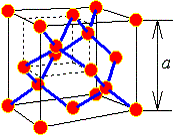

# 扩散的微观机制

这个要咋讲，建议先看看PPT，关联

* VLSI-扩散上.pdf

仔细一看，这不前两天网课也讲了吗？这就加入。

然后还有b教材，再去缝合一个

## 扩散的微观机制 - RealTitle

当半导体中存在外电场时，载流子会沿电场力的方向作定向运动。当半导体中存在载流子浓度梯度时，载流子会从浓度高处向浓度低处作扩散运动。因为载流子荷电，所以，它们的定向运动都会形成电流。

当半导体中载流子浓度在空间上有变化（即存在载流子浓度梯度）时，载流子会从浓度高的区域向浓度低的区域运动（即作扩散运动）。微观粒子的扩散运动遵循菲克定律，即：粒子扩散运动的流密度（单位时间单位面积内流过的粒子数）可用一 $D \frac{\mathrm{d}n}{\mathrm{d}x}$ 表示，扩散运动流密度与浓度梯度成正比，其比例系数D 称为扩散系数，其量纲为 cm^2/s。载流子的扩散运动将引超扩散电流。由于空穴和电子极性相反，空穴利电子的扩做电流可分别用一 $\dots$ 和 $\dots$ 表示，其中，$D_p、D_n$ 。分别为空穴、电子的扩散系数。

当半导体中同时存在电场和浓度梯度时，一维情形下电子和空穴电流可用下式表示：

$$
J_n = q \mu_n n E + q D_n \frac{\mathrm{d}n(x)}{\mathrm{d}x} \\
J_p = q \mu_p p E - q D_p \frac{\mathrm{d}p(x)}{\mathrm{d}x}
$$

---

间隙式杂质， 替位式杂质

* Si、Ge 都具有金刚石结构，一个晶胞内含有 8 个原子。
* 由于晶胞内空间对角线上相距 1/4 对角线长度的两个原子为最近邻 原子， 3a 4 恰好就是共价半径的 2 倍， 因此晶胞内 8 个原子的体积与立方晶胞体积之比为 34 % ， 即晶胞内存在着 66 % 的空隙。
* 所以杂质进入半导体后可以存在于晶格原子之间的间隙位置上， 称 为间隙式杂质， 间隙式杂质原子一般较小。
* 也可以取代晶格原子而位于格点上，称为替（代）位式杂质， 替位 式杂质通常与被取代的晶格原子大小比较接近而且电子壳层结构也相似。

## (a) 间隙式扩散（interstitial）

间隙扩散杂质 Au，Fe，Cu，Ni，Zn，Mg

* 间隙原子必须越过的势垒高度 $E_i$ , $E_i$ 约为 0.6 ~ 1.2 eV
* 跳跃几率和温度有关
    振动频率 $v_0＝10^{13}～10^{14}/s$
* 快扩散杂质

$$
P_i = v_0 \exp(-\frac{E_i}{kT})
$$

T：绝对温度，k：玻尔兹曼常数

## (b) 替位式扩散（substitutional）

替位扩散杂质：P，As，B, Al，Ga，Sb，Ge。

替位原子的运动一般是以近邻处有空位为前题
B，P，一般作为替位式扩散杂质，实际情况更复杂，包含了硅自间隙原子的作用，称填隙式或推填式扩散

---

替位式扩散：B, P, As, Sb等

$$
N_v = N \exp(-\frac{E_{vac}}{kT})
$$

* 在温度T，单位晶体体积中的空位数
* 每一格点出现空位的几率为 Nv /N，替位式原子必须越过的势垒高度为Es ; E s 约3 ~ 4eV
* 跳跃几率为

$$
P_v = \exp(-\frac{E_{vac}}{kT}) \cdot v_0 \exp(-\frac{E_s}{kT}) = v_0 \exp(-\frac{E_{vac} + E_s}{kT})
$$

* 慢扩散杂质

---

III、Ⅴ 族元素掺入 IV 族的 Si 或 Ge 中形成替位式杂质，用单位体积中的杂质原子数， 也就是杂质浓度来定 量描述杂质含量多少， 杂质浓度的单位为 1/cm^3 。

图1 替位式杂质和间隙式杂质

## (c) 填隙式(interstitial assisted kick-out)或推填式扩散(Interstitialcy-assited)

硅自间隙原子

间隙原子

## 本征扩散系数

当 $N_A, N_D < n_i$（在一定温度下）时，称为本征掺杂。

$$
D_i = D^{0} \exp(-\frac{E_a}{kT})
$$

$E_a$：本征扩散激活能

$D^0$ 和温度弱相关，而主要取决于晶格几何尺寸和振动频率 $v_0$

表观扩散系数:

$$
D^0 = a^2 v_0, \mathrm{D: cm^2/s}
$$

---

半导体工艺中常用掺杂原子在单晶硅中的本征扩散系数因子和激活能

As的优势：小D，大固溶度
