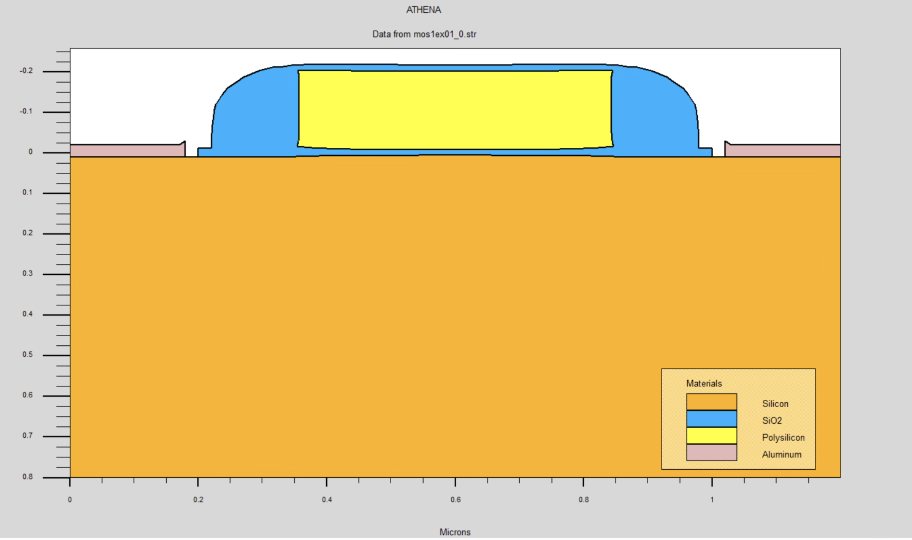

# 实验2  短沟道MOS晶体管特性仿真

注意：本文档已废弃，请查看 Word 文档以获取最新内容。

## 1、实验内容

（1）短沟道LDD-MOS晶体管结构定义。
（2）转移特性、输出特性.
（3）结构和参数：器件结构下图所示,宽度1.2μm，衬底为P型、厚度0.8μm、浓度 $1 \times 10^{14} cm^{-3}$、晶向<100>，栅氧化层厚度13nm，栅为n+掺杂多晶硅。


图1  普通耐压层功率二极管结构

## 2、实验要求

（1）掌握器件工艺仿真和电气性能仿真程序的设计
（2）改变表面浓度，改变栅氧化层厚度，观察阈值电压变化。

## 3、实验过程

### 3.1 掌握器件工艺仿真和电气性能仿真程序的设计

#### 调用 ATHENA 仿真器并生成网格信息

```text
#定义X网格
line x loc=0 spac=0.1
line x loc=0.2 spac=0.006
line x loc=0.65 spac=0.006
#定义Y网格
line y loc=0.00 spac=0.002
line y loc=0.2 spac=0.005
line y loc=0.5 spac=0.05
line y loc=1.0 spac=0.15
```

初试化 P 型 Si 衬底，含硼浓度 1×e14cm-3，晶向为 100（衬底的定义）。

```text
init silicon c.boron=1e14 orientation=100 space.mul=2 two.d
```

#### 提取器件参数

请解释 TCAD 提取器件参数代码

```text
extract name="nvt" (xintercept(maxslope(curve(abs(v."gate"),abs(i."drain")))) \
    - abs(ave(v."drain"))/2.0)
extract name="nbeta" slope(maxslope(curve(abs(v."gate"),abs(i."drain")))) \
    * (1.0 / abs(ave(v."drain")))
extract name="ntheta" ((max(abs(v."drain")) * $"nbeta")/max(abs(i."drain"))) \
    — (1.0 / (max(abs(v."gate")) — ($"nvt")))
```

#### 用 Log, Solve 和 Load 语句产生曲线族

```sh

# 设置栅极偏置，同时设置Vds=0V
 
solve init
 
solve vgate=0.5 outf=solve_tmp0_Test2
solve vgate=1.1 outf=solve_tmp1_Test2
solve vgate=2.2 outf=solve_tmp2_Test2
solve vgate=3.3 outf=solve_tmp3_Test2
 
#加载文件和步进Vd
 
load infile=solve_tmp0_Test2
log outf=Test2_MOSLEX_0.log 
solve name=drain vdrain=0 vfinal=3.3 vstep=0.3

load infile=solve_tmp1_Test2 
log outf=Test2_MOSLEX_1.log
solve name=drain vdrain=0 vfinal=3.3 vstep=0.3
 
load infile=solve_tmp2_Test2
log outf=Test2_MOSLEX_2.log
solve name=drain vdrain=0 vfinal=3.3 vstep=0.3
 
load infile=solve_tmp3_Test2
log outf=Test2_MOSLEX_3.log
solve name=drain vdrain=0 vfinal=3.3 vstep=0.3
```



### 3.2 改变表面浓度，改变栅氧化层厚度，观察阈值电压变化

进行器件物理特性分析，先求栅压为1.1V,2.2V,3.3V时，漏电流与漏电压的关系，即进行CVT分析

CVT（Constant Voltage Test）分析，常用于半导体器件的电学特性研究，尤其是在评估二极管等器件的电容-电压特性（C-V特性）时。以下是关于CVT分析的详细解释：

CVT分析的概念
CVT分析是通过施加恒定的电压（或一系列电压）并测量器件的响应，如电流和电容，来评估器件特性的方法。对于半导体器件，尤其是二极管，CVT分析通常用来测量器件在不同电压下的电容变化，以了解材料的掺杂分布、结电容和其他电学特性。

CVT分析的步骤
器件准备: 将待测试的二极管或其他半导体器件接入测试电路。
电压施加: 施加一系列恒定电压，通常包括正向偏置、反向偏置和零偏置。
电流和电容测量: 在每个施加的电压下，测量相应的电流和电容值。
数据记录和分析: 记录测量的数据，并对其进行分析以提取所需的器件特性。

```text
solve init
solve vgate=1.1 outf=solve_tmp1
solve vgate=2.2 outf=solve_tmp2
solve vgate=3.3 outf=solve_tmp3
solve vgate=5  outf=solve_tmp4
load infile=solve_tmp1
log outf=mos_1.log
solve name=drain vdrain=0 vfinal=3.3 vstep=0.3
load infile=solve_tmp2
log outf=mos_2.log
solve name=drain vdrain=0 vfinal=3.3 vstep=0.3
load infile=solve_tmp3
log outf=mos_3.log
solve name=drain vdrain=0 vfinal=3.3 vstep=0.3
load infile=solve_tmp4
log outf=mos_4.log
solve name=drain vdrain=0 vfinal=3.3 vstep=0.3
```

对不同的 $V_g$，求 $I_d$ 与 $V_{ds}$ 的关系曲线:


---

显示MOSFET的输出特性，即漏极电流（I_D）随栅极电压（V_G）的变化曲线。具体来说：

横轴（X轴）通常是栅极电压（V_G），从0V到3V。
纵轴（Y轴）是漏极电流（I_D），显示器件在不同栅极电压下的电流响应。
这种图像可以帮助分析MOSFET的阈值电压（V_t），即漏极电流开始明显增加的栅极电压值。通过这种仿真，可以了解MOSFET的开关行为和电流驱动能力，这是评估和设计半导体器件的重要步骤。

对栅极电压进行步进变化，开始电压为0伏，每步增加0.25伏，直到达到3.0伏。这个步骤是为了得到不同栅极电压下，器件的电特性数据。

将当前仿真状态保存到文件Test2-Vt.str，这样可以以后重新加载此仿真状态继续计算或者进行分析。

使用tonyplot工具（这是Synopsys提供的一个可视化工具）来绘制仿真数据文件Test2-Vt.log中的数据。这个命令会生成图像，显示MOSFET在不同栅极电压下的特性曲线。

```sh
solve init
 
# 漏极给偏置电压
solve vdrain=0.1

# 栅压步进
 
log outf=Test2-Vt.log master
 
solve vgate=0 vstep=0.25 vfinal=3.0 name=gate 
save outf=Test2-Vt.str
tonyplot Test2-Vt.log
```


### debug

代码见 `code/lab2-1.in`

TCAD DeckBuild Error, please explain the error message and provide the solution.

请为我解释并修正在TCAD DeckBuild中出现的错误消息。

```text
ERROR: failed extracting 1d cross section
    Extracted results: N/A
    Check cut line and/or selected quantities
```

---

```text
implant boron dose=9.5e11 energy=10 crystal
    errors detected in implant  boron dose=9.5e11 energy=10 crystal command
        Initialization must be performed first.
```

---

```text
EXTRACT> extract name="Gateoxide" thickness material="Sio-2" mat.occno=1 x.val=0.3
WARNING: x value is out of bounds of structure (min=1.79769e+308, max=-1.79769e+308)
defaulting to left hand side @ x=-1.#INF
WARNING: specified cutline may give inaccurate values resulting from proximity to structure edge, (min=1.79769e+308, max=-1.79769e+308)
ERROR: failed extracting 1d cross section
    Extracted results: N/A
    Check cut line and/or selected quantities
```
