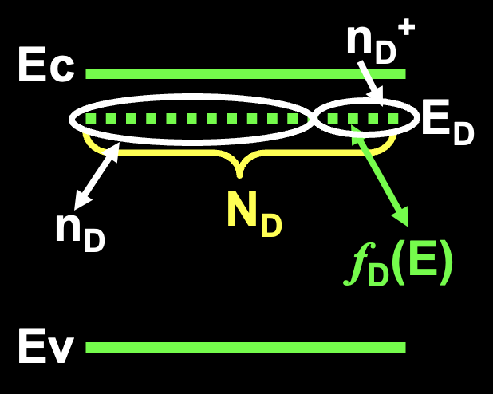

# 半导体物理

## 1 半导体中的电子状态

### 1.1 半导体的晶格结构和结合性质

晶体的基本特点

* **周期排列(规则性)**：组成晶体的原子按一定的方式有规则的排列而成。
* **固定熔点**：硅的熔点:1420摄氏度, 锗的熔点: 941摄氏度
* 单晶体具有**各向异性**

金刚石结构特点 （**考简答题**）

1. 每个原子周围有四个最邻近的原子，构成正四面体结构
2. 任一顶角上的原子和中心原子各贡献一个价电子为该两个原子所共有，并形成稳定的共价键结构
3. 共价键结构，共价键夹角：109˚28’
4. 两个面心立方沿立方体空间对角线互相位移了四分之一的空间对角线长度套构而成。

### 1.2 半导体中的电子状态和能带

#### 1.2.1 原子的能级和晶体的能带

晶体由原子周期性重复排列而成的

原子和晶体的区别

(1) 电子的区别：
孤立原子：电子在单势场中的运动
晶体：电子在周期性势场中的公有化运动

(2) 能级的区别：
孤立原子：孤立能级
晶体：准连续能带

半导体中**电子共有化运动**

内壳层的电子，轨道交叠少，共有化运动弱。
外层的价电子，轨道交叠多，共有化运动强。

孤立原子中的能级

$$ E_n = - \frac{m_0 q^4}{8 \varepsilon_0^2 h^2}·\frac{1}{n^2} = -13.6\frac{1}{n^2} $$

其中，m0：电子质量，q：电子电量，h：普朗克常数，ε0：介电常数

原子能级的简并

当2个原子相距很远时，每个原子的电子壳层完全相同，即电子有相同的能级，此时为简并的。

原子能级简并的消失

由于2个电子不能有完全相同的能量，交叠的壳层发生分裂，形成相距很近的能级带以容纳原来能量相同的电子。原子相距越近，分裂越厉害，能级差越大。由此导致简并的消失。

能带特点:
分裂的每一个能带称为允带，允带间的能量范围称为禁带
内层电子受到的束缚强，能级分裂小，能带窄；外层电子受束缚弱，能级分裂明显，能带宽。

#### 1.2.2 半导体中的电子状态和能带

单个电子运动满足的规律 （**考试要考**）

由粒子性有 $\color{#E45F59} P = m_0 v$，$\color{#E45F59} E = \frac{P^2}{ 2m_0}$
由德布罗意关系 $\color{#E45F59} P = \hbar k$，$\color{#E45F59} E = hv = \hbar \omega$
因此 $\color{#E45F59} v = \frac{\hbar k}{m_0}$，$\color{#E45F59} E = \frac{\hbar^2 k^2}{2 m_0}$

注: $\hbar$ 指普朗克常数，其中 $k$ 为波矢，大小等于波长倒数 $\frac{2\pi}{\lambda}$ ，方向与波面法线平行，即波的传播方向。

自由电子 vs 晶体中的电子

自由电子 $ | \psi (x) \psi'(x) | = A^2 $ 即自由电子在空间等几率出现，也就是作自由运动；

布里渊区: (**考试要考**)

当 $k=nπ/a \ \ \ (n= ±1，±2...)$ 时，能量不连续，形成一系列相间的允带和禁带。允带的k值位于下列几个称为布里渊区的区域中

第一布里渊区 $－π/a < k < π/2a$
第二布里渊区 $－2π/a < k < -π/a, π/a < k < 2π/a$
第三布里渊区 $－3π/a < k < -2π/a, 2π/a < k < 3π/a$

第一布里渊区称为**简约布里渊区**，相应的波矢称为简约波矢

#### 1.2.3 金属、半导体、绝缘体的能带

满带: 指完全被电子占据的能带，满带中的电子不会导电
能带半满: 能导电

固体按其导电性分为导体、半导体、绝缘体的机理，可根据电子填充能带的情况来说明
金属、半导体、绝缘体的主要区别（禁带宽度和导带填充程度）：

* 金属导带半满；
* 半导体禁带宽度在1eV左右；
* 绝缘体禁带宽且导带空；

固体导电的原因：
能带理论：电子从一个能级跃迁到另外一个能级。满带电子在外电场下不形成电流(内层电子)(价带),非满带中电子在外电场下跃迁到无电子能级，形成电流(外层电子)(导带)

半导体中能带:

* 高纯半导体在绝对零度时导带是空的，并且由一个能隙 $E_g$ 与充满的价带隔开。
* 能带隙是导带的最低点和价带最高点之间的能量差。
* 导带的最低点称为导带底，价带的最高点称为价带顶。
* 当温度升高时，电子由价带被热激发至导带。导带中的电子和留在价带中的空穴二者都对电导率有贡献。

$E_c$: 导带，空白处，导电
$E_v$: 价带，共价键
$E_g$: 禁带，以上两者之间

半导体能带与温度的关系:

* T=0K的半导体能带见图 (a)，半导体的价带是满带，导带是空带，半导体不导电。
* 当温度升高或其它外界因素作用下，原先空的导带变为半满带，而价带顶附近同时出现了一些空的量子态也成为半满带，见图 (b)。导带和价带中的电子都可以参与导电。

#### 1.2.4 本征激发

本征激发是半导体在温度或光照等外界因素的作用下，价带电子获得足够的能量跃迁到导带，同时在价带留下空穴的过程

### 1.3 半导体中电子的运动 有效质量

半导体中的 $E-k$ 关系 （**考填空**）

令$\color{#E45F59} \frac{1}{m_n^*} = \frac{1}{\hbar^2} (\frac{\mathrm{d}^2 E}{\mathrm{d} k^2})|_{k=0}$，$m_n^*$ 指导带底电子有效质量，有 $\color{#E45F59}E(k) - E(0) = \frac{\hbar k^2}{2 m_n^*}$

能带宽度对晶体中电子速度及有效质量的影响

原子核外不同壳层电子其有效质量大小不同：
有效质量与能量函数对于k的二次微商成反比，能带越窄，二次微商越小，有效质量越大。

* 内层电子的能带窄，有效质量大
* 外层电子的能带宽，有效质量小

外层电子，在外力的作用下可以获得较大的加速度。

导带: 由于 $E(k) > E_c \Rightarrow m_n^*>0, m_p^*<0$
价带顶: 由于 $E(k) < E(0) \Rightarrow m_n^*<0, m_p^*>0$

导带顶电子有效质量公式：
$$m_e^* = \frac{{\hbar^2}}{{\left(\frac{{d^2E}}{{dk^2}}\right)_{E=E_c}}}$$

价带顶电子有效质量公式：
$$ m_h^* = \frac{{\hbar^2}}{{\left(\frac{{d^2E}}{{dk^2}}\right)_{E=E_v}}}$$

空穴有效质量公式：
$$m_p^* = \frac{{\hbar^2}}{{\left(\frac{{d^2E}}{{dk^2}}\right)_{E=E_v}}}$$

其中，$\hbar$是约化普朗克常数，$d^2E/dk^2$表示能带的二阶导数，$E_c$表示导带底能级，$E_v$表示价带顶能级。这些公式用于计算半导体中导带顶和价带顶电子的有效质量，以及空穴的有效质量。请注意，这些公式的具体形式可能因材料和能带结构而异。在实际应用中，需要根据具体的半导体材料和能带结构来选择适当的公式和参数值。

### 1.4 本征半导体的导电机构 空穴

本征的含义：本征方程、本征值，即本来的特征，100%纯的，无外来杂质的

空穴直观解释：电子从价带跃迁到导带底，在外场作用下，导带电子参与导电；同时，价带不满的状态——空穴也参与导电

在结构上理解：原共价电子逃离所处的位置，产生了一个空的位置，称为空穴

空穴的电性：产生了一个正电荷的空状态

绝对零度 $\rightarrow$ 室温下

强电离区杂质基本电离标准: **90%杂质电离**

### 1.5 回旋共振

以电磁波通过半导体样品，交变电场频率等于回旋频率时，发生共振吸收。测出频率和电磁感应强度便可得到 $m_n^*$

磁场强度为 $B$ 作用在速度为 $v$ 的电子上，磁场力为 $ f = -qv \times B $

电子作回旋运动，回旋速度和加速度分别为 $ v = r\omega_c, a = \frac{v^2}{r} $

得出，半导体样品置于均匀恒定磁场中，电子回旋频率为

$$\color{#E45F59}\omega_c = \frac{qB}{m_n^*}$$

### 1.6 硅和锗的能带结构

硅的导带结构（Si的回旋共振结果） （**考试要考**）

* B沿[111]方向，有**1**个吸收峰
* B沿[110]方向，有**2**个吸收峰
* B沿[100]方向，有**2**个吸收峰
* B沿任意方向，有**3**吸收峰

## 2 杂质和缺陷能级

### 2.1 硅/锗晶体中的杂质能级

本节重点（期末考试知识点）：

* 替位式杂质与间隙式杂质区别
* 施主杂质与施主能级
* 杂质电离与杂质电离能
* 施主杂质电离过程与原理
* 杂质电离能的计算
* 如何计算杂质补偿半导体的载流子数量
* 如何分辨半导体导电类型

#### 2.1.1 间隙式杂质 / 替位式杂质

* 间隙式杂质：杂质原子存在于间隙位置
* 替位式杂质：杂质原子替换晶体原子

#### 2.1.2 施主杂质 / 施主能级

V族元素在Si,Ge晶体中是替位式杂质

**施主杂质 (N型杂质)**: ？？？的杂质
**施主电离**: 释放电子的过程。指在半导体材料中掺入的施主杂质失去一个电子，形成正离子的过程。
**施主能级 $E_D$**: 施主杂质多余电子被束缚时的能量状态

施主能级位于离导带底很近的禁带中

施主杂质未电离时，是电中性的，电离以后，成为正电中心
分别称为 中性态(束缚态) / 施主离化态

4价Si中掺入5价磷(P)，P的5个价电子中的4个与Si形成共价鍵，剩余一个价电子。

由于杂质浓度比较低，故没有杂质能带

杂质原子相距较远，所以现成相同能量的孤立能级

* 杂质能级用短线表示;
* $\Delta E_D \ll E_g$（分立能级，局域，未形成能带）

$T \neq 0K$，能带角度：电子从 $E_D$ 跃迁到 $E_C$ ，成为导带电子

#### 2.1.3 受主杂质 / 受主能级

**受主杂质 (P型杂质)**: 能够接受电子的杂质
**受主电离**: 受主杂质获得电子的过程
**受主能级 $E_A$**: 受主束缚电子的能量状态

4价Si中掺入3价的硼B，硼原子有3个价电子，与周围四个硅原子形成共价鍵，缺少一个电子，必须从周围获得一个电子，成为负电中心B-

N型半导体: 以电子导电为主

半导体掺入III族元素后，杂质电离使导电空穴增多，主要依靠空穴导电的半导体为P型半导体

受主能级位于离价带顶很近的禁带中

浅能级杂质 -- 电离能很小

classification (根据杂质向半导体提供载流子): n / p / 本征

类氢原子模型的计算 -- (源于Si中掺入P)

$$ E_n = - \frac {m_0 e^4}{8 \theta^2 h^2 n^2} = -\frac{13.6}{n^2} (eV) $$

#### 2.1.4 浅能级杂质电离能的简单计算

逆天人似乎没讲，可以参考教程

[半导体物理 西安电子科技大学 P27](https://www.bilibili.com/video/BV1fp4y1z7oF?t=670.3&p=27)

#### 2.1.5 杂质的补偿作用

作用: 补偿作用可以用来形成PN结，例如在N型半导体中掺入P型杂质，或者在P型半导体中掺入N型杂质。

在半导体中既掺入施主杂质，又掺入受主杂质，施主杂质和受主杂质具有相互抵消的作用 -> 补偿半导体

施主杂质浓度 $N_D, (\mathrm{cm}^{-3})$
受主杂质浓度 $N_A, (\mathrm{cm}^{-3})$
导带电子浓度 $n, (\mathrm{cm}^{-3})$
价带空穴浓度 $p, (\mathrm{cm}^{-3})$

计算杂质补偿半导体的载流子数量:

case1: if $N_D \gg N_A$, then $n_0-N_D - N_A \approx N_D$

we call $N_D - N_A$ : 有效施主浓度

case2: if $N_A \gg N_D$, then $p = N_A - N_D \approx N_A$

we call $N_A - N_D$ : 有效受主浓度

case3: if $N_A \approx N_D$, we call it 过度补偿

#### 2.1.6 深能级杂质

当半导体中存在非III，V 族杂质时，会引入深能级

产生的能级离导带底或者价带顶都比较远，而且往往有若干个能级。深能级杂质对半导体中的载流子浓度和导电类型影响不大，但对载流子的复合作用更强，故称为复合中心

### 2.2 III-V 族化合物中的杂质能级

本节重点（期末考试知识点）：
等电子杂质与等电子陷阱

III-V族化合物是两种元素1:1构成的物质。杂质进入后，可以成为间隙或替位式杂质。

* 替位式杂质：取代III 族、V 族位置
* 间隙式杂质：处于4 个III 族（V 族）原子围成的正四面体

一些重要实验结果

* II族元素掺入III、V族中，通常取代III族元素，而位于其格点位置上。因为比III族少一个价电子，倾向于接受1个电子，而起受主作用，引入浅受主能级
* VI族元素掺入III、V族中，通常取代V族元素，而位于其格点位置上。因为比V族多一个价电子，倾向于释放1个电子，而起施主作用，引入浅施主能级
* IV族元素掺入III、V族中，杂乱发布在格点位置上。效果取决于杂质浓度，以及样品所处条件
    if IV浓度低，then 取代 III族，施主作用
    if IV浓度高，then 取代 V族，受主作用

等电子杂质效应: 有些V族元素的取代会产生能级，此能级为等电子能级

等电子陷阱: 杂质电子与基质原子的价电子数量相等。替代格点原子后，仍为电中性。但是，原子序数不同导致了原子的“共价半径”和“电负性”不同，即对电子的束缚能力不同于格点原子，能俘获电荷成为带电中心，形成等电子陷阱

### 2.4 缺陷、错位能级

本节重点 (**考试要考**):

* 点缺陷（弗兰克尔缺陷，肖特基缺陷）
* 位错

2.4.1 **点缺陷**

在格点位置振动 -> 获得足够能量，挣脱周围原子的束缚，而挤入间隙位置

Frankel (弗兰克尔)缺陷: 间隙原子 / 相对空位 成对出现

Schottky (肖特基)缺陷: 若间隙原子运动到样品表面，形成新的表面，则样品体内只有空位存在

样品中，Frankel 缺陷与 Schottky 缺陷同时存在，Schottky 缺陷的浓度 $\gg$ Frankel 缺陷的浓度

空位周围... 起受主作用

空位：不饱和键，倾向于接受电子 -- 受主
间隙原子：4个多余的价电子 -- 施主 (也可能做受主)

在III、V族化合物半导体中，点缺陷的来源

二元化合物半导体: A取代B，记作 $A_B$

2.4.2 错位 (线缺陷)

最著名的位错是刃位错或称棱位错，从原子排列的状况看如同垂直于滑移面插进了一层原子

## 3 半导体中载流子的统计分布

本章重点：

* 费米分布函数与波尔兹曼分布函数；
* 费米能级的意义；
* 态密度；
* 简并半导体与非简并半导体的电子和空穴浓度；
* 费米能级位置的确定（载流子浓度出发）；
* 电荷中性方程极其重要意义；

### 3.1 状态密度

#### 3.1.1 K 空间量子态的分布

定义：
a. 量子态：最多只能容纳一个电子的状态。
b. 状态密度：能带中，若能量在 $E - Ε + \mathrm{d}E$ 之间有 $\mathrm{d}Z$ 个量子态，则状态密度为:

$$ g(E) = \frac{\mathrm{d}Z}{\mathrm{d}E} $$

电子在晶体中传播满足的条件

#### 3.1.2 状态密度

在半导体的导带和价带中，能级密度很大，间隙很小。被认为是准连续的。表示其密度的大小，需要用状态密度表示。

状态密度求解过程：

a. 计算单位K空间中的量子态数—K空间状态密度；
b. K空间中E-Ε+dE之间所对应的体积；
c. K空间体积与K空间态密度相乘得到E-Ε+dE之间的量子态数dZ;
d. 利用公式求解态密度

导带底能量状态密度为

$$\color{#E45F59} g_c(E) = V \frac{(m_n^*)^{\frac{3}{2}}}{2 \pi^2 h^3} (E - E_c)^\frac{1}{2}$$

价带项能量状态密度为

$$ \color{#E45F59} g_v(E) = V \frac{(m_n^*)^{\frac{3}{2}}}{2 \pi^2 h^3} (E_v - E)^\frac{1}{2}$$

### 3.2 费米能级和载流子的统计分布

#### 3.2.1 费米分布函数

热平衡状态下电子按能量大小服从费米统计分布。表示能量为E的量子态被一个电子占据的几率是：

$$ \color{#E45F59} f(E) = \frac{1}{1 + \exp(\frac{E - E_F}{k_0T})} $$

$E_F$ 是费米能级: 与温度导电类型、杂质含量等有关，标志了电子填充水平
$k_0$ 是波尔兹曼常数
$T$ 为热力学温度

热平衡状态下，电子在允许的量子态上如何分布的统计分布函数。

T = 0K (red line in the image)

当T>0时
若 $E < E_f$ ，则 $f(E) > 1/2$
若 $E = E_f$，则 $f(E) = 1/2$
若 $E > E_f$，则 $f(E) < 1/2$

T=0K：所有电子将占满费米能级以下的低能级，高能级为空。外加一个电子，只能占据费米能级，即导致内能增加 $E_F$

for example:

T=300K时，$k_0 T = 0.026eV$, 所以, $Ε_c-Ε_F \gg k_0 T$
当 $Ε-Ε_F = 5k_0 T$ 时，电子填充的几率 $f(Ε)=0.007$
当 $Ε-Ε_F = -5k_0 T$ 时，电子填充的几率 $f(Ε)=0.993$

#### 3.2.2 玻耳兹曼分布函数

$$ \color{#E45F59} f_B(E) = A e^{-\frac{E}{k_0T}} $$

表明一定温度下电子占据能量为E的量子态的几率由指数因子决定

$-\frac{E}{k_0T}$ 表示能量的负指数关系分布

relationship between 费米分布函数 and 玻耳兹曼分布函数

$$
\begin{split}
f_B(E)
&= \frac{1}{1 + \exp(\frac{E - E_F}{k_0 T})} \\
&\approx \exp (-\frac{E - E_F}{k_0 T}) \\
&= e^{\frac{E_F}{k_0 T}} e^{- \frac{E}{k_0 T}} \\
&= A e^{-\frac{E}{k_0T}}
\end{split}
$$

两种函数适用范围

1. 当 $\color{#E45F59}E-E_f \approx  k_0 T$ ，**费米分布函数**适用；
2. 当 $\color{#E45F59}E-E_f \gg k_0 T$，**波尔兹曼分布函数**适用。

#### 3.2.3 空穴分布函数

空穴的费米分布函数

能量为 $E$ 的量子态被电子分布函数为 $f(E)$，被空穴占据的几率:

$$ 1-f(E) = \frac{1}{1 + \exp(\frac{E_F - E}{k_0T})} $$

空穴的波尔兹曼分布函数

When $E-E_F \gg (k_0 T)$

$$
1-f(E) \approx \exp(\frac{E - E_F}{k_0 T}) = B e^{\frac{E}{k_0 T}}
$$

电子 + 空穴 (的分布函数) = 1

(1) 导带中的电子浓度的计算

可以参考院长PPT3 - P26

$Ε-Ε+ \mathrm{d}Ε$ 内的电子数为 $\mathrm{d}N = f_B(E) g_c(E) \mathrm{d}E$

导带中的电子数 （**考试要考**）

$n_0$ 导带电子浓度:

$$
\color{#E45F59} n_0 = N_c \exp(- \frac{E_c - E_F}{k_0 T})
$$

$N_c$ 有效状态密度:

$$
\color{#E45F59} N_c = 2 \frac{(2 \pi m_n^* k_0 T)^{\frac{3}{2}}}{h^3}
$$

(2) 价带中的空穴浓度

$$
\color{#E45F59} p_0 = N_v \exp(\frac{E_v - E_F}{k_0 T})
$$

$$
\color{#E45F59} N_v = 2 \frac{(2 \pi m_p^* k_0 T)^{\frac{3}{2}}}{h^3}
$$

温度的影响

$T \rightarrow 0K$ ：$N_c \rightarrow 0, \exp(-\frac{A}{T}) \rightarrow0 $, 则 $n_0 \rightarrow 0$ .

$T$ 增大，$N_c$ 增大，$\exp(-\frac{A}{T})$ 增大，$T$ 很大时，$\exp(-\frac{A}{T}) \sim 1$

费米能级的影响：

$E_F$ increase ，$E_c - E_F$ decrease ，$n_0$ increase

$E_F-E_v$ 越大，$p_0$ 越小

载流子浓度乘积 $n_0 p_0$

$$
\color{#E45F59} n_0 p_0 = 4 (\frac{2 \pi k_0}{h^2})^3 (m_n^* m_p^*)^{\frac{3}{2}} T^3 \exp(- \frac{E_g}{k_0 T})
$$

电子空穴浓度乘积讨论：

1.浓度乘积与费米能级无关；
2.浓度乘积与杂质浓度无关；
3.浓度乘积与温度有关，一定温度下乘积恒定；
4.浓度乘积公式对本征半导体和杂质半导体都适用

### 3.3 本征半导体的载流子浓度

本征半导体的电中性条件：$n_0 = p_0$

$$
N_c \exp(- \frac{E_c - E_F}{k_0 T}) = N_v \exp(\frac{E_v - E_F}{k_0 T})
$$

由上式得到本征半导体费米能级

$$
E_{i} = E_{F} = \frac{E_c + E_v}{2} + \frac{k_0 T}{2} \ln(\frac{N_v}{N_c})
$$

本征载流子浓度:
根据等式 $n_0=p_0$ ，将费米能级公式带入,可以算出 $n_0$ 等数值

$$
n_i = n_0 = p_0 = (N_c N_v)^{\frac{1}{2}} \exp(- \frac{E_g}{k_0 T})
$$

$$
n_0 p_0 = n_i^2
$$

本征载流子浓度 $n_i$ 与禁带宽度 $E_g$

**本征载流子浓度**随温度**升高**迅速**增大**

同一温度下,禁带宽度越大,本征载流子浓度越小.与所含杂质无关,适用于杂质半导体材料。

本征载流子浓度 $n_i$ 与温度 $T$ ，可以求得半导体的禁带宽度

$$
\ln(n_i T^{-\frac{3}{2}}) = - \frac{Eg}{2k}\frac{1}{T} + B
$$

本征半导体在室温不能正常工作

### 3.4 杂质半导体的载流子浓度

重点:

* 电子或空穴占据杂质能级的几率;
* N型半导体的电中性条件；
* 不同温度区间费米能级，电子和空穴的浓度；
* 各种条件下的电中性方程。

电子占据施主杂质能级的几率变为：

$$
f_D(E) = \frac{1}{1 + (g_D) \exp(\frac{E_D - E_F}{k_0 T})}
$$

$g_D=2$ 称为施主能级的基态简并度，$g_A=4$受主能级简并度。

$$
n_D = N_D f_D(E) = \frac{N_D}{1 + \frac{1}{g_D}\exp(\frac{E_D - E_f}{k_0 T})}
$$

$E_D$ 与 $E_F$ 的相对位置反映了电子占据杂质能级的情况

见PPT P47 -- 三种情况

case1 施主能级远在费米能级之上

case2 $E_D = E_F$ ...

case3 ...

n型半导体的载流子浓度

$$ n_0 = n_D^+ + p_0 $$

其中，$n_D^+$是施主杂质浓度，$p_0$是本征载流子浓度。

$$
\color{#E45F59} N_c \exp(- \frac{E_c - E_F}{k_0 T}) = N_v \exp(\frac{E_v - E_F}{k_0 T}) + \frac{N_D}{1 + 2\exp(- \frac{E_D - E_F}{k_0 T})}
$$

下面基于各种条件的变化对此式进行详细分析：(**考试要考**)

* a. 低温弱电离区
* b. 中间电离区
* c. 强电离区
* d. 过渡区
* e. 高温本征激发区

a.低温弱电离区

温度极低时，忽略本征电离，导带电子由施主产生，故 $p_0 = 0$

$$
E_{F} = \frac{E_{c}+E_{D}}{2}+\left(\frac{k_{0} T}{2}\right) \ln \left(\frac{N_{D}}{2 N_{c}}\right)
$$

低温弱电离区计算出的电子浓度

$$
n_{0} = (\frac{N_{D} N_{c}}{2})^{\frac{1}{2}} \exp(- \frac{\Delta E_D}{2 k_0 T})
$$

(1) 杂质越多(浓度越高)，导带电子浓度 $n_0$ 越大；
(2) $N_c$ 越大，导带电子浓度 $n_0$ 越大；
(3) $E_D$ 越小，导带电子浓度 $n_0$ 越大；
(4) 温度越高，导带电子浓度 $n_0$ 越大。

b.中间电离区

掺杂半导体的载流子浓度和费米能级由温度和杂质浓度决定，杂质浓度一定时，随着温度的升高，载流子从以杂质电离为主要来源过渡到以本征激发为主要来源。

c.强电离区

温度升高使大部分杂质电离，称之为强电离。施主全部电离的标准是：90%

$$ n_0 = n_D^+ \approx N_D $$

温度升高使费米能级逐渐靠近本征能级。禁带的大小随温度变化。温度增加，禁带减小

施主杂质全部电离时，$n_0=N_D$ 。温度上升，载流子浓度将保持不变，显示出与温度无关。此区域为“饱和区”

d.过渡区

杂质全电离的饱和区与本征激发之间的区域称之为过渡区。

比较复杂...

e.高温本征激发区

公式 -- jpg

本征激发温度的高低与掺杂施主浓度的含量有关

院长之总结图，载流子浓度 and 费米能级

不同掺杂浓度下的费米能级

半导体的金属化

### 3.5 一般情况下的载流子统计分布

请重新排版，第三章已经结束力

### 3.6 简并半导体

请重新排版，第三章已经结束力

## 4 载流子的散射及电导

### 4.1 载流子的漂移运动  迁移率

利用电导率：$\sigma = \frac{1}{\rho}$ 得到欧姆定律的微分形式为: $\color{#E45F59}J = \sigma |Ε|$

漂移运动

平均漂移速度为：$\overline{v_d}$

电流强度：$I = -n q \overline{v_d} \times 1 \times s$

电流密度：$J = -n q \overline{v_d}$

总的电导率为：$\sigma = n q \mu_n + n q \mu_p$
n型、p型、本征从中提取即可

求载流子浓度: $n_i  = \frac{1}{\rho q (\mu_n + \mu_p)}$

### 4.2 载流子的散射

#### 4.2.1 载流子散射概念

散射概念：

* 粒子性：载流子在半导体中运动，不断与热振动的晶格原子或电离杂质发生碰撞，改变了载流子的速度大小和方向。
* 波动性：电子波在半导体中传播时遭到散射。

散射过程：
a. 无电场时，无规则热运动，不形成电流；
b. 有电场时，载流子定向运动；
c. 载流子遭到散射，使其只能在两次散射之间获得加速度。

结论：
a. 在恒定电场作用下，电流密度是恒定的。
b. 电流产生的原因是电场对载流子的加速和散射对载流子运动的阻碍共同造成的。
c. 散射是半导体中电阻率产生的主要原因。

载流子以一定平均速度定向漂移

#### 4.2.2 晶格振动的散射

主要散射机构

(1) 格波的概念

a.晶格原子在平衡位置附近振动；
b.晶格原子的振动由不同的基本波动按照波的叠加原理组合而成，基本波成为格波。

(2) 声学波和光学波 (**考试要考**)

a. 格波波矢：$q = \frac{2\pi}{\lambda}$
b. 相同q的格波数量取决于晶格原胞中所含的原子数。

原胞:

1个原子：一个q对应3个格波；
2个原子：一个q对应6个格波；

* 3支频率低，称声学波
* 3支频率高，称光学波

c. N个原胞构成的半导体，共有N个不同q的格波，每个q有6个不同频率格波，共有6N个不同的格波。下面3支为声学波，上面3支为光学波。

6种传播模式 有横波和纵波

长声学纵波 对散射影响比较大
影响其次的是 光学纵波

(3) 声学波与光学波区别：

原子振动方式：无论声学波还是光学波都是2横1纵

> **PPT P15** 有极霸图，但没看懂

(4) 声学波与光学波的频率

格波的频率是量子化变化的

$$
E_{\mathrm{phomon}} = (n + \frac{1}{2}) \hbar \omega_{a}
$$

最小声子单元: $\hbar \omega_{a}$
增加一个最小单元 -- 吸收声子
减少一个最小单元 -- 放出声子

格波的散射：电子与晶格碰撞 -- 产生、吸收声子

院长私藏了几张ppt --> 看HEIF

[旦又秒（bing之天书）](http://fdjpkc.fudan.edu.cn/_upload/article/files/b7/47/81b789084326983c6e01d04ea453/703103e0-674a-4ee2-954b-8c3030cc7ea9.pdf)

### 4.3 迁移率与杂质浓度和温度的关系 (**考试要考**)

$$
\color{#E45F59}\mu = \frac{q}{m^{*}} \frac{1}{AT^{\frac{3}{2}} + \frac{B N_i}{T^{\frac{3}{2}}}}
$$

(1) 高纯和低掺杂样品：$N_i$ 很小，声学波散射起主要作用，$T \uparrow\mu \downarrow$
(2) 掺杂增加：杂质散射增加。$\mu$ 随温度 $T \uparrow$ 先增大而后下降，此时变为声学波散射为主。
(3) 轻掺杂时，多子与少子迁移率相同，迁移率数值恒定 $\mu_{\mathrm{少}} = \mu_{\mathrm{多}}$。
(4) 重掺杂后，杂质能级扩展为杂质能带，多子运动受电离杂质散射和施主能级俘获作用，受到影响减小，导致多子运动速度减慢。$\mu_{\mathrm{少}}$ 不变，$\mu_{\mathrm{少}} < \mu_{\mathrm{多}}$。
(5) 重掺杂后，作正常的漂移运动，所以少子迁移率受影响不大

### 4.4 电阻率及其杂质浓度和温度的关系

a. 轻掺杂，迁移率恒定，n等于杂质浓度
=> 电阻率与掺杂浓度成线性反比

b. 重掺杂，

case1 杂质不能全部电离
case2 迁移率随掺杂浓度增大降低

=> 电阻率与掺杂浓度非线性反比

建议看看PPT4 P20 的图，指出 考试要考 ，另外图是复旦人之ppt的

### 4.6 强电场下的效应、热载流子

院长私藏了几张ppt --> 看HEIF

讲完了，但不知道这章干了啥（悲

## 5 非平衡载流子

本章重点：

1. 准费米能级
2. 非平衡载流子的复合过程
3. 载流子复合后向外释放能量的方法
4. 爱因斯坦关系式

### 5.1 非平衡载流子的流入与复合

过剩载流子

非平衡载流子的复合

### 5.2 非平衡载流子的寿命

非平衡载流子的寿命是指非平衡载流子在半导体中存在的时间。它是由于非平衡载流子的产生和复合过程决定的。

非平衡载流子的寿命的计算方法:
设 $t = 0$ 时刻光照停止，非平衡载流子浓度 $\Delta p$ 开始衰减，其衰减速率与非平衡载流子的浓度成正比。

$$ \frac{d \Delta p(t)}{dt} = - \frac{\Delta p(t)}{\tau} $$

$$ \Rightarrow \Delta p(t) = (\Delta p)_0 \exp(- \frac{t}{\tau}) $$

### 5.3 准费米能级

准费米能级定义: (**考试要考**) $E_F^n, E_F^p$

半导体热平衡态被破坏后，不存在统一的费米能级，对导带和价带中电子来讲，他们各自基本上处于平衡态，而导带和价带之间处于不平衡态，引入导带和价带的费米能级，称为准费米能级，他们之间不重合。

### 5.4 复合理论

非平衡载流子复合: 非平衡态 -> 平衡态

非平衡载流子复合方式: (**考试要考**)

1. 从复合过程：
(1) 直接复合：
(2) 间接复合：

2. 从复合位置：
(1) 体内复合
(2) 表面复合。

3. 从能量交换方式：
辐射复合：发射光子
非辐射复合：发射声子；俄歇复合。

### 5.7 载流子的漂移运动，爱因斯坦关系式

爱因斯坦关系: 漂移和扩散之间的关系

热平衡状态下不均匀的n型半导体，施主浓度随x增加而下降，则自由电子和空穴浓度也是x的函数。产生扩散运动，其中电子的扩散电流密度为：$...$ -- PPT5 P18

爱因斯坦关系式:

$$
\color{#E45F59} \frac{D_n}{\mu_n} = \frac{k_0 T}{q}, \frac{D_p}{\mu_p} = \frac{k_0 T}{q}
$$

## 参考资料

[【物理】半导体物理 西安电子科技大学 柴常春等主讲](https://b23.tv/5tNZzWQ)

说明：@P32 12:00
