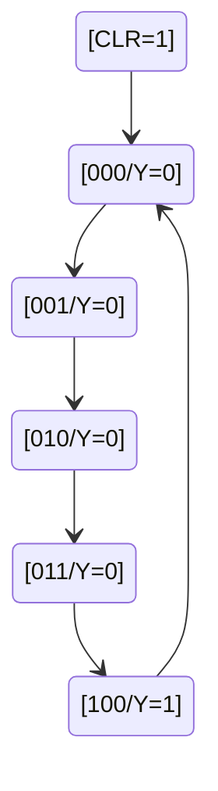

# FPGA应用开发

Verilog硬件描述语言

说明:

* 序号就不按逆天课本来了

## 2 Verilog HDL 基础

```v
module and2gate (y, a, b);
input a,b;
output y;
wire a,b;
reg y;
always @ ( a or b) // variable in always must be reg type
begin
    y<=a & b;
end
module
```

端口必须define方向，内部连线不必define方向

`input`和`inout`不能define为`reg`类型

define端口位宽

调用元件(元件例化)

### 2.2 Verilog HDL基本语法

常量及其表示

4种基本值 (xz不区分大小写)
(1) 0:逻辑0或false
(2) 1:逻辑1或true
(3) x:未知状态
(4) z:高阻

字符串常量
每个字符串 = 8位ASCII值序列

reg型数据的格式 -> `reg[msb:lsb]`

2.2.3 **变量的数据类型**

(1) 线网类型变量(net)

wire 导线 表示为物理连接
可综合性 —-可以画为电路图

(2) 寄存器类型(register)

register必须被赋值，只能在initial/always赋值，default is x

(3) memory型

`reg[7:0] mem[1023:0];`define a 1024bit，every bitwidth = 8bit的存储器
`mem[1] = 2` 对某一单元赋值

用parameter(参数)语句to define`符号常量`

```v
parameter width = 6; //define参数width为常量6
```

### 2.3 运算符及表达式

算数运算符

位运算符

`~` 每一位取反 ~a
`&` 按位与 -- 对应位相乘 需要扩位 a&b
`|` 按位或 a|b
`^` 按位异或 a^b
`^~(~^)` 按位同或 a^~b

缩位运算符

& 按位取与

关系运算符

真/假/不确定(1'b0/1'b1/1'bx)
有x/z，则结果不确定

等式运算符

等于 == / 不等于 != / 全等 === / 不全等 !==
使用!=时，若有x/z，则结果1'bx
使用===时，有x/z，也可以为真

逻辑运算符 ! / && / ||

移位运算符 >> / << 补零

拼接运算符 {A,B} {n{A}}

条件运算符

信号 = 条件?表达式1:表达式2

```v
assign out = (sel == 0) ? a : b;
```

例：四位加法器

```v
module add4(a,b,co,sum);
input[3:0] a,b;
output co;
output[3:0] sum;
wire[3:0] a,b,sum;
assign {co,sum} = // ????????
```

### 2.4 过程语句

initial block

主要用于仿真测试，只执行一次，不能逻辑综合
`initial`语句在一个`module`中的使用次数是无限的

```v
initial
begin
    // for (i=0;i<size;)
end
```

或者，给测试变量a提供一组激励

```v
`timescale 100ns/100ns
module test;
reg a,b;
initial
begin
    a = 0, b = 0;
    #2 a = 1; // #2 表示经过200ns
    #2 b = 1;
    #2 b = 0;
    #2 a = 0;
    #2 finish;
end
endmodule
```

always block

`always`块内的语句是不断重复执行的

敏感信号表达
不能用敏感信号列表以外的信号，会导致出现锁存器
不能将电平敏感和边沿敏感信号，写在同一敏感列表中

边沿触发
`posedge`上升沿 `negedge`下降沿

always @ (negedge clk1)

同步清零/异步清零 -- 书P29

```v
always @ (a, b, c)
begin
    // zzbl
end
```

### 2.5 块语句

串行块 begin...end

`#` 延时符号

并行块 fork...join

### 2.6 赋值语句

#### 2.6.1 连续赋值

assign 目标线网型变量 = 表达式;

#### 2.6.2 过程赋值

过程块中的赋值，目标是reg变量

(1) 非阻塞赋值(Non_Blocking)

<=

相当于并行执行

(2) 阻塞赋值(Blocking)

=

相当于串行执行

不能在不同的always块中，对同一变量赋值

### 2.7 条件语句

(1) if ... else语句

(2) Verilog case statement

for undefined cases, use `default`

`case`语句的分支

* `casex` ignore比较过程中值为z的位
* `casez` ignore比较过程中值为z和x的位

assign out = (a>b)?1:0;  (更简洁

条件的描述完备性 -- 避免产生锁存器

综合指令 -- shu p49

```v
xxx // synopsys parallel_case
```

### 2.8 Verilog Loop

forever

repeat

例: 二进制乘法

while

Verilog for Loop

++ oprator does not exist in Verilog

Verilog disable

```v
if (i = 114) disable xxx;
```

### 2.9 Verilog task

`task` -- always use in function simulation

use `task`

```v
<your-task-name>(port_list)
```

### 2.10 Verilog function

The output is its function-name. You can't use output in a function

```v
function [automatic] [return_type] name ([port_list]);
statements 
endfunction
```

use `function`

```v
<your-function-name>(port_list)
```

the differnce bewteen `task` and `function`

BOOK -P61

### 2.11 Compilier Directives

```v
`define

`include "filename"

`timescale
```

### 2.12 Code Example

#### 2.12.1 组合逻辑电路

1. 使用连续赋值语句描述电路 (assign)

    ```v
    module logic_express1 (a,b,c,d,f,g,h)
    input a, b, c, d;
    output f, g, h;
    assign g = (a & b)|(c & d);
    assign f = g | h;
    endmodule
    ```

2. multi compare

    ```v
    module compare_n (...);
    ```

3. 3-8 decoder

4. ROM

    ```v
    reg[3:0] data;
    reg[3:0] men[15:0];
    ```

时序逻辑电路

1. JK Trigger

    ```v
    module jk_ff (clk, j,k, q, qn);
    input clk, j,k;
    output q, qn;
    reg 9;
    assign qn = ~ g;
    always @ (posedge clk)
    begin
        case({j, k})
            2'b00: q < = q;
            2'b01: q < = 0;
            2'b10: g < = 1;
            2'b11: q< = ~g;
        endcase
    end
    endmodule
    ```

2. Latch

    ```v
    begin
        if (~clr) temp = 0;
        else if (en) temp = data;
    end
    ```

3. D Trigger

    ```v
    module dff_1 (clk , data, g, qn) ;
    input clk, data;
    output q, qn;
    reg q;
    assign qn = ~q;
    always @ (posedge c1k)
    begin
        g < = data;
    end
    endmodule
    ```

4. frequency division circuit (分频电路)

    div3

    any odd number div: cnt = (2n-1)

5. adder

## 3 Verilog HDL 层次化描述

### 3.1 设计方法学

* system level
* algorithm level
* registerr transport level, RTL
* logic gate level
* switch level

### 3.2 数据流建模描述方式

在数字电路中，信号经过逻辑电路的过程就像数据在电路中流动，即信号从输入流向命出。当捡入变化吋，总会在一定的时问之后在输出端呈现出效果。
模拟数字电路的这一特性，对其进行建模的方式称为数据流建模描述方式。

数据流建模最基本的方法就是用关键词 `assign`，通过连续赋值语句实现

### 3.3 行为建模描述方式

initial / always

### 3.4 结构化建模描述方式

```v
wire clk;
led_1 M1 (.clk(clk)), .led1(led1));
```

#### 3.4.2 实例化基本门级和开关级元件

Verilog HDL 内置的基本门级元件

| 类型     | 名称   | 功能               |
| -------- | ------ | ------------------ |
| 多输入门 | and    | 多输入与门         |
| 多输出门 | buf    | 多输出端缓冲器     |
| 三态门   | bufif0 | 控制输出端口高阻态 |

(以下是一个由 bing 生成的表格)

具体用法

```v
nand NA1(out, in1, in2, in3);
```

开关级结构化描述

```v
nmos N1(out1, data, control);
pmos P1(out1, data, control);
```

#### 3.4.3 用户定义的原语

真值表

```v
table
    0 0 0 : 0;
    0 0 1 : 0; //以下类似
endtable
```

组合逻辑电路

时序逻辑电路

ex. D触发器

(??) 保持原来状态

## 4 Verilog 有限状态机设计

### 4.1 FSM (有限状态机)

FSM -> 同步时序电路

异步 时序电路 采用电路图输入的方法

有/没有 输入端控制的电路

有输入端控制的电路 -> FSM

A finite state machine (FSM) is a mathematical model of computation. It is an abstract machine that can be in one of a finite number of states at any given time. The FSM can change from one state to another in response to some inputs; the change from one state to another is called a transition. An FSM is defined by a list of its states, its initial state, and the inputs that trigger each transition.

FSMs are used in many applications such as digital circuits, software engineering, and control systems. They are particularly useful for modeling systems that have a finite number of states and that change from one state to another in response to some inputs.

### 4.2 FSM 的描述方法

step 1 画状态图



step 2 确定状态编码和编码方式
step 3 给出状态方程和输出方程

一 / 二 / 三 段式描述

编码方式

| 状态 | 顺序编码 | 格雷码 | 独热码 |
| ---- | -------- | ------ | ------ |
| S0   | 000      | 000    | 00001  |
| S1   | 001      | 001    | 00010  |
| S2   | 010      | 011    | 00100  |
| S3   | 011      | 010    | 01000  |
| S4   | 100      | 110    | 10000  |

Mearly米利型 / Moore穆尔型 时序电路

米利型有限状态机的输出不仅与当前内部状态有关，也与当前输入有关；
穆尔型有限状态机的输出只与当前内部状态有关。

Moore machine

```v
case(state)
...
assign Y = (state == S3);
...
```

Melay machine

```verilog
module Mealy_Model ( A, CLR, CP, Y);
input A, CP, CLR; //输入端口
output reg Y;
// 中间变量
reg [1:0] current_state, next_state;
// 用参数定义状态
parameter S0=2'b00, S1=2'b01, S2=2'b11;

// 触发器状态转换
always @(negedge CP, negedge CLR)
begin
    if (!CLR)
        current_state <= S0; // 复位
    else
        current_ state <= next_ state; //状态转换
end

always @(current_state, A)
begin
case(current _state)
    Y = 0; //电路输出
    S0: begin next state = (A==1)? S1: S0; end
    S1: begin next_state = (A==1)? S2: S0; end
    S2: if (A==1)
            begin next state = S2; end
        else
            begin Y = 1; next state = S0; end
    default: begin next_state = S0; end
endcase
end
endmodule
```

### 4.3 FSM 描述方法实例

4.3.1 1001 序列信号检测器

(将一个指定的序列从数字码流中识别出来) -- 教材 P114

4.3.2 交通信号控制系统

设计十字路口东西、南北两方向的红、黄、绿三色灯控制器,指挥车辆和行人安全通行。
交通灯信号控制系统示意因如图 4-19所示。输出R、Y G、Re、了2、Ge分别代表东西方向的红、黄、绿灯和南北方向的红、黄、绿灯。东西方向绿灯亮的时间七为30s,南北方向绿灯亮的时间tg为25s,两方向黄灯亮灯时间t为5s。
该交通管理器由控制器和受其控制的三个定时器及 6个交通信号灯组成。C1 C2 C3
为控制器发出的启动定时计数器t、t2、t，的控制信号，Wi、We、W。为定时计数器反馈给控制器的指示信号,计数器在计数过程中，相应的指示信号为0，计数结束时为1

具体参考实验9

## 6 逻辑验证与测试平台

nmsl

## 参考资料

* [【电子】Verilog硬件描述语言 西安电子科技大学 蔡觉平等主讲](https://www.bilibili.com/video/BV12y4y1v7V3)
* [鼠专之智慧树](https://coursehome.zhihuishu.com/courseHome/1000002108/158824/19#teachTeam)
* [RUNOOB Verilog 教程](https://www.runoob.com/w3cnote/verilog-basic-syntax.html)
* [verilog](https://www.chipverify.com/verilog/verilog-operators)

## 实验

C:\altera\91\quartus\eda\mentor\modelsim\modelsimSE_lib

详情见[实验指导书](FPGA应用开发实验指导书.pdf)

3个图片

* 代码验证通过
* 波形
* 硬件验证通过

### 实验7 存储器的设计

看PDF

## 作业

### 书后b题

#### 习题2

《教材》- P74

1.判断下列标识符在verilog中是否合法，如果有误则指出原因。

```v
count //合法
8sina //不合法，数字不能作为首字母
_date //合法
module //合法
$ display //不合法，系统函数保留
\74HC574\ //不合法，包含非法字符
```

2.下列数字的表示是否正确。

6'd18 正确
'bx0 正确
5'b0×110 正确
'da30 错误，10进制出现a
10'd2 正确
'hzf 正确

3.指出下面几个信号的最高位和最低位。

```v
reg [1:0] SEL; //msb=1，lsb=0
input [0:2] IP; //msb=0，lsb=2
wire [16:23] A; //msb=16，lsb=23
```

4.reg 型变量和 wire 型变量有什么本质的区别？

* wire表示直通，即只要输入有变化，输出马上无条件地反映；reg表示一定要有触发，输出才会反映输入。
* 不指定就默认为1位wire类型
* wire只能被assign连续赋值，reg只能在initial和always中赋值
* wire使用在连续赋值语句中，而reg使用在过程赋值语句中。

5.define以下的 Verilog HDL 变量。

(1) 一个名为 data_in 的8位向量线网 -- `wire[7:0], data_in;`
(2) 一个名称为 MEM1 的存储器，含有128个数据，每个数据位宽为8位 -- `reg[7:0] mem[127:0], MEM1;`
(3) 一个名为data_out 的8位寄存器 -- `reg[7:0] data_out;`

6.定义一个长度为256、位宽为4 的寄存器型数组，用for语句对该数组进行初始化，要求把所有的偶元素初始化为 1,所有的奇元素初始化为0

```v
// by new bing
reg[3:0] array [0:255];
integer i;

initial begin
    for (i = 0; i < 256; i = i + 1) begin
        if (i % 2 == 0) begin
            array[i] = 4'h1;
        end
        else begin
            array[i] = 4'h0;
        end
    end
end
```

9.用持续赋值语句描述一个4选1数据选择器。

连续赋值语句必须以关键词 assign 开始

```v
module mux_4to1_3bit (m,s,u,v,w,x);
input[3:0] u,v,w,x;
input[1:0] s;
output reg[3:0] m;

always @(s or u or v or w or x)
begin
    case(s)
        2'b00: m=u;
        2'b01: m=v;
        2'b10: m=w;
        default: m=x;
    endcase
end
endmodule
```

11.阻塞赋值和非阻塞赋值有什么本质的区别？

阻塞赋值 (=)是顺序执行的，即等号右边的表达式计算完并立即赋值给等号左边的变量后，才会执行下一条语句。阻塞赋值适用于描述组合逻辑电路，因为它与信号电平触发有关。

非阻塞赋值 (<=)是并行执行的，即等号右边的表达式计算完后，并不立即赋值给等号左边的变量，而是等到当前时刻结束后再统一更新。非阻塞赋值适用于描述时序逻辑电路，因为它与信号边沿触发有关。

13.用行为语句设计一个8位计数器，每次在时钟的上升沿，计数器加 1,当计数器溢出时，自动从零开始重新计数。另外，计数器有同步复位端

```v
module counter (
    input clk,
    input rst,
    output reg [7:0] count
);

always @(posedge clk) begin
    if (rst) begin
        count <= 8'h00;
    end else if (count == 8'hFF) begin
        count <= 8'h00;
    end else begin
        count <= count + 1;
    end
end

endmodule
```

14.设计一个4位移位寄存器

```v
module shift_register (
    input clk,
    input rst,
    input [3:0] data_in,
    output reg [3:0] data_out
);

always @(posedge clk) begin
    if (rst) begin
        data_out <= 4'h0;
    end 
    else begin
        data_out <= {data_out[2:0], data_in[3]};
    end
end

endmodule
```

15.initial 语句与 always 语句的关键区别是什么？

initial 语句和 always 语句的关键区别在于它们执行的次数。initial 语句仅在仿真开始时执行一次，而 always 语句会在其敏感列表中的任何信号发生变化时重复执行。

### 苟智慧树

#### 第一章测试

1.Verilog HDL的抽象分层建模方式可划分为系统级和算法级建模方式、寄存器级建模方式、逻辑门级建模方式和晶体管开关级建模方式 (TRUE)

4.以下哪些是FPGA和CPLD的相似点 (BD)

A. 采用SRAM工艺
B. 可采用Verilog HDL 进行电路设计
C. 器件密度可达到上千万门
D. 可编程逻辑器件

5.以下哪些是SOPC的基本特征  (ABCD)

A. 可能包含部分模拟电路
B. 单芯片
C. 至少包含一个嵌入式处理器内核
D. 低功耗

#### 第二章测试

1.如果线网类型变量说明后末赋值，起始缺省值是 (D)

A. 1
B. X
C. 0
D. z

2.`reg [7:0] mema[255:0]`正确的赋值是 ~~(B)~~ D

A. 4'bzz11
B. 8'd0;
C. mema[5]=3'd0,
D. 4'bxx11

3.`a=4'b11001,b=4'bx110`，verilog 语言，选择正确的运算结果 ~~(B)~~A

A. a&&b=1;
B. b&a=x
C. a&b=0
D. b&&a=x

4.下列标识符中，(A) 是veriog中合法的标识符。

A. _date
B. 8_sum
C. adder8#
D. $finish

5.下列语句中，不属于并行语句的是 ~~(D)~~ C

A. 元件例化语句
B. assign语句
C. case语句
D. 过程语句

### 极霸测试

always @ (posegde clk)
begin
cnt=n+1;
q=~q;
end
assign y=a+b;
写出上面程序中变量cnt， n，q， a，b的类型。

将时间尺度定义为 ``timescale 100ns/10ns`，下列选项正确的是（）。
A.时间精度100ns
B. #3.2表示延时0.32s
C. #3.2 表示延时32ns
D. 时间单位10ns

在Verilog HDL中，下列说法错误的是（）。
A. 任务可以有一个或多个输入端口，也可以没有
B. 函数不可以包含输出端口或双向端口
C. 西数必须有一个返回值，返回值被赋给和函数名同名的变量
D. 任务定义没有端口列表，函数定义有端口列表

在Verilog HDL中，下面说法错误的是（）。
A. 多条阻塞赋值语句是顺序执行的，而多条非阻塞语句是并行执行的。
B. 只有当变量声明为reg型变量后，才能在initial和always块内进行赋值。
C. 器件端口映射采用名字关联方式实例化模块时端口的次序可以任意排列。
D. 实例化用户定义模块可以省略实例化名。

verilog set A = 4'b1001, B = 4' b1010, C = 1' b1, then A<<1 = ?

判断: set  A = 4' b1010, B = 4' b0011, C = 1' b1, ~A = 0b0101, {A, B[0], C} =0b101011
