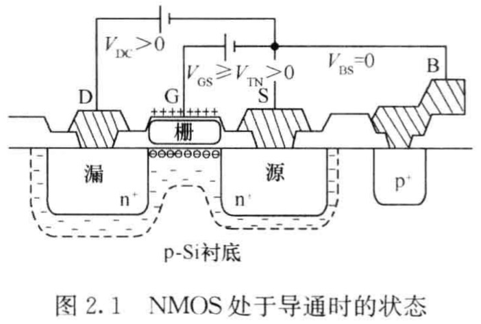
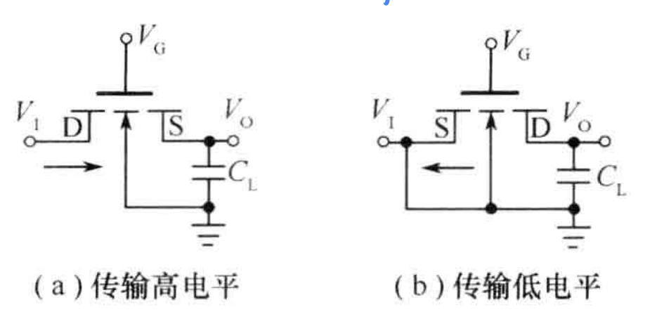
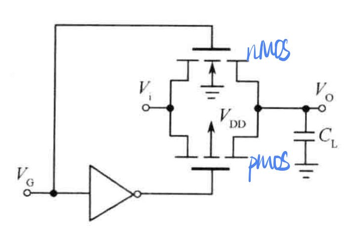
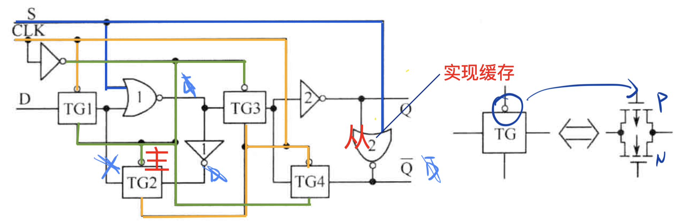
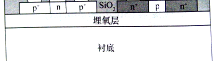

# 2 MOS 器件与工艺基础

## 2.1 MOS 晶体管基础

器件长宽比 W/L

### 2.1.1 MOS 晶体管结构及基本工作原理

源极 Sourece S
栅极 Gate G: 使用多晶硅 Polysilicon，是导体，作用是栅极或电极引线
漏极 Drain D
衬底 Substrate B

If a nmos D--V_cc, G--input, S--GND, then input=1 means open and 0 means close.

If a pmos S--V_cc, G--input, D--GND, then input=1 means close and 0 means open.

P型多子是空穴，少子是电子
N型多子是电子，少子是空穴

---

先注释一下里面的一些变量：

$V_{GS}$ 相对于源级的正电压
$V_{DS} = u_{D} - u_{S}$ ...
$V_T$ 阈值电压，$V_{TN}$
$V_{GD}=V_{GS}-V_{DS}=V_{TN}$ 临界状态，沟道夹断点。

先注释一下里面的一些概念：

沟道长度L ：源漏掺杂区之间的距离

沟道宽度W ：垂直于沟道长度的有效源漏区尺寸

表面反型：相对于原来的p型半导体，表面形成n型半导体的导电性质

沟道区：表面反型的区域

沟道夹断：

---

工作基本原理

当栅极施加相对于源极的正电压VGS ，栅极的正电荷在P型衬底上感应出等量的负电荷，随着VGS的增加，衬底中接近二氧化硅界面处的负电荷越来越多。
VGS很小时：栅极正电荷驱逐衬底表面空穴；
VGS增大：正电荷耗尽，形成带固定负电荷的耗尽层；
VGS再增大：耗尽层向下延伸，少量电子被吸引到表面；
VGS继续增大：表面积累的电子增多， ==> 在表面处，电子成为多数载流子 N型（表面反型）n+ - p - n +变为n+ - n - n + 形成沟道区。此时 VGS = VT（阈值电压）
在漏源电压VDS作用下，电子由源极到漏极，形成漏源电流 IDS
在VDS不变：VGS越大，表面处的电子密度越大，漏源电流IDS越大

a、VDS很小时,VDS与IDS近似线性
b、VGS > VTN且一定时:VDS增大, 漏端沟道区变薄。当VDS ＝ VGS －VTN时，即漏端VGD＝VGS－VDS＝VTN时，沟道夹断 沟道夹断点临界饱和点(饱和区与非饱和区的分界线)
c、VGS > VTN且一定时: VDS继续增大，漏端沟道消失，沟道夹断点向源端趋近，VDS增大电流几乎不变时为饱和区。

---

$$
V_{G} - V_{D} = V_{TN} \\
\to V_{D} = V_{G} - V_{TN} \\
\forall V_{G} - V_{D} < V_{TN}
\to \mathrm{沟道夹断}
$$

沟道长度调制效应

夹断后有电流

厄莱电压 $V_{A}$ 衡量沟道长度调制的大小
调制因子 $\lambda$

---

PMOS 工作原理

空穴 高电平 -- source $|v_{GS}|\downarrow$

### 2.1.2 阈值电压

$V_T$ 阈值电压的影响因素

A: 衬底掺杂浓度 （浓度低，（浓度低 VT小）
B: 材料的功函数差 （材料性质、掺杂类型与条件）
C: 二氧化硅中的电荷及性质氧化硅中的电荷及性质
D: 栅极单位面积的电容（栅极氧化层厚度）

### 2.1.3 电压-电流公式

**萨氏方程**，分别对应非饱和区、饱和区、截止区。 <- 指出考试用到时会给出，所以可以不用背。

$$
\begin{cases}
    I_{DS} = K_N \left[ (2V_{GS} - V_T)V_{DS} - V_{DS}^2 \right] & V_{GS} \geq V_{TN} , V_{DS} < V_{GS} - V_{TN} \\
    I_{DS} = K_N \left[ (V_{GS} - V_T)^2 \right] (1+\lambda V_{DS}) & V_{GS} \geq V_{TN} , V_{DS} \geq V_{GS} - V_{TN} \\
    I_{DS} = 0 & V_{GS} < V_{TN}
\end{cases}
$$

其中，$K_N = \dots$ -> PDF

### 2.1.4 平方律转移性质

~~SKIPPED~~

PDF 图还是比较关键的，请整理

### 2.1.5 MOS晶体管的跨导

衡量MOS器件的栅－源电压对源－漏电流控制能力的参数

$$
g_m = \frac{\partial I_{DS}}{\partial V_{GS}} = \frac{2I_{DS}}{V_{GS} - V_T}
$$

NMOS晶体管的跨导与载流子的迁移率、晶体管的宽长比成正比；和栅氧化层的厚度成反比，与器件工作状态有关。

### 2.1.6 MOS晶体管的直流导通电阻

$$
R_{ON} = \frac{V_{DS}}{I_{DS}}
$$

### 2.1.7 MOS晶体管的交流电阻

$$
r_d = \frac{\partial V_{DS}}{\partial I_{DS}} = \frac{1}{g_m}
$$

### 2.1.8 MOS晶体管的最高工作频率

当对栅极输入电容 $C_{GC}$ 的充放电电流和漏源交流电流的数值相等时，所对应的工作频率为流电流的数值相等时，所对应的工作频率为MOS晶体管的最高工作频率

### 2.1.9 MOS晶体管的衬底偏置效应

对于教材中的图2.14，其中的 $V_{BS}<0$ 的含义是反向电压，避免pn结正向导通。

### 2.1.10 CMOS 结构

指出PPT之图片非常重要，只能等教师发出PPT了。

## 2.2 CMOS 逻辑部件

### 2.2.1 CMOS 倒相器设计

在一定的工艺条件下，倒相器的设计，关键是对晶体管的尺寸（W/L）的设计，并由确定的沟道长度L，获得沟道宽度的具体数值。

上升时间 $t_r$: 输出信号从 $0.1V_{DD}$ 上升到 $0.9V_{DD}$ 所需的时间
下降时间 $t_f$: 输出信号从 $0.9V_{DD}$ 下降到 $0.1V_{DD}$ 所需的时间

通常要求 $t_r = t_f$

$$
\frac{(W/L)_P}{(W/L)_N} = \frac{\mu_n}{\mu_p}
$$

### 2.2.2 CMOS 与非门和或非门设计

#### 2.2.2.1 NAND

两输入与非门

PMOS 并联 NMOS 串联 -> AND

$(W/L)_P$ same; $(W/L)_N$ double

CMOS AND Gata （下图仅供参考，以教材为准）

#### 2.2.2.2 NOR

两输入或非门

PMOS 串联 NMOS 并联

$(W/L)_P$ double; $(W/L)_N$ same

CMOS NOR Gate （下图仅供参考，以教材为准）

### 2.2.3 其他 CMOS 逻辑门

#### 2.2.3.1 CMOS 组合逻辑单元

AND $\cdot$

* NMOS -- series
* PMOS -- parallel

OR $+$

* NMOS -- parallel
* PMOS -- series

上拉网络（PUN）和下拉网络（PDN）

#### 2.2.3.2 XOR

异或门

$Z(A,B) = \overline{A} \cdot B + A \cdot \overline{B}$

异或门具有运算的功能，在运算逻辑方面，它是一个非常重要的逻辑部件。当A和B均为0时，Z=0，当A和B均为1时，Z也为0，当A和B不相同时，Z=1。这样的关系正好满足二进制加的本位和的规律，所以，异或门常作为加法器的基本组成单元使用。
异或门的另一个应用是输出信号极性控制，当A=“1”时，B信号经过异或门倒相输出，当A=“0”时，B信号同相输出，A、B互易，情况相同。

#### 2.2.3.3 传输门

In this case, **input not in gate, gate is used as control**.

NMOS transmission gate

* can transmit Low level
* can't transmit High level completely

PMOS transmission gate

* can transmit High level
* can't transmit Low level completely

CMOS transmission gate -- 两个传输门并联

PMOS传输门可以完全传输 **高电平**

NMOS传输门可以完全传输 **低电平**

#### 2.2.3.4 三态门

tags: [#考试要考, #会分析工作原理]

谓三态逻辑是指该逻辑门除了正常的"0", "1"两种输出状态外，还存在第三态：**高阻输出态**。
应用较为广泛的三态门有**三态倒相器**和**三态同相器**。

---

三态倒相器

c＝1时高阻
c＝0时为倒相器

控制端C＝1时： M3 、M4 都截止都截止,高阻状态高阻状态

控制端C＝0时： 正常倒相状态

---

同相输出三态门

c=1时同相器
c＝0时高阻

控制端C＝1时：
不控制与非门、不控制与非门或非门
「倒相＋倒相」-> 同相

控制端C＝0时：
M1 、M2 都截止
高阻状态

### 2.2.4 D 触发器

## 2.3 MOS 集成电路工艺基础

### 2.3.1 基本的集成电路加工工艺

1. 器件制造基本问题
2. 掩模版 masks
3. 图形转移技术
4. 掺杂工艺
    tags: [#考试要考]

    掺杂分为热扩散法掺杂和离子注入法掺杂。
    **热扩散法**：是利用原子在高温下的扩散运动，使杂质原子从浓度很高的杂质源向硅中扩散并形成一定的分布。
    **离子注入法**：高能离子束轰击硅片表面
5. 氧化及热处理
6. 气相沉积工艺
    tags: [#考试要考, #填空题]

    **物理气相沉积**(PVD) 和 **化学气相沉积**(CVD)
    PVD技术两种基本工艺：**蒸镀法** 和 **溅镀法**。

    CVD是利用化学反应的方式在反应室内将反应物生成固态的粒子，并沉积在硅片表面的一种薄膜沉积技术。在集成电路工艺中能够用CVD 技术沉积的薄膜材料包括：二氧化硅、氮化硅、多晶硅、单晶硅等。其中，用于沉积单晶硅的CVD技术习惯上称为「**外延**」。

### 2.3.2 CMOS 工艺简化流程

1. 初始氧化（一次氧化）
2. 一次光刻和离子注入硼B+
3. 去除表面氧化层
4. 底氧生长： 热氧化生成一层均匀的氧化层
5. 沉积氮化硅并刻蚀场区
    tags: [#考试要考]

    这里实际上包含了三步工艺步骤：沉积氮化硅，光刻，刻蚀氮化硅。采用 CVD 技术在底氧上沉积一层氮化硅薄膜，然后光刻和刻蚀氮化硅层。刻蚀采用干法刻蚀技术，在有源区保留氮化硅，场区的氮化硅则被去除。
    所谓的 **有源区** 是指 **将来要制作晶体管**、**掺杂条**（低电阻掺杂区）、**接触电极** 等的区域；
    **场区** 是芯片上有源区之外的所有区域，场区的氧化层厚度远大于有源区的氧化层厚度，在这样厚的氧化层上布线（电路中各单元之间的连线）所产生的寄生电容较小，有利于降低系统的寄生延迟。习惯上称这次光刻为有源区光刻或场区光刻。
6. 场氧化：高温热氧化
7. 去除氮化硅和底氧层、进行栅氧化
8. 沉积多晶硅并光刻、刻蚀多晶硅图形
9. 离子注入形成PMOS和NMOS的源漏区
    硅栅自对准技术
10. 低温沉积掺磷二氧化硅
11. 光刻引线孔并回流
12. 沉积第一层金属层并完成第一次金属引线的光刻与刻蚀
13. 制作双层引线间的介电材料
14. 光刻和刻蚀双层金属间的连接通孔
15. 第第二层金属光刻与刻蚀

### 2.3.3 Bi-CMOS 工艺技术

Bi-CMOS工艺技术
双极器件优点：速度高 、驱动能力强、高频低噪声、高跨导
缺点：功耗大，集成度低

CMOS器件：优点：低功耗、集成度高、抗干扰能力强
缺点：速度低，驱动能力差

#### 2.3.3.1 以 p 阱 CMOS 工艺为基础的 Bi-CMOS 工艺

P45

p阱相当于隔离环

#### 2.3.3.2 以 n 阱 CMOS 工艺为基础的 Bi-CMOS 工艺

P46

n阱相当于隔离环

## 2.5 发展的 MOS 器件技术

### 2.5.1 物理效应对器件特性的影响

沟道调制效应

---

CMOS 寄生晶闸管效应 / CMOS latch-up / 可控硅效应

[Latch-Up现象](https://en.wikipedia.org/wiki/Latch-up)： CMOS寄生晶闸管效应出现在这些PNP和NPN二极管之间的相互作用。当特定条件下施加电压时，这些二极管可以进入导通状态，形成一个低阻抗路径，允许电流通过。这种情况下，CMOS电路将陷入"锁定"状态，无法正常工作，这就是所谓的Latch-Up现象。

预防和应对

1. 输入端信号幅度不能大于 输入端信号幅度不能大于Vcc和小于0V
2. 要消除电源上的干扰。
3. 在条件允许的情况下，尽可能降低电源电 尽可能降低电源电压。如果电路工作频率比较低，用+5V电源供电最好

---

常见的典型物理效应有：

* 短沟道效应
* 浅结效应
* 电迁移效应
* 寄生分布
* 关态沟道泄漏电流
* 栅泄漏电流

### 2.5.2 材料技术

材料科研人员不断地在工艺中引入新材料或对原有材料进行改进，力求克服或减小因尺寸缩小所产生的问题。

1. 硅化物（Silicide）
2. 铜互连
3. 低K值材料
4. 高K值栅介质
5. 应变硅（Strained Silicon）

### 2.5.3 器件结构

1. 短沟道效应抑制
2. SOI（Silicon on Insulator）技术
3. 高K值栅介质与金属栅组合结构
4. FIN结构和多栅结构

---

SOI技术：Silicon on Insulator

「硅-二氧化硅-硅」叠层结构

优点：

* 介质隔离，彻底消除寄生的可控硅效应；
* 寄生电容小、集成密度高、速度快、短沟道效应小
* 某些特殊结构（HK+MG，FIN）的衬底材料
* 常用SOI材料：注氧隔离的SIMOX材料，硅片键合加背面腐蚀的BESOI材料，经键合和注入相结合的Smart Cut SOI材料
