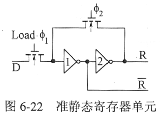

# 6 微处理器

## 6.1 系统结构概述

## 6.2 微处理器单元设计

### 6.2.1 控制器单元

### 6.2.2 算术逻辑单元ALU

ALU的信号结构

操作码：控制信息，对所需的操作进行选择和控制
操作码的位数由所需进行的操作与运算类型数量决定

标志位：表示操作的属性

---

Half-adder 半加器

半加器：不考虑前级进位输入 $C_{i-1}$

半加器与函数发生器逻辑配合可实现与、与非、 或、或非等逻辑操作

在实际设计中，若逻辑输入量只有两个，可用半加器代替全加器

---

Full-adder 全加器

ALU 的核心
指可以进行带进位输入和输出的加法运算单元

全加器的逻辑结构图

以全加器为核心构造的ALU -> PDF

ALU功能表
八种算术运算
四种逻辑运算

ALU实现算术运算的设计

函数发生逻辑电路

J IN 函数发生逻辑
Y函数发生逻辑
X函数发生逻辑

函数发生逻辑可采用组合逻辑门结构，也可采用传输晶体管逻辑

### 6.2.3 乘法器

### 6.2.4 移位器

桶型移位器 Barrel Shifter

### 6.2.5 寄存器

* 准静态寄存器
* 双港口寄存器
* 具有开漏晶体管的双港口寄存器
* 开漏结构寄存器的外部连接结构
* 静态存储单元双港口寄存器
* 移位寄存器
* 堆栈

#### 6.2.5.1 准静态寄存器

工作过程 -> PDF

tags: [#简答题]

组成：两个倒相器、两个传输晶体管

工作过程

写入控制 Load $\phi_1 = 1$ 时，输入传输晶体管导通信号 D 通过传输晶体管、倒相器 1、2 到达输出端 R

$\phi_1 = 0, \phi_2 = 1$ 时，传输晶体管截止，反馈晶体管导通

反馈传输晶体管、两个倒相器形成闭环 -- **锁存信号**

由于 $\phi_1, \phi_2$ 是两相不重叠时钟，从输入晶体管截止到反馈晶体管导通有一段延迟时间，此时存入信号依靠分布电容维持。若延迟时间过长，原先输入的信号可能会因为电容的漏电而丢失

---

两相不重叠时钟 -- R-S触发器法

#### 6.2.5.2 双港口寄存器

工作过程 -> PDF

工作过程：

W rite A ⋅ φ 1 有 效 时 ， 数 据 从 数 据 总 线 A存 入 寄 存 器 φ 2 有 效 时 ， 寄 存 器 通 过 反 馈 传 输 晶 体 管 锁 存 信 号 R e ad A ⋅ φ 1 有 效 时 ， 数 据 从 寄 存 器 读 出 到 数 据 总 线 A

#### 6.2.5.3 具有开漏晶体管的双港口寄存器

~~（讲了半天，不会是要考吧？）~~ 过程化已经考过了

特点：采用下拉晶体管结构 -- 开漏结构，关联[[5 单元库设计技术]]

作用：减轻寄存器单元的负载 -- 寄存器只需驱动开漏晶体管

D = 1 -> Bus High -> 1
D = 0 -> Bus Low -> 0

优点 -> 不知道啊

#### 6.2.5.4 静态存储单元双港口寄存器

#### 6.2.5.5 移位寄存器

### 6.2.6 堆栈

SKIPPED

## 6.3 存储器组织

SKIPPED
