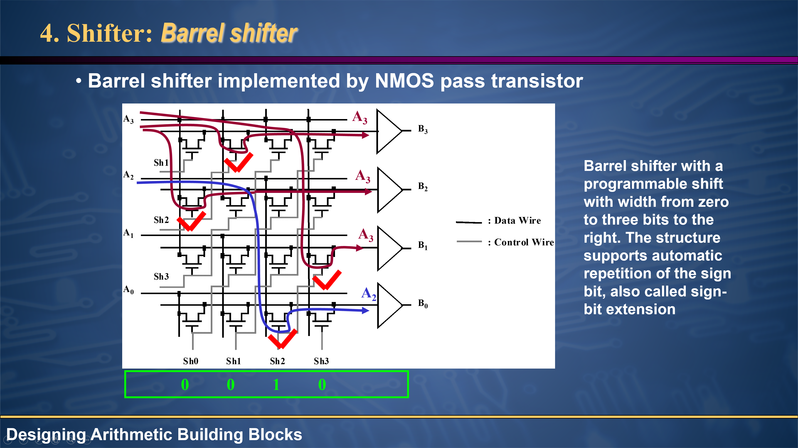
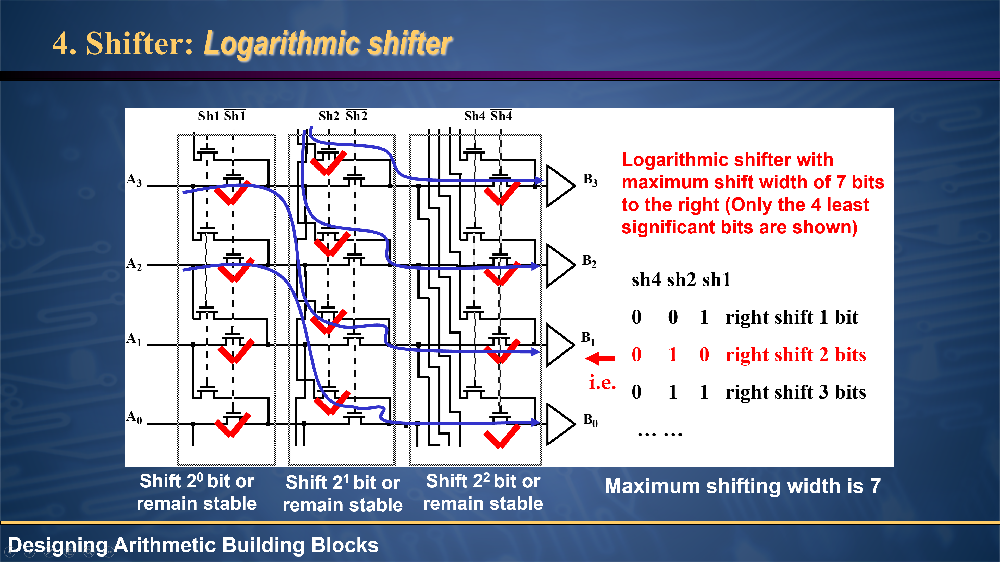

# 20231130课堂摘要

第10章——设计算术构建模块：移位器

## 关键点1：二进制移位

二进制移位是一种二进制运算，包括将二进制数的所有数字向左或向右移动固定量，然后补0，补0，补0。

二进制移位可用于将数字乘以2的幂（左移）或将数字除以2的幂（右移）。

## 练习1：二进制移位器（课堂作业）

| $A_i$ | $A_{i-1}$ | rgt | nop | left | $B_i$   | $B_{i-1}$ |
| ----- | --------- | --- | --- | ---- | ------- | --------- |
| $A_1$ | $A_0$     | 0   | 1   | 0    | $A_1$   | $A_0$     |
| $A_1$ | $A_0$     | 1   | 0   | 0    | $A_1$ ? | $A_0$ ?   |
| $A_1$ | $A_0$     | 0   | 0   | 1    | $A_0$   | $A_1$     |

## 练习2：桶形移位器（课堂作业）

一次只激活一条 Control Wire

| Data In     | Sh0 | Sh1 | Sh2 | Sh3 | Data Out    |
| ----------- | --- | --- | --- | --- | ----------- |
| A3 A2 A1 A0 | 1   | 0   | 0   | 0   | A3 A2 A1 A0 |
| A3 A2 A1 A0 | 0   | 1   | 0   | 0   | A3 A3 A2 A1 |
| A3 A2 A1 A0 | 0   | 0   | 1   | 0   | A3 A3 A3 A2 |
| A3 A2 A1 A0 | 0   | 0   | 0   | 1   | A3 A3 A3 A3 |

## 练习3：对数移位器（课堂作业）

Shifter: Logarithmic Shifter

只画出了4个最低有效位（least significant bit）。

| Data In                 | Sh1 | $\overline{Sh1}$ | Sh2 | $\overline{Sh2}$ | Sh4 | $\overline{Sh4}$ | Data Out                |
| ----------------------- | --- | ---------------- | --- | ---------------- | --- | ---------------- | ----------------------- |
| A7 A6 A5 A4 A3 A2 A1 A0 | 0   | 1                | 0   | 1                | 0   | 1                | A7 A6 A5 A4 A3 A2 A1 A0 |
| A7 A6 A5 A4 A3 A2 A1 A0 | 1   | 0                | 0   | 1                | 0   | 1                | 0 A7 A6 A5 A4 A3 A2 A1  |
| A7 A6 A5 A4 A3 A2 A1 A0 | 1   | 0                | 1   | 0                | 0   | 1                | 0 0 0 A7 A6 A5 A4 A3    |
| A7 A6 A5 A4 A3 A2 A1 A0 | 1   | 0                | 1   | 0                | 1   | 0                | 0 0 0 0 0 0 0 A7        |

| Data In                 | Sh1 | $\overline{Sh1}$ | Sh2 | $\overline{Sh2}$ | Sh4 | $\overline{Sh4}$ | Data Out                |
| ----------------------- | --- | ---------------- | --- | ---------------- | --- | ---------------- | ----------------------- |
| A7 A6 A5 A4 A3 A2 A1 A0 | 1   | 0                | 1   | 0                | 1   | 0                | A0 A1 A2 A3 A4 A5 A6 A7 |

需要注意的是，原来教师讲义上的表格做的不对，前几行都得删去。

[Arithmetic Circuits-2](http://people.ee.duke.edu/~jmorizio/ece261/classlectures/arithcircuits2.pdf)
