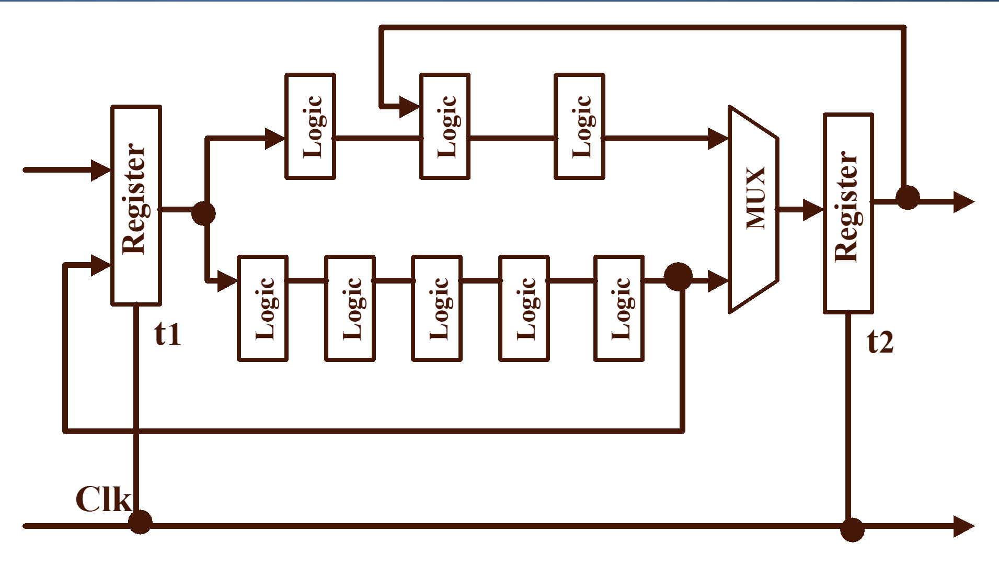

# 20231109课堂摘要

第7章——时序逻辑电路：同步时序电路（大部分数字IC是同步电路）

* 关键点1：有限状态机 Finite-State Machine。

IMG_1

* 练习1：画图练习。

IMG_2

* 关键点2：寄存器的时钟周期的约束。

"时钟最慢": $T \geq t_{clk-q} + t_{p,comb}(max) + t_{setup}$
"保持最快": $t_{hold} \leq t_{cdreg} + t_{cdlogic}$

* 练习2：时钟周期的约束1。

* 练习3：时钟周期的约束2。

[触发器的建立时间和保持时间](https://www.cnblogs.com/IClearner/p/6443539.html)

[时序路径约束](https://www.cnblogs.com/IClearner/p/6624722.html)

* 关键点3（回顾数字IC的质量评价指标之一：再生性）：双稳态原
理

* 练习4：定量计算钟控SR 触发器的晶体管 M5/M6 的尺寸
