# 3 整流电路

[看懂电感的这两个作用，电子学基本上就入门了](https://www.bilibili.com/video/BV1Ah4y1H7Jz/)

## 3.1 单相可控整流电路

### 3.1.1 单相半波可控整流电路

(1) 带电阻负载的工作情况

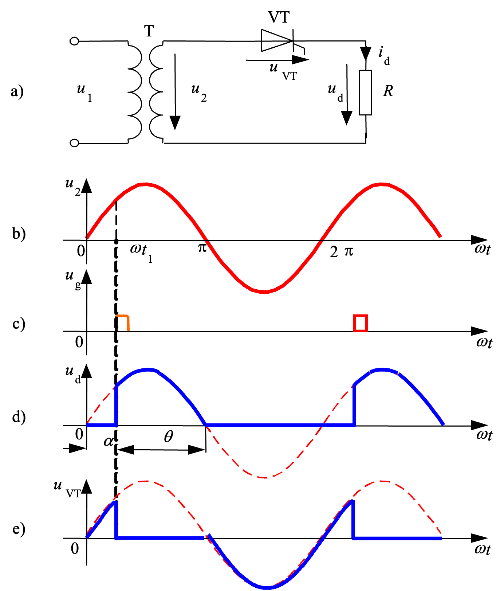

电阻负载的特点：电压与电流成正比，两者波形相同。

变压器T起变换电压和电气隔离的作用。

$u_d$ 脉冲直流

$\alpha = \pi - \theta$ 触发角

$\theta$ 晶闸管导通角

$u_d$ 波形在一个周期只脉动一次，故为单脉冲整流电路。

直流输出电压平均值：

$$
\begin{aligned}
    U_{d} &= \frac{1}{2\pi} \int_{\alpha}^{\pi} \sqrt{2} U_{2} \sin \omega t d(\omega t) \\
    &= \frac{\sqrt{2} U_{2}}{2\pi} (1+\cos\alpha) \\
    &= 0.45 U_{2} \frac{1+\cos\alpha}{2}
\end{aligned}
$$

(2) 带阻感负载的工作情况

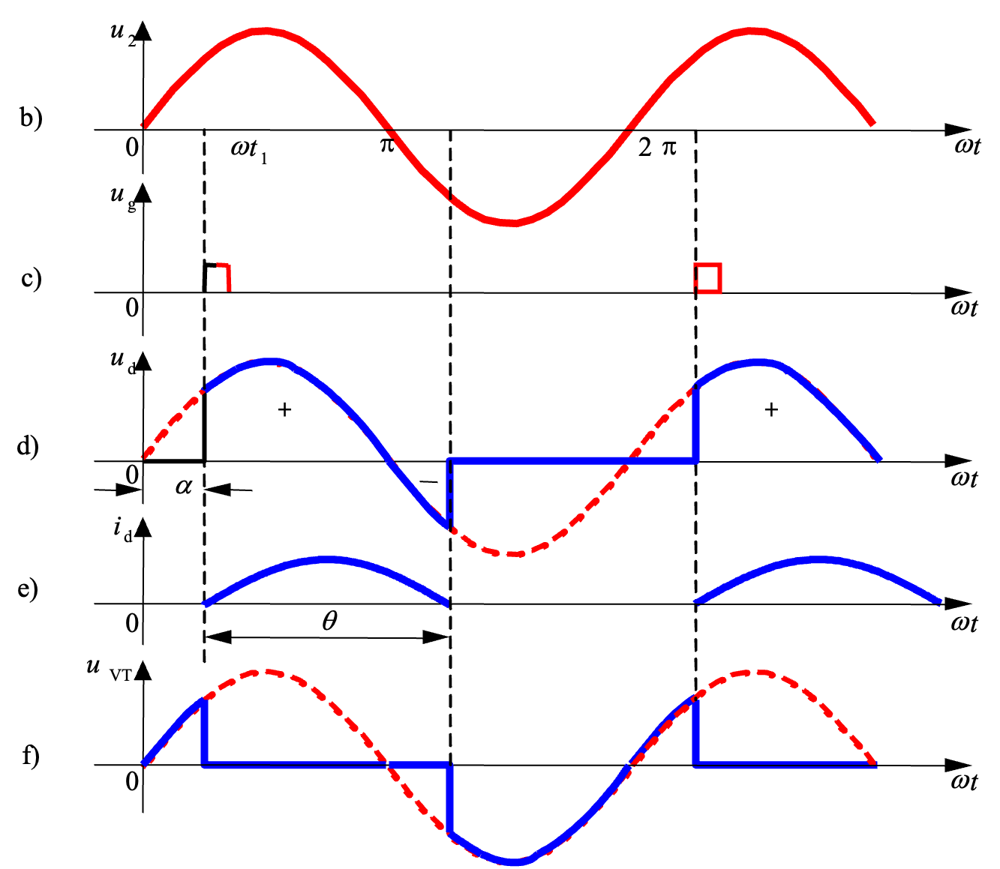

阻感负载的特点：电感对电流变化有抗拒作用，使得流过电感的电流不发生突变。

指出整流不充分啥的，没看懂

关联`电路分析`临阶响应分析

3个角度之间的关系 -- PPT上没有（恼

续流二极管

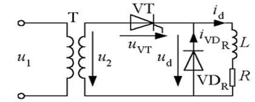

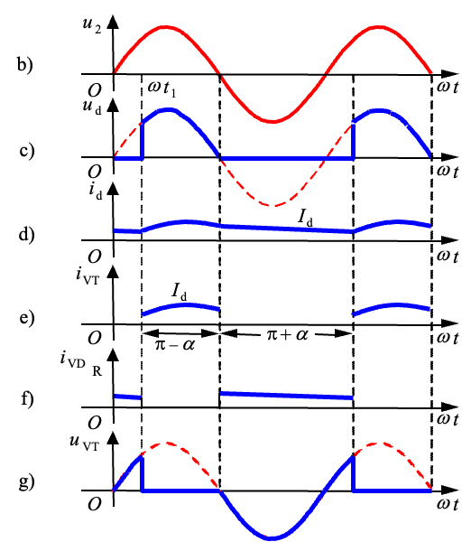

### 3.1.2 单相桥式全控整流电路

(1) 带电阻负载的工作情况

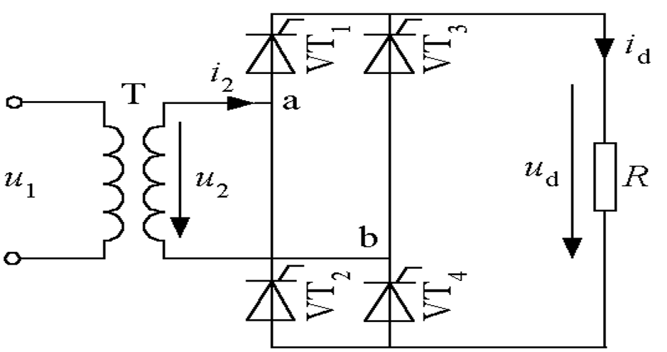

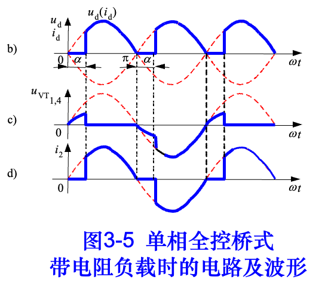

图3-5 单相全控桥式 带电阻负载时的电路及波形

桥臂?

$$
I_{\mathrm{dVT}} = \dots
$$

指出全控型脉冲更完整。

$$
\begin{aligned}
U_{d} &= \frac{1}{\pi} \int_{\alpha}^{\pi} \sqrt{2} U_{2} \sin \omega t d(\omega t) \\
&= \frac{\sqrt{2} U_{2}}{\pi} (1+\cos\alpha) \\
&= 0.9 U_{2} \frac{1+\cos\alpha}{2} \\
\end{aligned}
$$

$$
I_{\mathrm{dVT}} = \frac{1}{2} I_d = 0.45 \dots
$$

$$
I_{\mathrm{VT}} = \dots
$$

(2) 带阻感负载的工作情况

VT2和VT3导通后，VT1和VT4承受反压关断，流过VT1和VT4的电流迅速转移到VT2和VT3上，此过程称换相，亦称换流。

(3) 带反电动势负载时的工作情况

在 $|u_2|>E$ 时，才有晶闸管承受正电压，有导通的可能

停止导电角 $\delta = \sin^{-1} \frac{E}{\sqrt{2}U_{2}}$

平波电抗器 <- ???

### 3.1.3 单相全波可控整流电路

图3-9 单相全波可控整流电路及波形

单相全波与单相全控桥的区别如下，单相全波电路有利于在低输出电压的场合应用。

* 单相全波中变压器结构较复杂，材料的消耗多。
* 单相全波只用2个晶闸管，比单相全控桥少2个，相应地，门极驱动电路也少2个；但是晶闸管承受的最大电压是单相全控桥的2倍。
* 单相全波导电回路只含1个晶闸管，比单相桥少1个，因而管压降也少1个

### 3.1.4 单相桥式半控整流电路

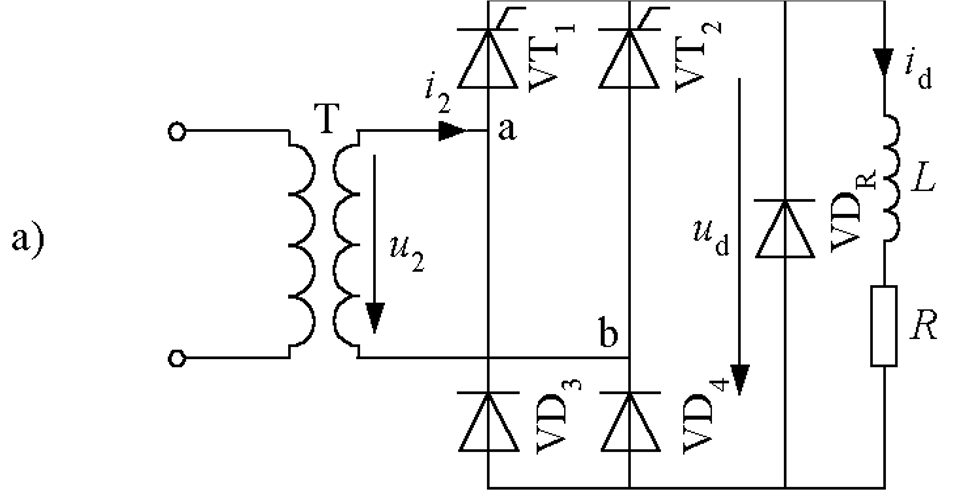
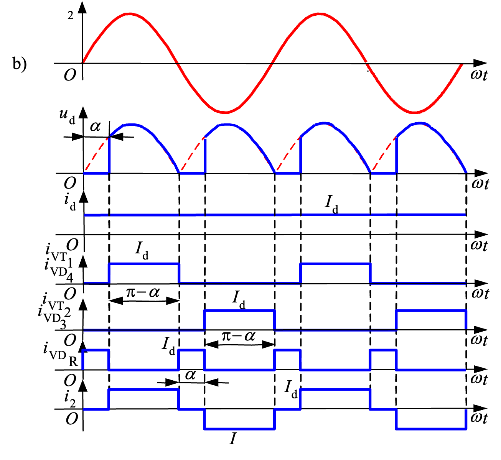

图3-10  单相桥式半控整流电路，有续流二极管，阻感负载时的电路及波形

续流二极管的作用 (图中$\text{VD}_R$)

* 避免可能发生的失控现象。
若无续流二极管，则当$\alpha$突然增大至180或触发脉冲丢失时，会发生一个晶闸管持续导通而两个二极管轮流导通的情况，这使$u_d$成为正弦半波，其平均值保持恒定，称为**失控**。
* 有续流二极管$\text{VD}_R$时，续流过程由$\text{VD}_R$完成，避免了失控的现象。
* 续流期间导电回路中只有一个管压降，有利于降低损耗。

单相桥式半控整流电路的另一种接法

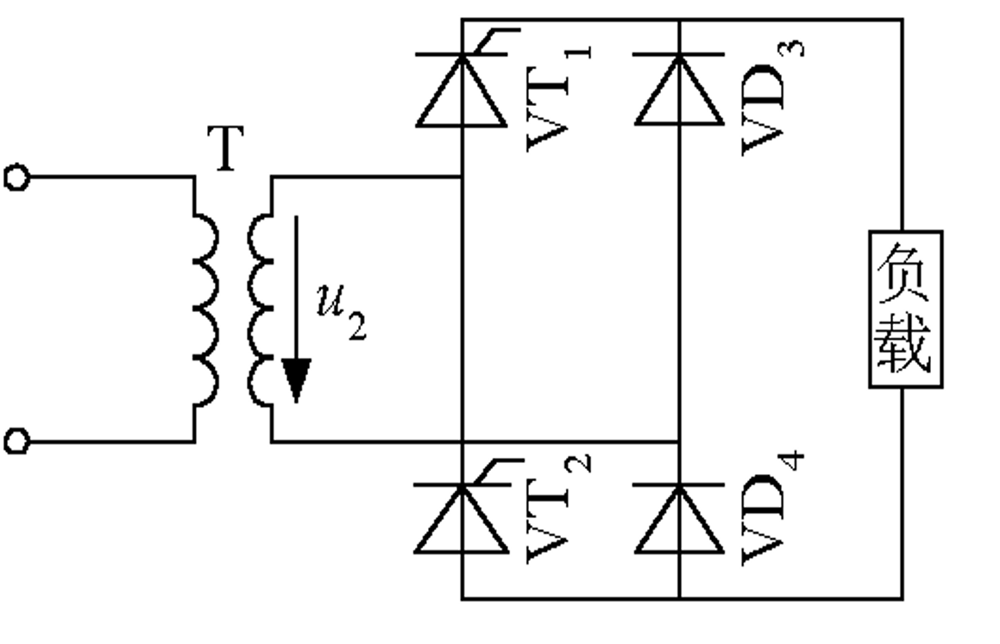

相当于把图3-5a中的VT3和VT4换为二极管VD3和VD4，这样可以省去续流二极管VDR，续流由VD3和VD4来实现。

## 3.2 三相可控整流电路

## 3.2.1 三相半波可控整流电路

* [ ] 本节请REMAKE

不得不指出从此处开始已经听不懂了，虽然之前的感觉也没懂，但不管怎么说，建议换教程... -- 2023-10-24

---

指出事已经不常用的电路

## 3.2.2 三相桥式全控整流电路

* [ ] 本节请REMAKE

---

指出事常用的电路

## 3.3 变压器漏感对整流电路的影响

考虑包括变压器漏感在内的交流侧电感的影响，该漏感可用一个集中的电感 $L_B$ 表示。
（电感阻止电流发生突变）

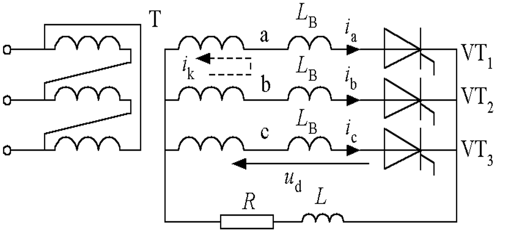
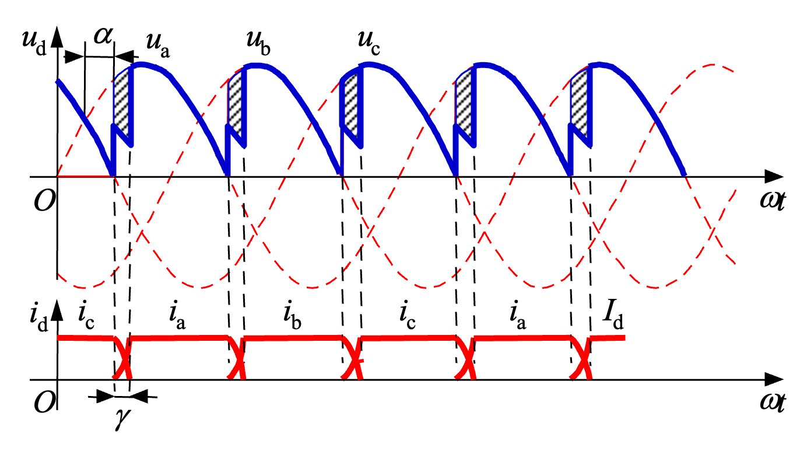

图3-25  考虑变压器漏感时的三相半波可控整流电路及波形

因a、b两相均有漏感，故ia、ib均不能突变。于是VT1和VT2同时导通，相当于将a、b两相短路，在两相组成的回路中产生环流ik。

$i_k=i_b$ 是逐渐增大的，而 $i_a=I_d-i_k$ 是逐渐减小的。当 $i_k$ 增大到等于 $I_d$ 时，$i_a=0$，VT1关断,换流过程结束。

换相重叠角: 换相过程持续的时间，用电角度 $\gamma$ 表示。
换相过程中，整流电压ud为同时导通的两个晶闸管所对应的两个相电压的平均值。

$$
u_d  =u_a + \dots
$$

换相压降 -- 与不考虑变压器漏感时相比，ud平均值降低的多少。

$$
\Delta U_d = \frac{3}{2\pi} X_B I_d
$$

换相重叠角 $\gamma$ 的计算

$$
\begin{split}
    i_k = \frac{\sqrt{6}U_2}{2X_B} \left[ \cos\alpha - \cos(\omega t - \frac{5\pi}{6})\right]
\end{split}
$$

when $\omega t = \alpha + \gamma + \frac{5\pi}{6}$, then $i_k = I_d$

$$
I_d = \frac{\sqrt{6} \dots}{} \\
\cos \alpha - \cos(\alpha + \gamma) = \dots
$$

$\gamma$ 随其它参数变化的规律：

1. $I_d$ 越大则 $\gamma$ 越大；
2. $X_B$ 越大 $\gamma$ 越大；
3. 当 $\alpha \leq 90$ 时，$\alpha$ 越小 $\gamma$ 越大。

变压器漏抗对各种整流电路的影响

LEARN MORE -> A TABLE IN PPT ...

---

变压器漏感对整流电路影响的一些结论:

1. 出现换相重叠角 $\gamma$ ，整流输出电压平均值 $U_d$ 降低。
2. 整流电路的工作状态增多。
3. 晶闸管的 di/dt 减小，有利于晶闸管的安全开通。
   有时人为串入进线电抗器以抑制晶闸管的di/dt。
4. 换相时晶闸管电压出现缺口，产生正的du/dt，可能使晶闸管误导通，为此必须加吸收电路。
5. 换相使电网电压出现缺口，成为干扰源。

## 3.4 电容滤波的不可控整流电路

### 3.4.1 电容滤波的单相不可控整流电路

常用于小功率单相交流输入的场合，如目前大量普及的微机、电视机等家电产品中。

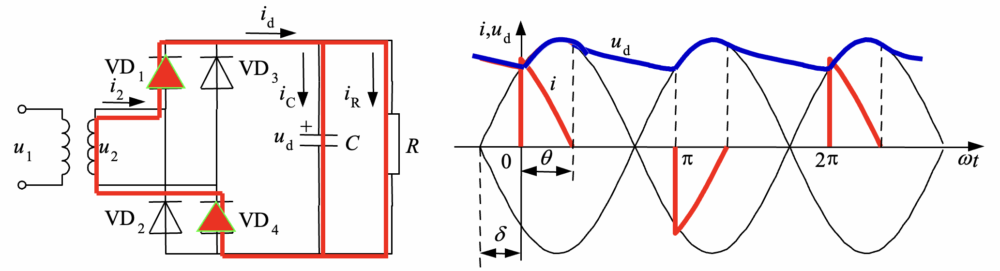

图3-26  电容滤波的单相桥式不可控整流电路及其工作波形

$\delta, \theta, \omega RC$ 的关系 -- PPT上好像没有？

### 3.4.2 电容滤波的三相不可控整流电路

what?

## 3.5 整流电路的谐波和功率因数

### 3.5.1 谐波和无功功率分析基础

### 3.5.2 带阻感负载时可控整流电路交流侧  谐波和功率因数分析

功率因数计算

基波电流有效值为

i2的有效值I= Id，结合式（3-74）可得基波因数为 （3-75）
电流基波与电压的相位差就等于控制角 ，故位移因数为

所以，功率因数为

$$
\lambda = v \lambda_1 = \frac{I_1}{I}\cos\varphi = \frac{2\sqrt{2}}{\pi}\cos\alpha
$$

---

变压器二次侧电流谐波分析

功率因数计算
