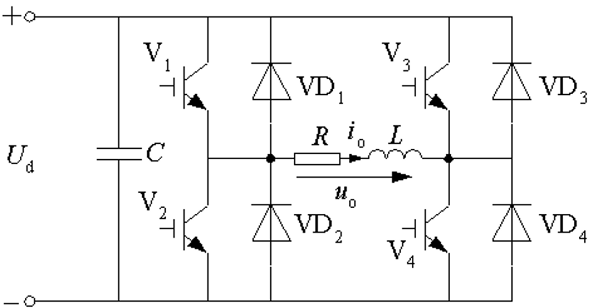

# 4 逆变电路

逆变的概念

逆变与整流相对应, 直流电变成交流电。

交流侧接电网, 为有源逆变。
交流侧接负载, 为无源逆变。 <-- 本章讲述无源逆变

逆变与变频

变频电路：分为交交变频和交直交变频两种。
交直交变频由交直变换（整流）和直交变换两部分组成, 后一部分就是逆变。

主要应用

各种直流电源, 如蓄电池、干电池、太阳能电池等。
交流电机调速用变频器、不间断电源、感应加热电源等电力电子装置的核心部分都是逆变电路。

## 4.1 换流方式

### 4.1.1 逆变电路的基本工作原理

逆变电路最基本的工作原理: 改变两组开关切换频率, 可改变输出交流电频率。

电阻负载时, 负载电流 $i_o$ 和 $u_o$ 的波形相同, 相位也相同。

阻感负载时, $i_o$ 相位滞后于 $u_o$, 波形也不同。

### 4.1.2 换流方式分类

换流: 电流从一个支路向另一个支路转移的过程, 也称为换相。

1. **器件换流**

   * 利用全控型器件的自关断能力进行换流(Device Commutation)

2. **电网换流**

   * 由电网是供换流电压称为电网换流(Line Commutation)
   * 可控整流电路、交流调压电路和采用相控方式的交交变频电路
   * 不需器件具有门极可关断能力，也不需要为换流附加元件

3. **负载换流**

   * 由负载提供换流电压称为负载换流(Load Commutation)
   * 负载电流相位超前于负载电压的场合，都可实现负载换流
   * 负载为电容性负载时，负载为同步电动机时，可实现负载换流

4. **强迫换流**
    * 设置附加的换流电路，给欲关断的晶体管
    * 强迫施加反向电压或反向电流的换流方式称为强迫换流

## 4.2 电压型逆变电路

逆变电路的分类: 根据直流侧电源性质的不同。

* 直流侧是电压源 -- 电压型逆变电路 Voltage Source Type Inverter-VSTI
* 直流侧是电流源 -- 电流型逆变电路 Current Source Type Inverter-CSTI

电压型逆变电路的特点

1. 直流侧为电压源或并联大电容, 直流侧电压基本无脉动。
2. 输出电压为矩形波, 输出电流因负载阻抗不同而不同。
3. 阻感负载时需提供无功功率。为了给交流侧向直流侧反馈的无功能量提供通道, 逆变桥各臂并联反馈二极管。

### 4.2.1 单相电压型逆变电路

单相电压型逆变电路中的「单相」表示什么？

#### 4.2.1.1 半桥逆变电路

工作原理

V1 和 V2 栅极信号在一周期内各半周正偏、半周反偏，互补。

$u_o$ 为矩形波，幅值为 $U_m = \frac{U_d}{2}$

#### 4.2.1.2 全桥逆变电路

#### 4.2.1.3 带中心抽头变压器的逆变电路

NMSL

### 4.2.2 三相电压型逆变电路

应用最广的是三相桥式逆变电路

## 4.3 电流型逆变电路

直流电源为电流源的逆变电路--电流型逆变电路

一般在直流侧串联大电感，电流脉动很小，可近似看成直流电流源

实例之一: 图5-11电流型三相桥式逆变电路 (图中电感和电容的作用？)

交流侧电容用于吸收换流时负载电感中存贮的能量

---

电流型逆变电路主要特点

1. 直流侧串大电感，相当于电流源
2. 交流输出电流为矩形波，输出电压波形和相位因负载不同而不同
3. 直流侧电感起缓冲无功能量的作用，不必给开关器件反并联二极管

电流型逆变电路中，采用半控型器件的电路仍应用较多

换流方式有负载换流、强迫换流

### 4.3.1 单相电流型逆变电路

防止巨大电流变化 <-- 怎么说

由四个桥臂构成, 每个桥臂的晶闸管各串联一个电抗器, 用来限制晶闸管开通时的di/dt, 防止晶闸管被击穿。

图4-12 单相桥式电流型（并联谐振式）逆变电路

### 4.3.2 三相电流型逆变电路

这是什么罢, 评价是这这不会。

## 4.4 多重逆变电路和多电平逆变电路

* **多重逆变电路**把几个矩形波组合起来, 接近正弦
* **多电平逆变电路**输出较多电平, 使输出接近正弦

### 4.4.1 多重逆变电路

单相电压型二重逆变电路

多重逆变电路有串联多重和并联多重两种

串联多重: 把几个逆变电路的输出串联起来, 多用于电压型。
并联多重: 把几个逆变电路的输出并联起来, 多用于电流型。

3次谐波

* $u_1$ 和 $u_2$ 相位错开 $\varphi=60°$, 其中的3次谐波就错开了  3×60°=180。
* 变压器串联合成后，3次谐波互相抵消，总输出电压中不含3次谐波。
* $u_o = u_1 + u_2$ 的波形是 120° 矩形波，含6k±1次谐波，3k次谐波都被抵消。

---

三相电压型二重逆变电路

直流侧电流每周期脉动12次，称为12脉波逆变电路。

使m个三相桥逆变电路的相位依次错开 $\pi/(3m)$, 连同合成输出电压并抵消上述相位差的变压器，就可构成6m的脉波逆变电路

<!-- 此处请补充几个公式 -->

### 4.4.2 多电平逆变电路

三电平逆变电路

不慎看到 图4-25 三电平逆变电路 , 已经被吓昏。
