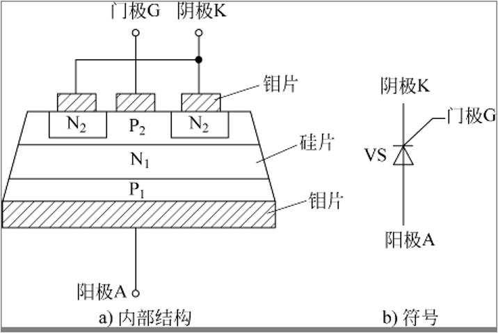
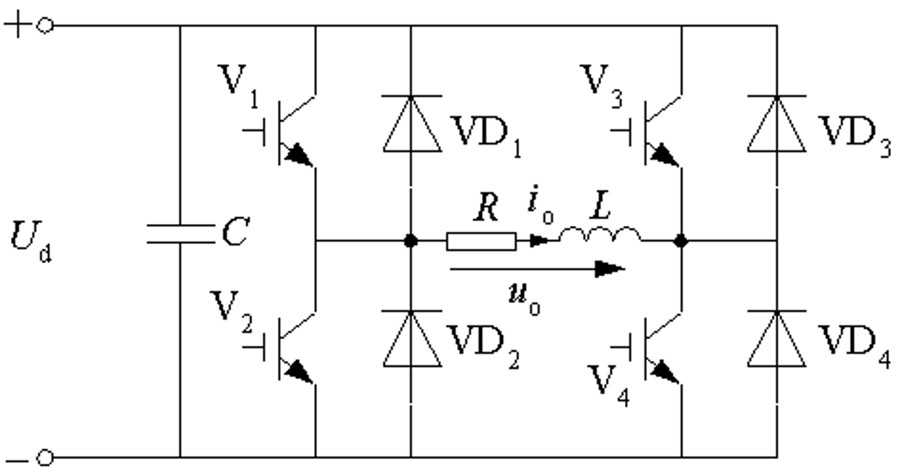

# 期末之重点

拒绝的指引，指本课程最晚给出复习指导。需要指出的是，当时划重点图里的顺序是乱的，本文档已重新整理。

题型

* 判断题（分数占比少）
* 简答题

有些简答题需要背诵，请填满。

教师，你们抄题目都行。

指出有开放性题目，分数比较高，你们多写点罢。

## 1 电力系统的组成

### 1.1 电力电子技术的构成

电力电子技术是应用于电力领域的电子技术，是利用电力电子器件来转换和控制电能的技术。

电力电子技术一般分为两个分支：

* **电力电子器件制造技术**
* **变流器技术（电力电子器件应用技术）**，包括利用电力电子器件形成各种功率变换电路并对其进行控制的技术

### 1.3 电力电子的应用领域

由于功率整流器、功率晶体管、晶闸管、GTO、IGBT等功率器件取得很大进展，故电力变换和控制的领域不断地扩大。

下面将重点介绍电力电子器件在工业企业和日常生活的应用领域。

## 2 电力电子器件

[[2 电力电子器件]]

## 2.3 半控型器件

晶闸管

1 普通晶闸管

晶闸管是四层（PNPN）三端（AKG）器件。A是阳极，K为阴极，G为门极。它有三个PN结J1、J2、J3。在一般情况下，由于器件存在着反向PN结，因而，无论是承受正压还是反压，器件均不能导通。

4层 PNPN AKG 器件

A: 阳极
K: 阴极
G: 门极

导通条件

1. 承受正向阳极电压
2. 正向门级电压

晶闸管导通后门极的控制作用便消失，晶闸管始终保持着导通状态。只有当**阳极电压为零**或**承受负压**晶闸管才能关断。由此可见，晶闸管相当于一个可以控制导通的单向开关，属**半控型器件**，即**只能控制导通而不能控制关断**。门极上用于控制导通的电压称为触发脉冲电压。

## 3 整流电路

[[3 整流电路]]

整流电路: 出现最早的电力电子电路，将交流电变为直流电

* 按组成的器件可分为 **不可控**、**半控**、**全控** 三种
* 按电路结构可分为**桥式电路**和**零式电路**
* 按交流输入相数分为**单相电路**和**多相电路**
* 按变压器二次侧电流的方向是单向或双向，又分为**单拍电路**和**双拍电路**

## 4 逆变电路

**换流**: 电流从一个支路向另一个支路转移的过程, 也称为换相。

逆变概念：逆变 -- 与整流相对应，直流电变成交流电，

* 交流侧接电网，为**有源逆变**
* 交流侧接负载，为**无源逆变**

本章讲述无源逆变

逆变与变频

* 变频电路：交交变频和交直交变频两种
* 交直交变频由交直变换和直交变换两部分组成，后一部分就是逆变

---

单向电压 电流逆变电路波形分析

### 4.1 换流方式

#### 4.1.2 换流方式分类

换流: 电流从一个支路向另一个支路转移的过程, 也称为换相。

1. **器件换流**

   * 利用全控型器件的自关断能力进行换流(Device Commutation)

2. **电网换流**

   * 由电网是供换流电压称为电网换流(Line Commutation)
   * 可控整流电路、交流调压电路和采用相控方式的交交变频电路
   * 不需器件具有门极可关断能力，也不需要为换流附加元件

3. **负载换流**

   * 由负载提供换流电压称为负载换流(Load Commutation)
   * 负载电流相位超前于负载电压的场合，都可实现负载换流
   * 负载为电容性负载时，负载为同步电动机时，可实现负载换流

4. **强迫换流**
    * 设置附加的换流电路，给欲关断的晶体管
    * 强迫施加反向电压或反向电流的换流方式称为强迫换流

### 4.2 电压型逆变电路

逆变电路按其直流电源性质不同分为两种

* **电压型** 逆变电路或 **电压源型** 逆变电路
* **电流型** 逆变电路或 **电流源型** 逆变电路

电压型逆变电路的特点

1. **直流侧为电压源或并联大电容**, **直流侧电压基本无脉动**。
2. **输出电压为矩形波**, 输出电流因负载阻抗不同而不同。
3. **阻感负载时需提供无功功率**。为了给交流侧向直流侧反馈的无功能量提供通道, 逆变桥各臂并联反馈二极管。

#### 4.2.1 单相电压型逆变电路

##### 4.2.1.1 半桥逆变电路

工作原理

$V_1$ 和 $V_2$ 栅极信号在一周期内各 **半周正偏**、**半周反偏**，互补。

$u_o$ 为矩形波，幅值为 $U_m = \frac{U_d}{2}$

---

$i_o$ 波形随负载而异，感性负载时，(图5.6b)

1. $V_1$ 或 $V_2$ 通时，$i_o$ 和 $u_o$ **同方向**，**直流侧向负载提供能量**
2. $\text{VD}_1$ 或 $\text{VD}_2$ 通时，$i_o$ 和 $u_o$ **反向**，**电感中贮能向直流侧反馈**

$\text{VD}_1$ , $\text{VD}_2$ 称为 **反馈二极管**，还使 $i_o$ 连续，又称 **续流二极管**

特点

* 优点: **简单，使用器件少**
* 缺点: **交流电压幅值 $\frac{U_d}{2}$，直流侧需两电容器串联，要控制两者电压均衡**
* 用于几kW以下的小功率逆变电源

单相全桥、三相桥式都可看成若干个半桥逆变电路的组合

##### 4.2.1.2 全桥逆变电路

## 4.3 电流型逆变电路

直流电源为电流源的逆变电路--电流型逆变电路

一般在直流侧串联大电感，电流脉动很小，可近似看成直流电流源

实例之一: 图5-11电流型三相桥式逆变电路

Q: 图中电感和电容的作用？

A: **交流侧电容用于吸收换流时负载电感中存贮的能量**

---

电流型逆变电路主要特点

1. **直流侧串大电感**，相当于 **电流源**
2. **交流输出电流为矩形波**，输出电压波形和相位因负载不同而不同
3. **直流侧电感起缓冲无功能量的作用**，不必给开关器件反并联二极管

电流型逆变电路中，采用半控型器件的电路仍应用较多

换流方式有 **负载换流**、**强迫换流**

### 4.3.1 单相电流型逆变电路

输出电流波形接近矩形波，含基波和各奇次谐波，且谐波幅值远小于基波

因**基波频率接近负载电路谐振频率**，故**负载对基波呈高阻抗，对谐波呈低阻抗，谐波在负载上产生的压降很小**，因此**负载电压波形接近正弦**

工作波形分析

一周期内，**两个稳定导通阶段** 和 **两个换流阶段**

$t_1 \to t_2$：$\text{VT}_1$ 和 $\text{VT}_4$ **稳定导通阶段**，$i_o = I_d$，$t_2$ 时刻前在C上建立了 **左正右负的电压**

$t_2 \to t_4$：$t_2$ 时触发 $\text{VT}_2$ 和 $\text{VT}_3$ 开通，进入 **换流阶段**

* $L_T$ 使 $\text{VT}_1$、$\text{VT}_4$ **不能立刻关断**，**电流有一个减小过程**
* $\text{VT}_2$ 、 $\text{VT}_3$ **电流有一个增大过程**
* **4个晶闸管全部导通**，负载电容电压经两个**并联**的放电回路**同时放电**：
* $L_{T1}$、$\text{VT}_1$、 $\text{VT}_3$ 、$L_{T3}$ 到C；另一个经 $L_{T2}$、 $\text{VT}_2$ 、$\text{VT}_4$、$L_{T4}$ 到C

$t=t_4$ 时，$\text{VT}_1$、$\text{VT}_4$ **电流减至零而关断**，**换流阶段结束**

* $i_o$ 在 $t_3$ 时刻，即 $i_{VT1}=i_{VT2}$ 时刻**过零**，$t_3$ 时刻大体位于 $t_2$ 和 $t_4$ 的中点

$t_4－t_2 = t_{\gamma}$ 称为 **换流时间**

## 5 直流直流变流电路

[[5 直流直流变流电路]]

关于本章的一点补充。当年教师曾说，
> 10分，降压斩波电路/升压斩波电路工作原理
> 5分，Cuk斩波电路，关注原理与优点

### 5.1 基本斩波电路

**换流**：电流从一个支路向另一个支路转移的过程，也称换相

* **开通**：适当的门极驱动信号就可使其开通
* **关断**：

  * 全控型器件可**通过门极关断**
  * 半控型器件晶闸管，必须利用**外部条件才能关断**
  * 一般在晶闸管电流**过零后施加一定时间反压**，才能关断

研究换流方或主要是研究如何使器件关断

本章换流及换流方式问题最为全面集中，因此在本章讲述

#### 5.1.1 降压斩波电路

工作原理

$t=0$ 时刻驱动**V导通**，**电源E向负载供电**，负载电压 $u_o=E$，负载电流 $i_o$ **按指数曲线上升**。
$t=t_1$ 时控制**V关断**，**二极管VD续流**，负载电压 $u_o$ **近似为零**，**负载电流呈指数曲线下降**。

通常串接较大电感L使负载电流连续且脉动小。

#### 5.1.2 升压斩波电路

工作原理

假设L值很大，C值也很大
V通时，**E向L充电**，充电电流**恒为** $I_1$，同时**C的电压向负载供电**，因C值很大，输出电压 $u_o$ 为**恒值**，记为 $U_o$。
V断时，**E和L共同向C充电并向负载R供电**。
稳态时，一个周期T中L**积蓄能量与释放能量相等**

#### 5.1.3 Cuk斩波电路

工作原理

V通时，**电源E经V向L供电使其贮能**，此时电流为 $i_1$。同时，**C维持输出电压恒定并向负载R供电**。
V断时，**L的能量向负载释放**，电流为 $i_2$。**负载电压极性为上负下正**，**与电源电压极性相反**，该电路也称作反极性斩波电路。

所以输出电压为：

$$
U_o=\frac{t_{on}}{t_{off}}E = \frac{t_{on}}{T - t_{on}}E = \frac{\alpha}{1-\alpha}E
$$

优点（与升降压斩波电路相比）：
**输入电源电流和输出负载电流都是连续的，且脉动很小，有利于对输入、输出进行滤波。**

## 补充

开放题：电力电子在集成电路中应用啥的

prompt:

1. 请介绍电力电子技术在集成电路中应用
2. 请介绍集成电路在电力电子技术中应用

你好，这是必应。电力电子技术是指利用电力电子器件和电路来控制和转换电能的技术。电力电子技术在集成电路中的应用主要包括以下几个方面：

* **电源管理**：电力电子技术可以实现集成电路的电源转换、稳压、保护、隔离等功能，提高电源的效率和可靠性。
* **电机驱动**：电力电子技术可以实现集成电路对电机的控制和调速，提高电机的性能和效率。
* **信号处理**：电力电子技术可以实现集成电路的信号放大、滤波、调制、解调等功能，提高信号的质量和传输速率。
* **智能控制**：电力电子技术可以实现集成电路的智能控制和优化，提高系统的自适应性和灵活性。

电力电子技术在集成电路中的应用具有广泛的前景和潜力，可以为各个领域提供高效、节能、安全、智能的电力解决方案。

---

集成电路是指将电子元件和电路集成在一个小型的半导体芯片上的技术。集成电路在电力电子技术中的应用主要包括以下几个方面：

* **电力电子器件**：集成电路可以实现电力电子器件的微型化、高效化、智能化，如功率MOSFET、IGBT、GaN等。
* **电力电子模块**：集成电路可以实现电力电子模块的集成化、标准化、模块化，如DC-DC转换器、AC-DC整流器、逆变器等。
* **电力电子系统**：集成电路可以实现电力电子系统的优化化、网络化、智能化，如电动汽车、风力发电、智能电网等。

集成电路在电力电子技术中的应用具有巨大的优势和价值，可以为各个领域提供高性能、低成本、高可靠的电力电子解决方案。
