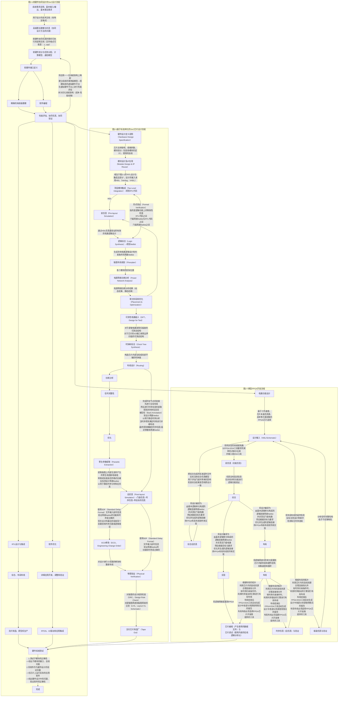

# 20240412流程图（涵盖了图2-1，2-2，2-7）

```mermaid
graph TD
subgraph 图2-1软硬件协同设计的SoC设计流程
direction LR
2_1A[系统需求说明、基本输入/输出、基本算法需求] 
--> |用于设计的技术文档（有特定格式）| 2_1B[高级算法建模与仿真（协同设计方法的关键）]
--> |软硬件协同仿真所需的可执行的说明文档（文件格式可能是：.c,.cpp）| 2_1C[软硬件划分与任务分配、计算模型、通信模型（协同设计方法的关键）]
--> 2_1D[软硬件接口定义]

2_1D[软硬件接口定义] --> 2_1E1[精确的系统级建模] --> 2_1F[性能评估、协同仿真、协同验证]
--> 2_1G1[RTL设计与集成] --> 2_1H1[综合、布局布线] --> 2_1I1[流片制造、原型机生产] --> 2_1J[硬件系统测试]

2_1F[性能评估、协同仿真、协同验证] --> 
|将应用一一在系统架构上映射
建立系统的事务级模型---搭建系统的虚拟硬件平台
在虚拟硬件平台上进行性能评估
多次优化系统架构（成本-性能权衡）| 2_1C[软硬件划分与任务分配、计算模型、通信模型]

2_1D[软硬件接口定义] --> 2_1E2[软件编程] --> 2_1F[性能评估、协同仿真、协同验证]
--> 2_1G2[软件优化] --> 2_1H2[详细应用开发、调整和验证] --> 2_1I2[RTOS、IO驱动和应用集成] --> 2_1J[硬件系统测试] --> 
|  1.测试子模块的正确性
-->验证子模块的接口、总线功能
2.将软件作为硬件设计的验证向量
-->在芯片上运行实际的应用软件
-->找出硬件设计中的问题、验证软件的正确性| 2_1K[完成]
end

subgraph 图2-2基于标准单元的SoC芯片设计流程
direction LR
2_1F[性能评估、协同仿真、协同验证]
-->2_21[硬件设计定义说明（Hardware Design Specification）] 
--> |芯片总体架构、规格参数、模块划分（包括各模块的定义）、使用的总线| 2_22[模块设计及IP复用（Module Design & IP Reuse）] 
--> |相当于图2-1的“RTL设计与集成这部分”，设计的输入采用HDL（Verilog、VHDL）| 2_23[顶层模块集成（Top Level Integration）--得到RTL代码]
--> |HDL| 2_24[前仿真（Pre-layout Simulation）--RTL级仿真--功能仿真]
--> |通过HDL仿真器验证的有效的电路逻辑设计| 2_25[逻辑综合（Logic Synthesis）--得到Netlist]
--> |生成含有电路逻辑设计和约束条件的网表Netlist| 2_26[版图布局规划（Floorplan）]
--> |各个模块的实际位置| 2_27[电源网络功耗分析（Power Network Analysis）]
--> |电源网络功耗分析结果（动态结果、静态结果）| 2_28[单元布局和优化（Placement & Optimization）]
--> 2_210[可测性电路插入（DFT，Design for Test）]
--> |对于逻辑电路采用扫描链的可测试结构
对于芯片的I/O端口采用边界扫描的可测试结构| 2_211[时钟树综合（Clock Tree Synthesis）]
--> |构造芯片内部全局或局部平衡的时钟链| 2_212[布线设计（Routing）]
--> 2_213[功耗分析]
--> 2_214[信号完整性]
--> 2_215[优化]
--> 2_216[寄生参数提取（Parasitic Extraction）]
--> |提取版图上内部互连所产生的寄生电阻和电容值
转换成标准延迟的格式后被反标回设计网表Netlist
以用于静态时序分析和后仿真| 2_217[后仿真（Post-layout Simulation）--门级仿真--时序仿真--带反标的仿真]
--> |使用SDF（Standard Delay Format）文件输入延时信息
验证网表Netlist的功能和时序是正确的
但在设计的最后阶段发现个别路径有时序问题或逻辑错误| 2_218[ECO修改（ECO，Engineering Change Order）]
--> |对设计进行小范围的修改和重新布线| 2_219[物理验证（Physical Verification）]
--> |对版图的设计规则检查（DRC，Design Rule Check）
对逻辑图网表和版图网表的比较（LVS，Layout Vs. Schematic）| 2_220[交付芯片制造厂（Tape Out）]
-->2_1J[硬件系统测试]

2_212[布线设计（Routing）]
-->|完成所有节点的连接
先进行全局布线
然后进行时序信息的提取
得到的时序信息将
被反标（Back Annotation）到设计网表Netlist
以用于静态时序分析
当时序得到满足时再进行详细布线
最终得到精确的时序信息/延迟参数和网表Netlist| 2_217[后仿真（Post-layout Simulation）--门级仿真--时序仿真--带反标的仿真] 
--> |使用SDF（Standard Delay Format）
文件输入延时信息
验证网表Netlist的
功能和时序是正确的| 2_219[物理验证（Physical Verification）]

2_23[顶层模块集成（Top Level Integration）--得到RTL代码] <--> 
|形式验证（Formal Verification）
指的是逻辑功能上的等效性检查
RTL代码之间
门级网表Netlist与RTL代码之间
门级网表Netlist之间| 2_25[逻辑综合（Logic Synthesis）--得到Netlist]

2_28[单元布局和优化（Placement & Optimization）] --> 2_24[前仿真（Pre-layout Simulation）]
end

subgraph 图2-7典型FPGA开发流程
direction LR
2_1F[性能评估、协同仿真、协同验证]-->
2_71[电路功能设计]-->|基于工作速度、
芯片本身的资源、
成本等方面权衡的
FPGA芯片选择|2_72[设计输入（HDL/Schematic）]-->|将所涉及的系统或电路
以FPGA EDA工具要求的某种形式表示出来
并输入给EDA工具| 2_73[前仿真（功能仿真）]-->|仿真没有延迟信息
仅对初步的功能进行
逻辑功能验证| 2_74[综合]-->|将设计编译为
由基本逻辑单元构成的
逻辑连接网表Netlist
并非真实门级电路
然后根据目标与要求
优化所生成的逻辑连接
供FPGA布局布线软件来实现|2_75[综合后仿真]-->|把综合生成的标准延时文件
反标注到综合仿真模型
用于评估门延时带来的影响
检查综合结果是否和原设计一致|2_72[设计输入（HDL/Schematic）]

2_74[综合]-->|将设计编译为
由基本逻辑单元构成的
逻辑连接网表Netlist
并非真实门级电路
然后根据目标与要求
优化所生成的逻辑连接
供FPGA布局布线软件来实现|2_76[实现]-->|将逻辑网表配置到FPGA|2_77[芯片编程]-->2_1J[硬件系统测试]

2_74[综合]-->|将设计编译为
由基本逻辑单元构成的
逻辑连接网表Netlist
并非真实门级电路
然后根据目标与要求
优化所生成的逻辑连接
供FPGA布局布线软件来实现|2_78[布局]-->|将逻辑网表中的单元配置到
芯片内部的固有硬件结构
权衡速度和面积|2_79[布线]-->|根据布局的拓扑
利用芯片内的连线资源
合理连接各元件
有时序约束条件时，
利用时序驱动的引擎进行布局布线
布线结束后
FPGA EDA工具自动生成
设计中各部分资源使用情况的报告
布局布线必须选择FPGA芯片开发商
提供的工具|2_77[芯片编程（产生使用的数据文件）与
芯片调试（使用内嵌的在线逻辑分析仪）]

2_79[布线]-->|根据布局的拓扑
利用芯片内的连线资源
合理连接各元件
有时序约束条件时，
利用时序驱动的引擎进行布局布线
布线结束后
FPGA EDA工具自动生成
设计中各部分资源使用情况的报告
布局布线必须选择FPGA芯片开发商
提供的工具|2_710[时序仿真（后仿真）与验证]-->|将布局布线的延时信息
反标注到设计网表中
检测有无时序违规|2_72[设计输入（HDL/Schematic）]

2_79[布线]-->|根据布局的拓扑
利用芯片内的连线资源
合理连接各元件
有时序约束条件时，
利用时序驱动的引擎进行布局布线
布线结束后
FPGA EDA工具自动生成
设计中各部分资源使用情况的报告
布局布线必须选择FPGA芯片开发商
提供的工具|2_711[板级仿真与验证]-->|分析信号完整性和
电子干扰等特性|2_72[设计输入（HDL/Schematic）]
end
```
