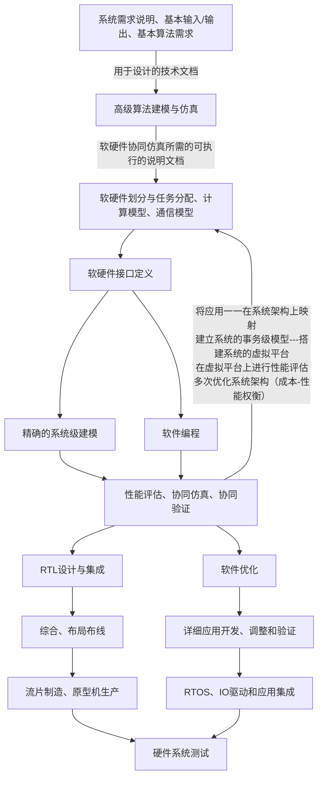
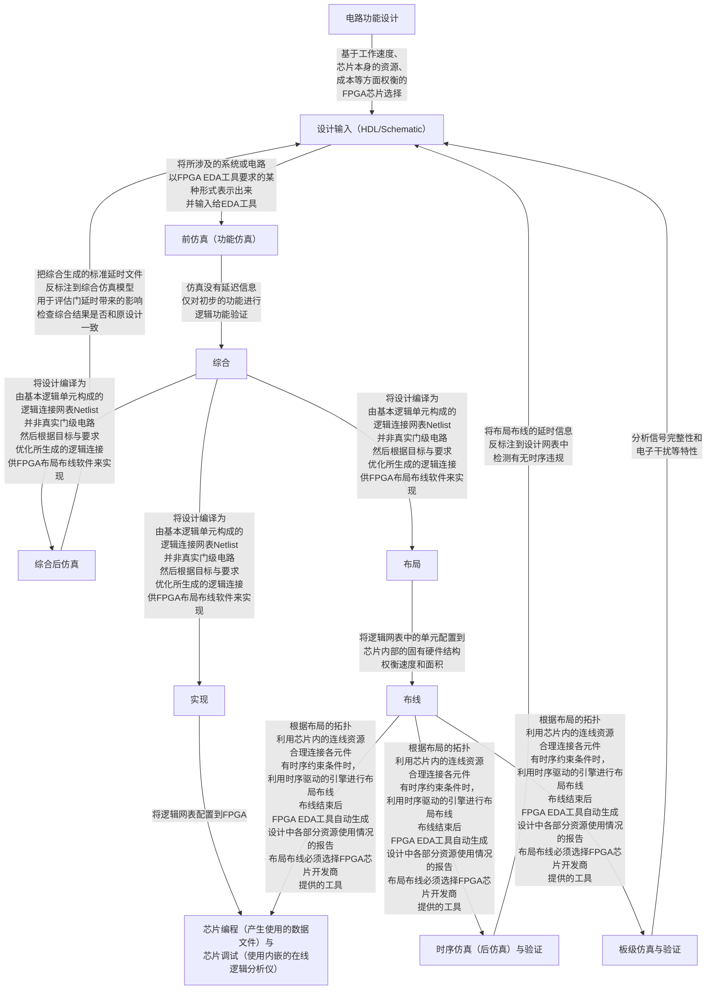

# 绘制2.1，2.2，2.3的SoC设计流程

## Question

仿照如下2.2的SoC设计流程的mermaid代码（可直接复制到obsidian并进行可视化），试着绘制自己版本的2.1，2.2，2.3的SoC设计流程（没有标准答案），在下次课上进行简单讨论。

```mermaid

flowchart TD

1[硬件设计定义说明（Hardware Design Specification）] 

--> |芯片总体架构、规格参数、模块划分（包括各模块的定义）、使用的总线| 2[模块设计及IP复用（Module Design & IP Reuse）] 

--> |相当于图2-1的“RTL设计与集成这部分”，设计的输入采用HDL（Verilog、VHDL）| 3[顶层模块集成（Top Level Integration）--得到RTL代码]

--> |HDL| 4[前仿真（Pre-layout Simulation）--RTL级仿真--功能仿真]

--> |通过HDL仿真器验证的有效的电路逻辑设计| 5[逻辑综合（Logic Synthesis）--得到Netlist]

--> |生成含有电路逻辑设计和约束条件的网表Netlist| 6[版图布局规划（Floorplan）]

--> |各个模块的实际位置| 7[电源网络功耗分析（Power Network Analysis）]

--> |电源网络功耗分析结果（动态结果、静态结果）| 8[单元布局和优化（Placement & Optimization）]

--> 10[可测性电路插入（DFT，Design for Test）]

--> |对于逻辑电路采用扫描链的可测试结构

对于芯片的I/O端口采用边界扫描的可测试结构| 11[时钟树综合（Clock Tree Synthesis）]

--> |构造芯片内部全局或局部平衡的时钟链| 12[布线设计（Routing）]

--> 13[功耗分析]

--> 14[信号完整性]

--> 15[优化]

--> 16[寄生参数提取（Parasitic Extraction）]

--> |提取版图上内部互连所产生的寄生电阻和电容值

转换成标准延迟的格式后被反标回设计网表Netlist

以用于静态时序分析和后仿真| 17[后仿真（Post-layout Simulation）--门级仿真--时序仿真--带反标的仿真]

--> |使用SDF（Standard Delay Format）文件输入延时信息

验证网表Netlist的功能和时序是正确的

但在设计的最后阶段发现个别路径有时序问题或逻辑错误| 18[ECO修改（ECO，Engineering Change Order）]

--> |对设计进行小范围的修改和重新布线| 19[物理验证（Physical Verification）]

--> |对版图的设计规则检查（DRC，Design Rule Check）

对逻辑图网表和版图网表的比较（LVS，Layout Vs. Schematic）| 20[交付芯片制造厂（Tape Out）]





12[布线设计（Routing）]-->|完成所有节点的连接

先进行全局布线

然后进行时序信息的提取

得到的时序信息将

被反标（Back Annotation）到设计网表Netlist

以用于静态时序分析

当时序得到满足时再进行详细布线

最终得到精确的时序信息/延迟参数和网表Netlist| 17[后仿真（Post-layout Simulation）--门级仿真--时序仿真--带反标的仿真] --> |使用SDF（Standard Delay Format）

文件输入延时信息

验证网表Netlist的

功能和时序是正确的| 19[物理验证（Physical Verification）]



3[顶层模块集成（Top Level Integration）--得到RTL代码] <--> 

|形式验证（Formal Verification）

指的是逻辑功能上的等效性检查

RTL代码之间

门级网表Netlist与RTL代码之间

门级网表Netlist之间| 5[逻辑综合（Logic Synthesis）--得到Netlist]



8[单元布局和优化（Placement & Optimization）] --> 4[前仿真（Pre-layout Simulation）]
```

## Answer

### 图2-1

图2-1：

### 图2-2

图2-2：

```mermaid
flowchart TD
1[硬件设计定义说明（Hardware Design Specification）] 
--> |芯片总体架构、规格参数、模块划分（包括各模块的定义）、使用的总线| 2[模块设计及IP复用（Module Design & IP Reuse）] 
--> |相当于图2-1的“RTL设计与集成这部分”，设计的输入采用HDL（Verilog、VHDL）| 3[顶层模块集成（Top Level Integration）--得到RTL代码]
--> |HDL| 4[前仿真（Pre-layout Simulation）--RTL级仿真--功能仿真]
--> |通过HDL仿真器验证的有效的电路逻辑设计| 5[逻辑综合（Logic Synthesis）--得到Netlist]
--> |生成含有电路逻辑设计和约束条件的网表Netlist| 6[版图布局规划（Floorplan）]
--> |各个模块的实际位置| 7[电源网络功耗分析（Power Network Analysis）]
--> |电源网络功耗分析结果（动态结果、静态结果）| 8[单元布局和优化（Placement & Optimization）]
--> 10[可测性电路插入（DFT，Design for Test）]
--> |对于逻辑电路采用扫描链的可测试结构
对于芯片的I/O端口采用边界扫描的可测试结构| 11[时钟树综合（Clock Tree Synthesis）]
--> |构造芯片内部全局或局部平衡的时钟链| 12[布线设计（Routing）]
--> 13[功耗分析]
--> 14[信号完整性]
--> 15[优化]
--> 16[寄生参数提取（Parasitic Extraction）]
--> |提取版图上内部互连所产生的寄生电阻和电容值
转换成标准延迟的格式后被反标回设计网表Netlist
以用于静态时序分析和后仿真| 17[后仿真（Post-layout Simulation）--门级仿真--时序仿真--带反标的仿真]
--> |使用SDF（Standard Delay Format）文件输入延时信息
验证网表Netlist的功能和时序是正确的
但在设计的最后阶段发现个别路径有时序问题或逻辑错误| 18[ECO修改（ECO，Engineering Change Order）]
--> |对设计进行小范围的修改和重新布线| 19[物理验证（Physical Verification）]
--> |对版图的设计规则检查（DRC，Design Rule Check）
对逻辑图网表和版图网表的比较（LVS，Layout Vs. Schematic）| 20[交付芯片制造厂（Tape Out）]


12[布线设计（Routing）]-->|完成所有节点的连接
先进行全局布线
然后进行时序信息的提取
得到的时序信息将
被反标（Back Annotation）到设计网表Netlist
以用于静态时序分析
当时序得到满足时再进行详细布线
最终得到精确的时序信息/延迟参数和网表Netlist| 17[后仿真（Post-layout Simulation）--门级仿真--时序仿真--带反标的仿真] --> |使用SDF（Standard Delay Format）
文件输入延时信息
验证网表Netlist的
功能和时序是正确的| 19[物理验证（Physical Verification）]

3[顶层模块集成（Top Level Integration）--得到RTL代码] <--> 
|形式验证（Formal Verification）
指的是逻辑功能上的等效性检查
RTL代码之间
门级网表Netlist与RTL代码之间
门级网表Netlist之间| 5[逻辑综合（Logic Synthesis）--得到Netlist]

8[单元布局和优化（Placement & Optimization）] --> 4[前仿真（Pre-layout Simulation）]
```

### 图2-7

图2-7：

