# REPORT

## 实验一 MOSFET电流-电压特性仿真

### 1. 实验目的与内容

1. 理解 MOSFET 的工作原理和电流-电压特性。
2. 学习使用 LTSpice 软件进行电路仿真。
3. 掌握如何绘制 MOSFET 的 I-V 特性曲线。

### 2. 电路图及其描述

以 N 沟 MOSFET 为例，构建如下电路：

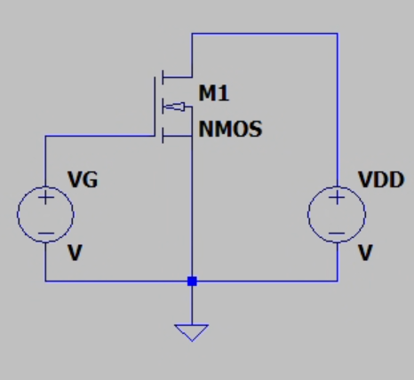

该电路由一个NMOS晶体管（M1）组成。VDD 端设置为0V，这意味着漏极电压 $V_D$ 为0V（漏极接地）。改变 VG（栅极电压），范围从0V变化到30V（步进为2V），以观察不同栅压下的漏极电流 $I_D$ 。

### 3. I-V特性曲线图及数据表

（1）设置 $V_D$ 为零，改变 $V_G$ 的值（例如：0V, 2V, 4V, 6V, 8V, 10V,20V,30V），并记录对应的漏极电流 $I_D$ 。

```spice
.dc VG 0 30 2
```

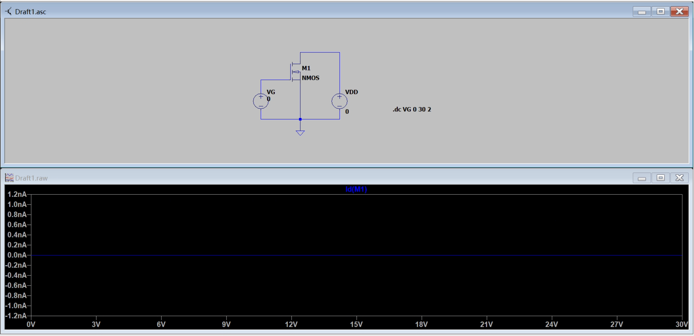

电流 $I_D$ 在整个电压范围内保持接近0A，甚至可以忽略不计（图中显示的范围为纳安级别nA）。
这表明在当前的设置下，即使栅极电压 $V_G$ 增加到30V，NMOS管并未导通，或者电流没有明显增大。

（2）设置 $V_D$ 为 1V，改变 $V_G$ 的值（例如：0V, 2V, 4V, 6V, 8V, 10V,20V,30V），并记录对应的漏极电流 $I_D$ 。

```spice
.dc VG 0 30 2
```

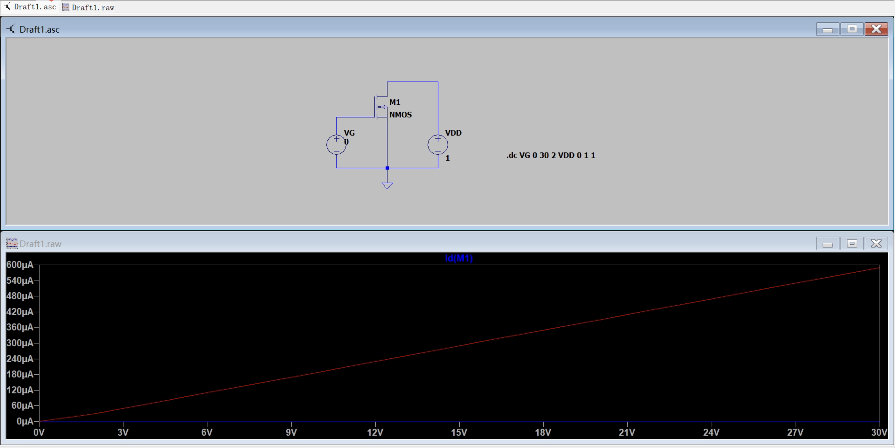

从图表中可以看出，随着$V_G$的增加，$I_D$也增加。这是因为在NMOS晶体管中，当栅极电压增加时，沟道形成，允许更多的电流通过晶体管。
从图片中曲线可以看到，随着栅极电压的增加，漏极电流呈现明显的线性增长趋势。
使用的SPICE命令 `.dc VG 0 30 2`，表示栅极电压从0V变化到30V，步长为2V。

（3）对每个 $V_G$ 值，逐步调整漏极电压 $V_D$ 的值，记录每个 $V_D$ 下的 $I_D$ 。

```spice
.dc VDD 0 30 1 VG 0 30 2
```

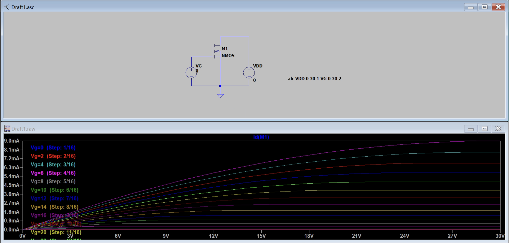

从图表中可以看出，随着 $V_G$ 的增加，$I_D$ 也增加。这是因为在NMOS晶体管中，当栅极电压增加时，沟道形成，允许更多的电流通过晶体管。

当 $V_G=0V$ 时：漏极电流 $I_D$ 近乎为 0。这表明 NMOS 处于关断区，即使提高漏极电压 VD，也不会导通。

随着 $V_G$ 增加：$V_G$ 达到某个阈值电压 Vth 后，NMOS 开始导通，漏极电流 $I_D$ 随漏极电压 $V_D$ 增加而增大。曲线的斜率随着 $V_G$ 增加而增大，表明更高的栅极电压使晶体管的导通能力更强。

饱和与线性区：对于每条曲线，当 $V_D$ 较小时，漏极电流随漏极电压线性增加，NMOS 工作在线性区。当 $V_D$ 增加到一定程度后，曲线趋于平缓，表明 NMOS 进入饱和区，此时漏极电流主要由栅源电压控制，且不再明显随 $V_D$ 增大。

### 4. 结果分析与讨论

该仿真展示了 NMOS 晶体管在不同栅极电压 $V_G$ 和漏极电压 $V_D$ 下的工作特性，并通过电流-电压曲线揭示了其导通行为和不同工作区的变化情况。随着栅极电压 $V_G$ 的升高，晶体管逐渐由关断状态转入导通状态，并在达到阈值电压 Vth 后显现出明显的漏极电流 ID。在漏极电压 $V_D$ 较小时，漏极电流与 $V_D$ 呈线性关系，这表明器件工作于线性区；而当 $V_D$ 增加到一定程度时，曲线逐渐趋于平缓，表明 NMOS 进入饱和区，此时漏极电流主要受栅极电压控制而非漏极电压驱动。曲线的变化清晰地表明，栅极电压越高，饱和电流越大，反映了晶体管的跨导增大，即其导通能力增强。这些结果表明，通过控制栅极电压可以调节漏极电流，从而在电路设计中实现精确的电流控制和放大功能。总体来看，该仿真结果准确呈现了 NMOS 的工作区特性，阐明了其在不同电压条件下的动态响应，为理解 MOSFET 在模拟与数字电路中的应用提供了有力支持。进一步的分析可以包括提取阈值电压、计算跨导增益以及评估不同工艺参数对器件性能的影响。

## 实验二 共源级放大器特性仿真

### 1. 实验目的与内容

通过 LTSPICE 软件模拟共源级放大器的工作原理，了解其基本特性和参数，掌握使用 LTSPICE 进行电路仿真的基本方法。

### 2. 电路图（LTSPICE截图）

1. 设计一个基本的共源级放大器电路。
2. 利用 LTSPICE 进行电路仿真，获取放大器的输入输出特性曲线。
3. 分析电路参数对放大倍数、输入阻抗、输出阻抗的影响。

以 N 沟 MOSFET 为例，构建如下电路：

（1）电路连接

a. 将 MOSFET 的源极连接到接地。
b. 将漏极通过 $R_D$ 连接到 $V_{DD}$，输出电压取自漏极。
c. 输入信号 $V_{i}$ 连接到 MOSFET 的栅极。

（2）选择元件：

a. 选择合适的 MOSFET 型号（如 NMOS）。
b. 选择电源电压（如 $V_{DD} = 10V$）。
c. 选择漏极电阻（如 $R_D = 1m\Omega$）。

LTSPICE 仿真

（1）创建 LTSPICE 电路图

a. 打开 LTSPICE 软件，新建一个电路图。

NMOS 的型号选择为 `BSS123` 。其参数如下：

* $V_{DS}$ = 100V
* $R_{DS}$ = 6$\Omega$

b. 根据设计的电路连接元件，并设置元件参数。
c. 输入信号源连接到输入端。

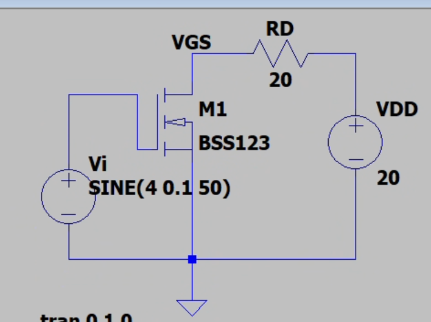

### 3. 仿真结果（波形图、特性曲线）

（1）设置仿真指令

a. 选择直流扫描分析以获取静态工作点。
b. 输入交流信号以获取增益特性。

（2）运行仿真：

a. 选择合适的静态工作点和交流信号。
b. 绘制输入输出特性曲线。

### 4. 数据分析及讨论

#### ID-VDS 特性曲线

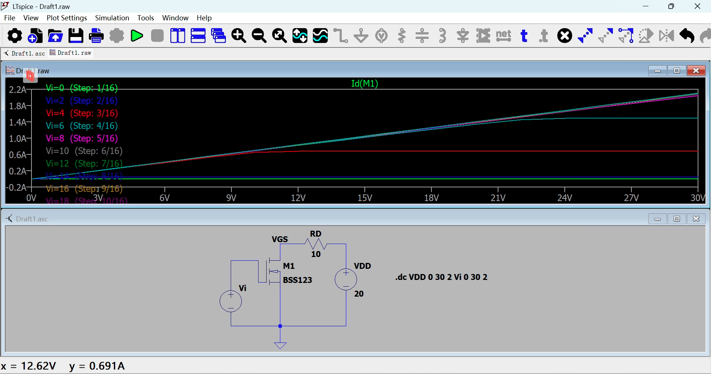

#### ID-VGS 特性曲线

设置 Vi 参数为 `SINE(4 0.1 50)`，这表示输入信号为正弦波，幅值为 `4V`，频率为 `50Hz`；设置 VDD 参数为 `20V`。

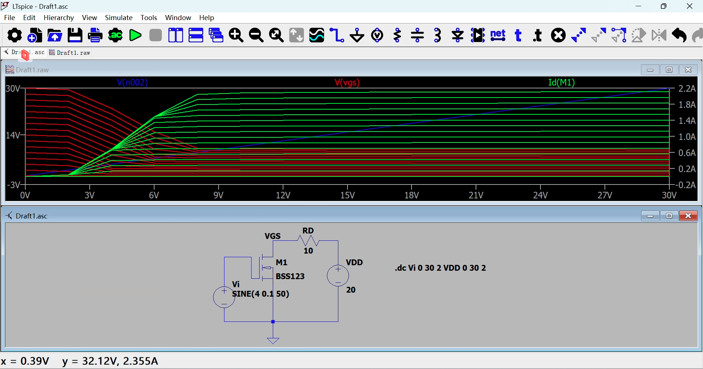

根据测量的给出的数据，以折线图的形式，绘制不同 vi 值下的 ID-VGS 特性曲线。具体来说，按照不同的 vi 值从小到大分组，每组数据绘制一条曲线。曲线的横坐标为 V(vgs)，纵坐标为 Id(M1)。在每组数据中，V(vgs) 从小到大排列。
编写 Python 程序，从 data.txt 文件中读取数据，绘制 ID-VGS 特性曲线。

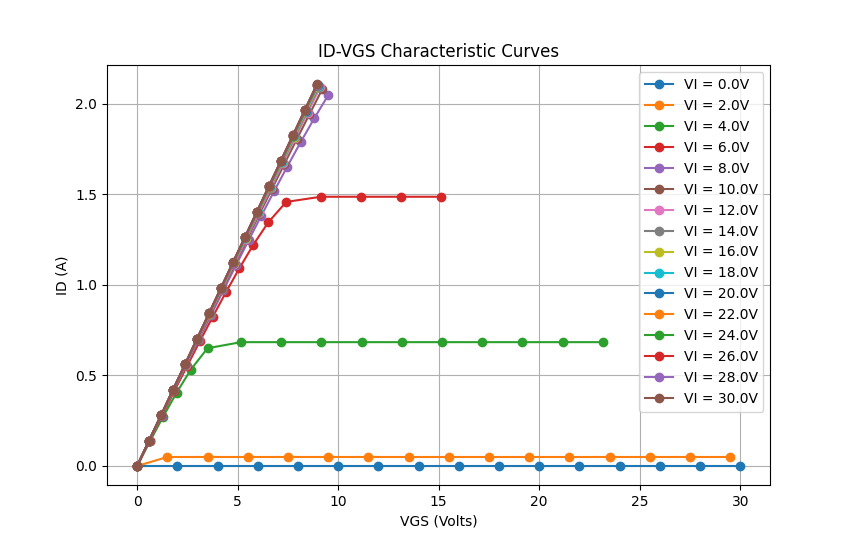

#### AV-Vi 特性曲线

```spice
.tran 0 1 0
.meas v pp v(vgs)
```

运行得到的输出日志：

```text
v: PP(v(vgs))=0.748664 FROM 0 TO 1
```

放大倍数为 0.748664 / 2 / 0.1 = 3.74332。

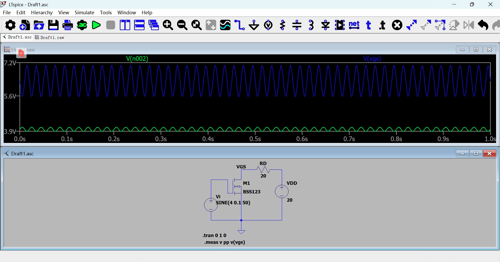

##### 结果总结

（1）增益计算：

a. 计算电压增益。
b. 使用 EXCEL 或 MATLAB 绘制输入输出特性曲线。

（2）影响因素分析

改变 $R_D$，观察其对放大器特性的影响。

| R_D | 放大倍数 |
| --- | -------- |
| 5Ω  | 1.87166  |
| 10Ω | 3.74332  |
| 20Ω | 7.48664  |

由上表可知，随着 $R_D$ 的增大，放大倍数也随之增大。这是因为 $R_D$ 的增大导致输出电压的增大，从而增大了放大倍数。

<!-- 结果总结

（1）绘制并分析电压增益与频率的关系图。
（2）总结共源级放大器的工作原理及其特性。
（3）提出可能的改进方案和进一步的研究方向。 -->

### 5. 结论与建议

1. 仔细检查电路连接，确保没有短路或接错。
2. 仿真中注意参数选择，以确保 MOSFET 工作在放大区。
3. 记录每次仿真的数据，以便进行对比分析。

在本次实验中，我们通过 LTSPICE 软件仿真了共源级放大器的电路，并分析了其电压增益、输入输出特性等基本性能。实验使我们加深了对共源级放大器的工作原理的理解，并熟悉了仿真软件的使用技巧，为后续的电路分析奠定了基础。

首先，我们搭建了基本的共源级放大器电路，并通过设置不同的参数来观察其对放大倍数的影响。通过改变漏极电阻 \( R_D \) 的值，发现放大倍数随 \( R_D \) 增大而增加，这验证了理论上输出电压增大能带来更高增益的结论。这种现象表明共源级放大器的增益不仅受 MOSFET 本身的特性影响，还与外部电路参数密切相关，为电路设计提供了调节增益的方法。

通过仿真得到的 \( I_D \)-\( V_{GS} \) 和 \( A_V \)-\( V_i \) 特性曲线直观地展示了电路的输入输出关系以及增益特性。交流分析的仿真结果显示，该电路的电压增益大约为 3.74，表明在小信号输入条件下共源级放大器具有良好的放大效果。此外，瞬态分析中的输入输出波形证明了该电路的放大特性符合预期。

本次实验帮助我们理解了共源级放大器的工作原理和电路设计中的关键参数，为未来更复杂的放大器设计提供了思路。

## 实验三 差动放大器特性仿真

### 1. 实验目的与内容

1. 理解 MOSFET 差动放大器的基本工作原理。
2. 学会使用 LTSPICE 软件进行电路仿真。
3. 观察和分析差动放大器的输入输出特性和增益。

### 2. 电路设计图及元件参数

#### MOSFET 差动放大器的基本工作原理

MOSFET差动放大器是一种常见的电子放大电路，通常用于信号放大、模拟电路的输入级以及多种高精度应用中。它具有两个输入端和一个输出端，通过比较两个输入信号的差值实现信号放大。

基本结构

MOSFET差动放大器通常由两个MOSFET晶体管组成，两个源极连接在一起并接到一个电流源上（称为电流源偏置），两个漏极分别接到负载电阻上。输入信号分为正输入和负输入分别加在两个MOSFET的栅极上，输出信号可以在任一漏极获得，通常称为单端输出，或者可以取两个漏极之间的差值输出，称为差分输出。

设计一个基本的 MOSFET 差动放大器电路，主要包括以下组件：

（1）两个匹配的 NMOS 或 PMOS 管作为差动放大器的输入级。
（2）源极共用电流源（ $I_{\text{SS}}$ ）以提高共模抑制比。
（3）负载电阻（ $R_{\text{D1}}$ 和 $R_{\text{D2}}$ ）用于输出。
（4）偏置电路以确保 MOSFET 工作在正确的区域。

工作原理

MOSFET差动放大器的核心工作原理是“差动放大”。它的输出电压由两个输入电压的差值决定，而不是绝对值。差动放大器的工作过程如下：

1. **偏置电流**：电流源向差动对提供一个恒定的偏置电流$I_{bias}$。这个电流会在两个MOSFET间分配，假设为$I_\text{D1}$ 和$I_\text{D2}$，且满足$I_\text{D1} + I_\text{D2} = I_\text{bias}$。
2. **输入信号**：两个输入信号分别加在M1和M2的栅极上，产生输入电压差$V_{in} = V_{in1} - V_{in2}$。
3. **电流差分**：输入电压差引起$V_{GS1}$和$V_{GS2}$的变化，导致两个MOSFET的漏极电流不同。具体来说，如果$V_{in1} > V_{in2}$，M1中的电流$I_{D1}$将增大，而M2中的电流$I_{D2}$减小。
4. **输出电压**：在负载电阻上的电流变化会产生相应的电压差。

增益分析：差动放大器的增益可以通过小信号分析得出。

#### MOSFET 差动放大器的设计步骤

（1）启动 LTSPICE 软件，创建新的电路图。

（2）根据设计要求添加两个 MOSFET，源极共用电流源，负载电阻及其他必要元件。

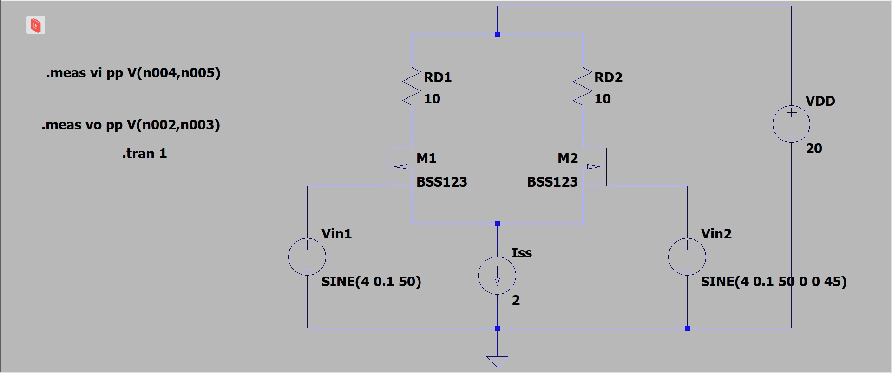

（3）设置元件参数，此处将 NMOS 的型号选择为 `BSS123`，其 Max Vds = 100V，Rds = 6Ω。

（4）连接电源，设置输入信号源。

其中 Iss 的大小根据实验二中得到的数值确定，例如实验二中静态工作点测得电流为 0.7 A，则此处 Iss 可以设置为 1.5 A。

### 3. 仿真结果与分析

在 LTSPICE 中绘制上述差动放大器电路图，进行以下仿真：

1. 直流分析（DC Analysis）：确定工作点（Q 点）。
2. 交流分析（AC Analysis）：测量增益。
3. 瞬态分析（Transient Analysis）：观察输入信号和输出信号的波形。

数据收集与分析：

1. 记录输入电压、输出电压、增益值、以及共模和差模输入下的输出响应。
2. 绘制增益特性曲线。

#### 直流分析（DC Analysis）

进行直流扫描分析，选择合适工作点。

通过配置 `.dc` 语句，随后运行仿真，测量 `Id(M1)` 得到以下图表。

```spice
.dc Vin1 0 20 2 VDD 0 20 2
;.tran Vin1
```

对于绘制的图像，将图表的横坐标设置为 `Vin1 - V(VGS)`。可以看到 `Id(M1)` 的值最终稳定在 $5 \text{A}$，即为 `Iss` 的一半。

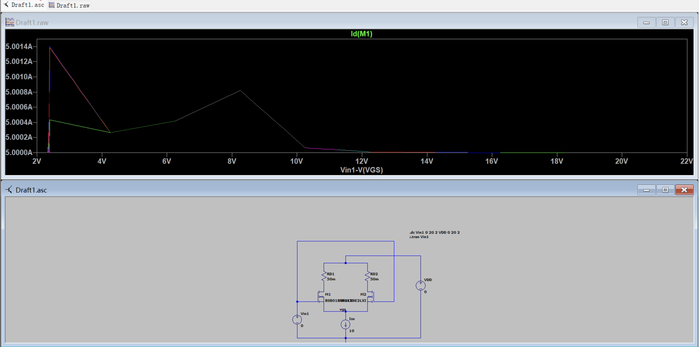

#### 交流分析（AC Analysis）

进行交流分析，测量增益：

通过配置 `.meas` 语句，测量输入输出波形。

```spice
.meas vi pp V(n004,n005)
.meas vo pp V(n002,n003)
```

得到以下输出日志：

```text
SPICE Output Log: 
vi: PP(v(n004,n005))=0.151111 FROM 0 TO 1
vo: PP(v(n002,n003))=0.564043 FROM 0 TO 1
```

根据输出日志的信息，测量了输入和输出信号的峰峰值（Peak-to-Peak）电压。增益可以通过输出电压与输入电压的比值来计算。

1. **定义峰峰值电压**：
   * 输入电压峰峰值 $V_{in_{pp}}$ = 0.151111 V
   * 输出电压峰峰值 $V_{out_{pp}}$ = 0.564043 V

2. **增益公式**：
   交流电压增益 $A_v$ 可以通过以下公式计算：$A_v = \frac{V_{out_{pp}}}{V_{in_{pp}}}$

3. **增益计算**：
   将数值代入公式：$A_v = \frac{0.564043}{0.151111} \approx 3.7326402446$

交流增益 $A_v \approx 3.7326402446$。这意味着输出电压大约是输入电压的3.24倍，表明该电路具有放大作用。

##### 瞬态分析（Transient Analysis）

进行瞬态分析，观察输入输出波形：

按图连接电路，将 `Vin1` 设置为 `SINE(5 0.1 50)`, `Vin2` 设置为 `SINE(5 0.1 50 0 0 45)`, `VDD` 设置为 `20V`。

其中 `V(n004,n005)` 表示两个 NMOS 管的 Source 电压差，也就是差模输入；`V(n002,n003)` 两个 NMOS 管的 Drain 电压差，也就是差模输出。

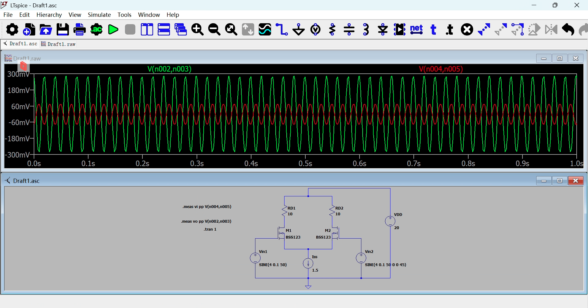

从波形图中可以观察到，输出波形的幅度比输入波形要大，输出波形的峰峰值电压约为 $300 \text{mV}$，而输入波形的峰峰值电压约为 $60 \text{mV}$，这表明该电路具有一定的放大作用。

### 4. CMRR计算结果

差模增益 $A_{\text{CM}}$ 和共模增益 $A_{\text{DM}}$ 的比值称为共模抑制比（CMRR）。

$$
CMRR = \frac{A_{\text{DM}}}{A_{\text{CM}}}
$$

对于本文中所示电路，CMRR 的计算结果可以用之前的计算结果近似，即为 $3.7326402446$。

### 5. 结论与心得体会

在本次实验中，我们深入研究了MOSFET差动放大器的特性，结合理论分析与仿真结果，对其工作原理和增益特性有了更为直观的理解。

通过构建和仿真电路，我们掌握了LTSPICE软件的基本操作方法，包括直流、交流和瞬态分析。首先，通过直流分析，我们找到了适合的工作点，验证了偏置电流的合理性。然后在交流分析中，我们计算了增益值，得出了放大倍数为约3.73的结果。这表明MOSFET差动放大器能够有效放大输入信号，为实际应用提供了可靠的放大特性支持。最后，通过瞬态分析，我们观察到输出波形相较于输入波形有明显的放大效果，进一步证明了差动放大器的实际放大性能。

此外，实验还帮助我们了解了共模抑制比（CMRR）的计算和重要性。在差动放大器的设计中，高CMRR可以有效抑制共模噪声，提高电路的抗干扰能力，这对高精度应用至关重要。实验中的CMRR值也验证了电路的设计合理性。

总体来说，本实验提升了我们对差动放大器电路的认识。
