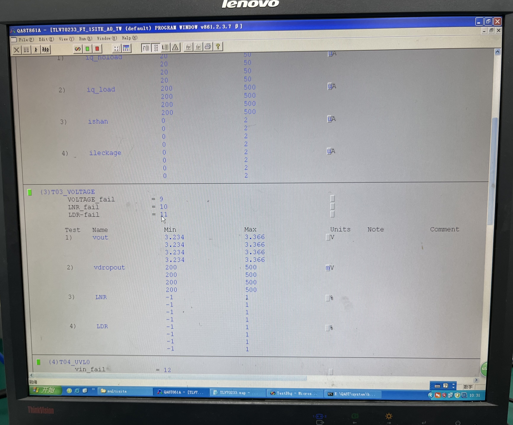

# 课程设计报告-芯片测试实践

<!-- pandoc 课程设计报告-芯片测试实践.md -o 课程设计报告-芯片测试实践.docx -->

## 1、课程目标

通过20课时的芯片测试学习，掌握常用仪器仪表的使用方法、误差来源、芯片测试的流程以及测试机类型。完成本课程设计后，学生应具有以下技能：

1) 掌握基本仪器仪表的功能及使用方法
2) 掌握芯片测试中的误差分析
3) 熟悉芯片测试的流程
4) 了解模拟测试机的板卡类型及机台测试的流程

## 2、课程内容

### 任务一

采用电压源、万用表，使用加压测流的方式测试图中Rx电阻值。


连接如下：

```text
R1 -\         /- R3
      - Rx - 
R2 -/         \- R4
```

（R1、R2、R3、R4阻值均未知）

1、叙述如何测RX的电阻；
2、计算RX的值，并和实际值对比；
3、误差分析说明

#### 1.1 叙述如何测RX的电阻

设置电压为 5V。

连接 `R1 - Rx - R4` ，测量得到电流为 0.9242 mA。
连接 `R2 - Rx - R3` ，测量得到电流为 3.3087 mA。
连接 `R1 - R2` ，测量得到电流为 0.9179 mA。
连接 `R3 - R4` ，测量得到电流为 8.0115 mA。

#### 1.2 计算RX的值

根据以上测量结果，列出方程计算出Rx的电阻值。

- 对于 `R1 - Rx - R4`，等效电阻为 $R_{1x4} = \frac{5V}{0.9242mA} = 5410.0843973166$
- 对于 `R2 - Rx - R3`，等效电阻为 $R_{2x3} = \frac{5V}{3.3087mA} = 1511.1675280322Ω$
- 对于 `R1 - R2`，等效电阻为 $R_{12} = \frac{5V}{0.9179mA} = 5447.2164723826Ω$
- 对于 `R3 - R4`，等效电阻为 $R_{34} = \frac{5V}{8.0115mA} = 624.10285215Ω$

代入测得的等效电阻值，得到方程组：

R1 + Rx + R4 = 5410.0843973166
R2 + Rx + R3 = 1511.1675280322
R1 + R2 = 5447.2164723826
R3 + R4 = 624.10285215

解方程得 Rx = (5410.0843973166 + 1511.1675280322 - 5447.2164723826 - 624.10285215)/2 = 424.9663004081

实际使用万用表测得的电阻值为 424.9 Ω。

#### 1.3 误差分析

导致误差的可能原因：

1. **电压源精度**：电压源输出电压的精度可能会影响电流测量的准确性。
2. **万用表精度**：万用表的测量误差可能会导致电流测量的偏差。
3. **接触不良**：测试夹具与电阻之间的接触不良可能会导致电流测量的不准确。

### 任务二

根据电容的充放电特性使用示波器抓取电容的充电过程，并将带测电容的容值利用C=I*dt/dv计算出来。（R1阻值已知）


1、记录示波器抓取的上电波形（图片）。

2、叙述如何得出电路当中的电流I。

3、使用万用表测出电容的容值和计算的结果进行对比，说明缩小测量误差。

#### 2.1 记录示波器抓取的上电波形

<!-- image -->

按照图示进行电路与示波器连接：


记录示波器抓取的上电波形：


#### 2.2 电路当中的电流I

给电压大小为 5V，电阻大小为 0.509kΩ

电阻分得电压 1（对应 Y1）: 4V - 0.7V = 3.3V

对应电流 1: 3.3V / 0.504kΩ = 6.48mA

电阻分得电压 2（(对应 Y2)）: 4V - 2.82V = 1.18V

对应电流 2: 1.18V / 0.504kΩ = 2.32mA

I: 计算平均电流: (6.48mA + 2.32mA) / 2 = 4.4mA

dt: $\Delta X$ = 170 ms
dv: $\Delta Y$ = 2.82V - 0.7V = 2.12V

则 $C = I \times dt / dv = 4.4\text{mA} * 170\text{ms} / 2.12V = 352.8301887\text{μF}$

#### 2.3 缩小测量误差的方法

使用万用表实际电容测量的值为 99.3 μF 和计算的 352.8 μF 之间存在较大差异，可能的改进方法包括：

1. **减小电流测量误差**：使用更精确的电流表，减小电流测量误差。
2. **减小时间测量误差**：使用示波器的测量功能，减小时间测量误差。
3. **减小电压测量误差**：使用更精确的电压表，减小电压测量误差。

### 任务三

使用T861测试机将稳压管TLV70233的参数测试出来，并且保存20次loop数据。

要求：

1、说明芯片测试前后的流程。
2、说明量产导入的操作步骤。
3、说明测试数据的含义，将测到的数据拍照记录一组。
4、思考并说明测试机测试时可能会存在哪些误差？

#### 3.1 芯片测试前后的流程

1、测试前的准备

**检查设备状态**：确保T861测试机处于正常工作状态，包括电源、接口连接及软件系统的启动。
**校准与设置**：根据芯片规格书对T861测试机进行校准，确保量测的精确性。同时，根据TLV70233的参数需求设置测试项目和参数，比如输出电压精度、输出电流、负载调整率等。
**数据记录与环境准备**：设定数据保存路径，并选择保存格式，如csv或txt，以便后续分析。准备良好的静电保护措施，防止芯片受损。

2、测试流程

**加载芯片**：将稳压管TLV70233放置在测试机的夹具或插槽中，确保接触良好。
**测试程序启动**：运行T861的测试程序，启动自动测试流程。根据TLV70233的数据手册要求，逐步测试其关键参数。
**多次循环测试**：设定测试程序运行20次loop，每次loop将数据存储到指定位置。循环测试有助于评估芯片的稳定性和一致性。

#### 3.2 量产导入的操作步骤

在TLV70233完成测试验证后，如果结果符合要求，则可以进入量产阶段。量产导入的主要步骤如下：

1、制定生产标准与参数

**确定生产标准**：基于前期测试结果和芯片规格书要求，制定稳压管TLV70233的量产参数标准。
**设定工艺参数**：针对批量生产的要求，制定温度、湿度、电压、电流等环境参数的控制范围，以确保产品质量一致性。

2、生产设备调试与参数导入

**设备校准**：在量产设备上进行相应的参数校准，使其达到量产要求。
**参数导入**：将前期测试的数据参数作为基准导入量产设备，确保每个芯片的测试条件一致。
**测试计划制定**：制定量产测试计划，包括测试周期、测试项目等。通常在量产中可能只对关键参数进行抽样测试，而非每个芯片进行完整测试，以提高效率。

3、量产初期验证

**小批量试生产**：在正式量产前进行小批量试生产，以确保设备调试正确，测试参数准确。
**数据分析与调整**：对试生产的测试数据进行分析，如果数据波动较大或有偏差，可能需要微调生产设备的参数设置。

4、全量产导入

**正式批量生产**：确认试生产的数据符合要求后，正式导入量产，按照制定的生产计划进行大批量生产。
**质量控制与抽检**：在量产过程中，进行周期性抽检，验证参数一致性，确保生产过程稳定性。
  
5、量产数据管理与持续改进

**数据归档**：将量产过程中的测试数据归档，形成量产数据报表，以便追溯和质量管理。
**持续改进**：定期分析量产数据，根据分析结果优化生产流程和测试参数，提高产品合格率和质量稳定性。

通过上述步骤，可以确保稳压管TLV70233的参数符合量产要求，并能够稳定地生产出符合规格的产品。

#### 3.3 测试数据的含义

本次实验实验的 ATE 型号为 T861 (Qa8T861A)

部分测试项目说明与测试代码如下：

测试项：开短路测试

```c++
 // T01_OS.CPP
 // os_vin
 // 在 VIN 引脚施加 -200 µA 电流和 -2 V 电压，电流范围限制为 2 mA，电压范围为 5 V
 // 用于模拟输入条件并确保测试在设备安全操作范围内
 dc_force(DVI_VIN, -200.0 uA, -2.0 V, RANGE_2_MA, RANGE_5_V);
 delay(3);
 // 读取 VIN 引脚的电压值，采样 20 次，确保测量精度，结果保存在 vin 变量中
 dc_measure(DVI_VIN, MEASURE_VOLTAGE, vin, 20, NO_DIFF_RANGE, 200);
 // 重置 VIN 引脚，电流为 0 µA，电压为 0 V，恢复初始状态
 dc_force(DVI_VIN, 0.0 uA, 0.0 V, RANGE_2_MA, RANGE_5_V); 
 delay(3);

 //os_en
 // 在 EN 引脚施加 -200 µA 电流和 -2 V 电压，电流范围限制为 5 mA，电压范围为 5 V
 // 用于模拟使能引脚的低电平输入条件
 dc_force(OVI_EN,-200.0 uA, -2.0 V, RANGE_5_MA, RANGE_5_V);
 delay(3);
 // 读取 EN 引脚的电压值，采样 20 次，确保测量精度，结果保存在 en 变量中
 dc_measure(OVI_EN, MEASURE_VOLTAGE, en, 20, NO_DIFF_RANGE, 200);
 // 重置 EN 引脚，电流为 0 µA，电压为 0 V，恢复初始状态
 dc_force(OVI_EN, 0.0 uA, 0.0 V, RANGE_5_MA, RANGE_5_V); 
 delay(3);

 //os_vout
 // 在 VOUT 引脚施加 -200 µA 电流和 -2 V 电压，电流范围限制为 2 mA，电压范围为 5 V
 // 用于模拟输出引脚的低电平输出条件
 dc_force(DVI_VOUT,-200.0 uA, -2.0 V, RANGE_2_MA, RANGE_5_V);
 delay(3);
 // 读取 VOUT 引脚的电压值，采样 20 次，确保测量精度，结果保存在 vout 变量中
 dc_measure(DVI_VOUT, MEASURE_VOLTAGE, vout, 20, NO_DIFF_RANGE, 200);
 // 重置 VOUT 引脚，电流为 0 µA，电压为 0 V，恢复初始状态
 dc_force(DVI_VOUT, 0.0 uA, 0.0 V, RANGE_2_MA, RANGE_5_V); 
 delay(3);
```

测试项：电压测试项

```c++
 // T03_VOLTAGE.CPP
 // VOUT**********
 // 在 VIN 施加 10 mA 电流和 5 V 电压，确保输入电压有效
 dc_force(DVI_VIN, 10.0 mA, 5.0 V, RANGE_20_MA, RANGE_10_V);
 // 在 EN 施加 1 mA 电流和 2 V 电压，使能设备
 dc_force(OVI_EN, 1.0 mA, 2.0 V, RANGE_5_MA, RANGE_5_V);
 delay(3);

 // 测量 VOUT 的输出电压
 dc_measure(DVI_VOUT, MEASURE_VOLTAGE, VOUT, 20, NO_DIFF_RANGE, 200);
 
 // 重置 VOUT 引脚电流和电压
 dc_force(DVI_VOUT, 0.0 mA, 0.0 V, RANGE_20_MA, RANGE_10_V);
 // 关闭 EN 引脚
 dc_force(OVI_EN, 1.0 mA, 0.0 V, RANGE_5_MA, RANGE_5_V);
 // 关闭 VIN 引脚
 dc_force(DVI_VIN, 10.0 mA, 0.0 V, RANGE_20_MA, RANGE_10_V);
 delay(3);

 //Vdropout**********
 // 在 VIN 施加 500 mA 电流和 3.234 V 电压，模拟输入条件
 dc_force(DVI_VIN, 500.0 mA, 3.234 V, RANGE_2_A, RANGE_5_V);
 // 在 EN 施加 1 mA 电流和 2 V 电压，使能设备
 dc_force(OVI_EN, 1.0 mA, 2.0 V, RANGE_5_MA, RANGE_5_V); 
 delay(3); 

 // 在 VOUT 施加反向 300 mA 电流和 -5 V 电压，模拟负载
 dc_force(DVI_VOUT, -300.0 mA, -5.0 V, RANGE_2_A, RANGE_10_V);
 delay(3); 

 // 测量 VIN 引脚电压
 dc_measure(DVI_VIN, MEASURE_VOLTAGE, V_VIN, 20, NO_DIFF_RANGE, 200);
 // 测量 VOUT 引脚电压
 dc_measure(DVI_VOUT, MEASURE_VOLTAGE, V_VOUT, 20, NO_DIFF_RANGE, 200);

 // 计算压降电压
 Vdropout[0]=V_VIN[0]-V_VOUT[0];

 dc_force(DVI_VOUT, 0.0 mA, 0.0 V, RANGE_20_MA, RANGE_10_V);
 dc_force(OVI_EN, 1.0 mA, 0.0 V, RANGE_5_MA, RANGE_5_V);
 dc_force(DVI_VIN, 300.0 mA, 0.0 V, RANGE_2_A, RANGE_10_V);
 delay(3);

 //LNR
 // 在 VIN 施加 300 mA 电流和 3.8 V 电压
 dc_force(DVI_VIN, 300.0 mA,3.8 V, RANGE_2_A, RANGE_10_V);
 // 在 EN 施加 1 mA 电流和 2 V 电压，使能设备
 dc_force(OVI_EN, 1.0 mA, 2.0 V, RANGE_5_MA, RANGE_5_V); 
 delay(3); 

 // 测量低输入电压时的 VOUT
 dc_measure(DVI_VOUT, MEASURE_VOLTAGE, V1, 20, NO_DIFF_RANGE, 200);

 // 提高 VIN 电压至 5.5 V
 dc_force(DVI_VIN, 300.0 mA,5.5 V, RANGE_2_A, RANGE_10_V);
 // 继续使能设备
 dc_force(OVI_EN, 1.0 mA, 2.0 V, RANGE_5_MA, RANGE_5_V); 
 delay(3); 

 // 测量高输入电压时的 VOUT
 dc_measure(DVI_VOUT, MEASURE_VOLTAGE, V2, 20, NO_DIFF_RANGE, 200);

 // 计算线性调整率
 LNR[0]=fabs(V2[0]-V1[0])/VOUT[0];

 //LDR
 // 在 VIN 施加 500 mA 电流和 5 V 电压，提供稳定输入
 dc_force(DVI_VIN, 500.0 mA,5.0 V, RANGE_2_A, RANGE_10_V);
 dc_force(OVI_EN, 1.0 mA, 2.0 V, RANGE_5_MA, RANGE_5_V); 
 delay(3); 

 // 测量轻负载下的 VOUT
 dc_measure(DVI_VOUT, MEASURE_VOLTAGE, V3, 20, NO_DIFF_RANGE, 200);

 // 增加负载，反向施加 300 mA 电流和 -5 V 电压
 dc_force(DVI_VOUT, -300.0 mA, -5.0 V, RANGE_2_A, RANGE_10_V);
 delay(3);

 // 测量重负载下的 VOUT
 dc_measure(DVI_VOUT, MEASURE_VOLTAGE, V4, 20, NO_DIFF_RANGE, 200);

 // 计算负载调整率
 LDR[0]=fabs(V3[0]-V4[0])/VOUT[0];
```

最终测试数据如下，数据保存的位置是 `TLV70233_FT_1SITE_A0_TW/DataLog'`：


以下是数据表格中各列的初步解释与分析思路。

数据列说明：**Test Parameters (参数名称)**：

- `os_vin`, `os_en`, `os_vout`：这些参数可能是稳压管的输入电压（Vin）、使能电压（Enable），和输出电压（Vout）的偏差值（os 代表offset）。
- `iq_noload`, `iq_load`：稳压管在空载和负载情况下的静态电流（quiescent current），表示无负载和有负载时的功耗。
- `ishan`，`ileckage`：可能是负载电流（或峰值电流）和泄漏电流。
- `vout`：稳压管的输出电压。
- `vdropout`：稳压管的压降，即输入电压与输出电压之间的差值，表示稳压管在一定负载下的电压保持能力。
- `LNR`（Line Regulation）：线性调整率，表示输入电压的变化对输出电压的影响百分比。
- `LDR`（Load Regulation）：负载调整率，表示负载变化对输出电压的影响百分比。
- `vin_H`, `vin_L`：输入电压的高低限值。
- `ven_H`, `ven_L`：使能电压的高低限值。
- `Ilimit`, `Ishort`：稳压管的限流（current limit）和短路电流（short-circuit current）。
- `Tstartup`：启动时间，表示芯片在上电后达到稳定输出所需的时间。

测试数据含义

从数据中可以观察到每一行代表一次独立的测试结果，包括输入、输出电压、负载电流等关键参数。通过这些数据可以分析出稳压管在不同条件下的输出性能，如：

- **稳定性**：观察`vout`的稳定性和`vdropout`的变化，确保输出电压能稳定保持在指定值。
- **能效**：根据空载电流和负载电流的变化，评估稳压管在不同负载下的功耗情况。
- **响应速度**：`Tstartup`可以用于衡量启动的响应时间。

ATE 测试输出实拍：




#### 3.4 测试机测试时可能会存在的误差

在该测试数据中可能出现的误差来源包括：

1. **设备校准误差**：`os_vin`, `os_vout`等偏差值如果较大，可能是由于设备校准不精准。
2. **外部环境因素**：环境温度、电磁干扰等可能会影响`iq_noload`和`ileckage`等电流参数的准确性。
3. **接触不良**：测试探针与芯片接触不良或出现接触电阻差异，可能会影响`vin_H`, `vin_L`, `vout`的精确度。
4. **数据采集噪声**：可能会对微小信号如泄漏电流`ileckage`和限流`Ilimit`的读数产生偏差。

#### 3.5 使用仪器仪表测试

在实际测试中，我们使用万用表、示波器、电源等仪器仪表进行测试。


##### 测试项：开短路测试

测试参数：vin, out, en
测试方法：万用表调至二极管档，红表笔接地，黑表笔接待测引脚，读取电压值并记录

##### 测试项：电流测试项

测试参数：Iq_noload
测试方法：

1. Vin 串电流表，调至mA 档
2. Vin 上电 5.0V,EN拉高
3. 读取 Vin 电流

测试参数：Iq_load
测试方法：

1. Vin、Vout 串电流表，调至 mA 档
2. Vin 上电 5.0V,EN 拉高
3. Vout 接负载并抽取 300mA
4. 读取 Vin、Vout 电流，两者相減

测试参数：Ishdn
测试方法：

1. Vin 串电流表，调至UA 档
2. Vin 上电 5.0V, EN拉低
3. 读取 Vin 电流

测试参数：Leckag
测试方法：

1. Vin 串电流表，调至UA 档
2. Vin 上电 5.0V,EN、Vout拉低
3. 读取 Vin 电流

##### 测试项：电压测试项

测试参数：Vout
测试方法：

1. Vin 上电 5.OV, EN 拉高
2. 读取 Vout 电压

测试参数：Vdropout
测试方法：

1. Vin 上电 3.234V, EN 拉高
2. Vout 抽取电流 300mA
3. 读取 Vin、Vout 电压并做差值

测试参数：LNR
测试方法：

1. Vin 上电3.8V,EN 拉高
2. 读取 Vout 电压 V1
3. Vin上电 5.5V,EN 拉高
4. 读取 Vout 电压 V2；LNR=|V1-V2|

测试参数：LDR
测试方法：

1. Vin 上电 5.OV,EN 拉高
2. 读取 Vout 电压 V3
3. Vout 加电子负载并且抽300mA 负载
4. 读取 Vout 电压V4；LDR= |V3-V4|

##### 测试项：功能测试项

测试参数：llimit
测试方法：

1. Vin 接电源，加 5V, EN 拉高
2. Vin 串电流表，调至 mA 档
3. Vout 接负载，并且以 0.01A 的步进增加电流
4. 监测Vin 电流表读数，当继续增加 Vout 负载但 Vin 电流表读数不增加时，记录此时电流 llimit
5. 撤掉电子负载

测试参数：Ishort
测试方法：

1. Vin 接电源，加 5.OV, EN 拉高
2. Vin 串电流表，调至mA 档
3. Vout 接地，等待100ms
4. 读取此时电流表读数 Ishort

##### 测试项：时间测试项

测试参数：Tstartup
测试方法：

1. Vin 接电源，加5.0V
2. EN 接示波器 CH1
3. OUT 接示波器 CH2
4. 设置 trig
5. EN 拉高，读取 CH1 上升沿 1.0V 到 CH2上升沿 1.6V 的时间差即为 Tstart-up

## 3、心得与体会

在芯片测试课程中，我收获了关于芯片测试流程、设备使用、误差来源及分析的实践经验。整个课程涵盖了从电阻测量、电容计算到稳压管芯片的多次循环测试，具体任务帮助我逐步掌握了芯片测试中的各个关键环节。

本次芯片测试实践让我系统地掌握了芯片测试的理论知识和实践操作技能。课程中各任务的循序渐进安排，有助于我逐步理解并掌握复杂的测试流程。同时，通过反复进行误差分析，我对测试精度有了深刻体会，今后我会更加关注设备选择、操作细节及数据处理方法的优化。
